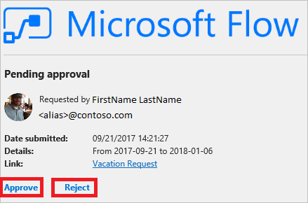

# Créer un flux d’approbation nécessitant l’approbation de tout le monde

Cette procédure pas à pas décrit comment créer un flux de travail d’approbation nécessitant que tout le monde (l’ensemble des approbateurs affectés) consente à une demande de congé pour que celle-ci soit approuvée, et entraînant son rejet si un seul approbateur s’y oppose.

Ce type de flux de travail d’approbation est utile au sein d’une organisation qui exige que toute demande de congé soit approuvée tant par le responsable du demandeur, que par le responsable du responsable. Chaque responsable peut refuser la demande de son côté.

> [!NOTE]
> Cette procédure pas à pas met en évidence un scénario d’approbation de vacances, mais vous pouvez utiliser ce type de flux d’approbation dans toutes les situations où plusieurs approbateurs sont nécessaires pour approuver une demande.
>
>

## Prérequis

* Accès à [Microsoft Flow](https://flow.microsoft.com), Microsoft Office 365 Outlook et aux utilisateurs de Microsoft Office 365.
* Une [liste](https://support.office.com/article/SharePoint-lists-I-An-introduction-f11cd5fe-bc87-4f9e-9bfe-bbd87a22a194) SharePoint.

    Cette procédure pas à pas suppose que vous avez créé une liste SharePoint utilisée pour les demandes de congés. Pour obtenir un exemple détaillé de liste SharePoint, consultez la procédure pas à pas [Approbations parallèles](parallel-modern-approvals.md).
* Bonne maîtrise des principes fondamentaux de la création de flux.

    Nous vous invitons à réviser la manière d’ajouter [des actions, des déclencheurs](multi-step-logic-flow.md#add-another-action) et [des conditions](add-condition.md). Les étapes suivantes supposent que vous savez comment effectuer ces actions.

> [!NOTE]
> Nous utilisons SharePoint et Office 365 Outlook dans cette procédure pas à pas, mais vous pouvez utiliser d’autres services comme Zendesk, Salesforce, Gmail ou n’importe lequel des plus de [200 services](https://flow.microsoft.com/connectors/) que Microsoft Flow prend en charge.
>
>

## Créer le flux

> [!NOTE]
> Si vous n’avez pas créé de connexion à SharePoint ou à Office 365 précédemment, suivez les instructions lorsque vous êtes invité à vous connecter.
>
>

Cette procédure pas à pas utilise des jetons. Pour afficher la liste de jetons, appuyez ou cliquez sur n’importe quel contrôle d’entrée, puis recherchez le jeton dans la liste **Contenu dynamique** qui s’ouvre.

Connectez-vous à [Microsoft Flow](https://flow.microsoft.com), puis procédez comme suit pour créer le flux.

1. Sélectionnez **Mes flux** > **Créer entièrement** en haut à droite de l’écran.
1. Ajoutez le déclencheur **SharePoint - Lorsqu’un élément est créé ou Lorsqu’un élément existant est modifié**.
1. Entrez **l’Adresse du site** SharePoint hébergeant la liste des demandes de congés, puis sélectionnez la liste **Nom de la liste**.
1. Ajoutez l’action **Utilisateurs d’Office 365 - Obtenir le responsable V2**, cochez la case **Utilisateur (UPN)**, puis ajoutez-lui le jeton **Créé par - E-mail**.

    Le jeton **Créé par l’adresse électronique** figure dans la catégorie **Lorsqu’un élément est créé ou Lorsqu’un élément existant est modifié** de la liste **Contenu dynamique**. Ce jeton fournit dynamiquement un accès aux données sur le responsable de la personne qui a créé l’élément dans SharePoint.

1. Ajoutez une autre action **Utilisateurs d’Office 365 - Obtenir le responsable V2**, puis ajoutez le jeton **E-mail** à la zone **Utilisateur (UPN)**.

    Le jeton **E-mail** figure sous la catégorie **Obtenir le responsable V2 2** de la liste **Contenu dynamique**. Ce jeton fournit dynamiquement un accès à l’adresse e-mail du responsable.

    Vous pouvez également renommer la carte **Obtenir le responsable V2 2** avec un nom descriptif comme « Responsable de niveau supérieur ».
1. Ajoutez l’action **Démarrer une approbation**, puis, dans la liste **Type d’approbation**, sélectionnez **Tout le monde dans la liste affectée**.

   > [!IMPORTANT]
   > En cas de refus d’un seul approbateur, la demande d’approbation est considérée comme rejetée par tous les approbateurs.
   >
   >
1. Utilisez le tableau suivant comme guide pour remplir la carte **Démarrer une approbation**.

   | Champ | Description |
   | --- | --- |
   |  Type d’approbation |Utilisez **N’importe qui dans la liste affectée** pour indiquer que tout approbateur peut approuver ou rejeter la demande. 
Utilisez **Tout le monde dans la liste affectée** pour indiquer qu’une demande n’est approuvée que si tous les approbateurs l’acceptent, et qu’elle est refusée si une seule personne la rejette. |
   |  Titre |Titre de la demande d’approbation. |
   |  Affectée à |Adresses de messagerie des approbateurs. |
   |  Détails |Toute information supplémentaire à envoyer aux approbateurs répertoriés dans le champ **Affectée à**. |
   |  Lien vers l’élément |URL de l’élément de l’approbation. Dans cet exemple, il s’agit d’un lien vers l’élément dans SharePoint. |
   |  Description du lien vers l’élément |Texte décrivant le **Lien vers l’élément**. |

   > [!TIP]
   > L’action **Démarrer une approbation** fournit plusieurs jetons, dont **Réponse** et **Résumé de la réponse**. Utilisez ces jetons dans votre flux pour produire des rapports détaillés des résultats de l’exécution d’un flux de demande d’approbation.
   >
   >

    La carte **Démarrer une approbation** est un modèle de demande d’approbation à envoyer aux approbateurs. Configurez-la d’une manière utile pour votre organisation. Voici un exemple.

    

1. Ajoutez l’action **Office 365 Outlook - Envoyer un courrier**, puis configurez-la pour envoyer un e-mail contenant les résultats de la demande.

    Voici un exemple de ce à quoi peut ressembler la carte **Envoyer un courrier**.

    

> [!NOTE]
> Toute action postérieure à l’action **Démarrer une approbation** s’exécute en fonction de la sélection que vous avez opérée dans la liste **Type d’approbation** sur la carte **Démarrer une approbation**. Le tableau suivant indique le comportement en fonction de votre sélection.
>
>

| Type d’approbation | Comportement |
| --- | --- |
| N’importe qui dans la liste affectée |Les actions postérieures à l’action **Démarrer une approbation** s’exécutent après la décision de n’importe lequel des approbateurs. |
| Tout le monde dans la liste affectée |Les actions postérieures à l’action **Démarrer une approbation** s’exécutent après qu’un approbateur a décliné ou que tous les approbateurs ont approuvé la demandé. |

En haut de l’écran, dans le champ **Nom de flux**, entrez un nom pour votre flux, puis sélectionnez **Créer un flux** pour enregistrer celui-ci.

Félicitations, votre flux est terminé. Si vous avez suivi la procédure, votre flux ressemble à cette image.

Désormais, chaque fois qu’un élément est ajouté à votre liste SharePoint ou qu’il change, votre flux est déclenché et envoie des demandes d’approbation à tous les approbateurs répertoriés dans la zone **Affecté à** de la carte **Démarrer une approbation**. Votre flux envoie des demandes d’approbation via l’application mobile Microsoft Flow et par e-mail. La personne qui crée l’élément dans SharePoint reçoit un e-mail résumant les résultats, et indiquant clairement si la demande a été approuvée ou rejetée.

Voici un exemple de demande d’approbation envoyée à chaque approbateur.

Voici un exemple de réponse et de résumé de la réponse après l’exécution du flux.

## En savoir plus sur les approbations

* [Approbations modernes d’un seul approbateur](modern-approvals.md)
* [Approbations modernes séquentielles](sequential-modern-approvals.md)
* [Approbations modernes parallèles](parallel-modern-approvals.md)
* [Approbations et Microsoft Common Data Service](common-data-model-approve.md)
* [Approuver des demandes en déplacement](mobile-approvals.md)
