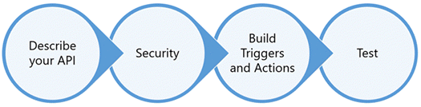

# Vue d’ensemble des connecteurs API (Microsoft Flow)
Un **connecteur API** est un wrapper OpenAPI (Swagger) autour d’une API REST qui permet au service sous-jacent de communiquer avec [Microsoft Flow](https://flow.microsoft.com), [PowerApps](https://powerapps.microsoft.com) et [Logic Apps](https://docs.microsoft.com/azure/logic-apps/). Il permet aux utilisateurs de se connecter à leurs comptes et de tirer parti d’un ensemble de **déclencheurs** et d’**actions** prédéfinis pour construire leurs applications et flux de travail.

En tant qu’**éditeur de logiciels indépendant** ou **propriétaire de service SaaS**, vous pouvez créer des connecteurs pour que vos utilisateurs aient accès à un large éventail de scénarios d’activités et de productivité. Un connecteur vous permet d’aller au-delà d’un ensemble défini d’intégrations et d’augmenter la portée, la découverte et l’utilisation de votre service.

## Configuration requise
Pour créer et soumettre un connecteur, votre service doit répondre aux exigences suivantes :

* Scénario d’utilisateur professionnel qui s’adapte parfaitement à Logic Apps, PowerApps et Microsoft Flow
* Service publiquement disponible avec API REST stable

## Créer votre connecteur
La première étape de création d’un connecteur API consiste à créer un connecteur personnalisé entièrement fonctionnel. Un connecteur personnalisé fonctionne exactement comme un connecteur API, mais sa disponibilité est limitée à son auteur et aux utilisateurs spécifiques du locataire de l’auteur.

Le processus de création d’un connecteur implique plusieurs étapes :

[En savoir plus](api-connector-dev.md) sur le développement d’un connecteur API.

## Soumettre pour certification
Une fois que vous avez créé un connecteur, soumettez-le pour certification. Dans le cadre du processus de certification tiers, Microsoft passe en revue le connecteur avant publication.

Ce processus vérifie le fonctionnement de votre connecteur dans Microsoft Flow et PowerApps, ainsi que la conformité technique et du contenu.

[En savoir plus](api-connector-submission.md) sur le processus pour soumettre votre connecteur à la certification et à la publication.

## Accéder au support
Pour le support relatif au développement et à l’intégration, envoyez un courrier à [condevhelp@microsoft.com](mailto:condevhelp@microsoft.com). Ce compte est activement surveillé et géré. Les requêtes et les incidents des développeurs sont rapidement envoyés à l’équipe appropriée.

