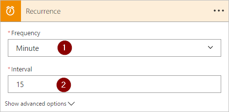
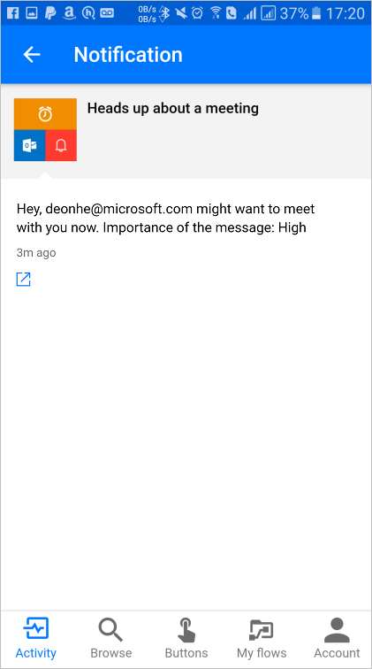

# Utiliser l’action « Appliquer à chacun » dans Microsoft Flow pour traiter régulièrement une liste d’éléments
De nombreux déclencheurs peuvent commencer immédiatement un flux en fonction d’un événement tel que la réception d’un e-mail dans votre boîte de réception. Ces déclencheurs sont formidables, mais vous pouvez parfois exécuter un flux qui interroge une source de données selon une planification prédéfinie et mène certaines actions en fonction des propriétés des éléments dans la source de données. Pour ce faire, votre flux peut être démarré selon une planification (par exemple une fois par jour) et utiliser une action de boucle comme **Appliquer à chacun** pour traiter une liste d’éléments. Par exemple, vous pouvez utiliser **Appliquer à chacun** pour mettre à jour les enregistrements d’une base de données ou d’une liste d’éléments à partir de Microsoft SharePoint.

Dans cette procédure pas à pas, vous allez créer un flux qui s’exécute toutes les 15 minutes et effectue les opérations suivantes :

1. Obtient les 10 derniers messages non lus de votre boîte de réception Office 365 Outlook.
2. Vérifie chacun des 10 messages pour confirmer si certains ont la valeur **Conférence maintenant** dans l’objet.
3. Vérifie si le message provient de votre patron ou a été envoyé avec une importance haute.
4. Envoie une notification Push et marque comme lus les e-mails dont l’objet contient **Conférence maintenant** et qui ont été envoyés par votre patron ou avec une importance haute.

Ce schéma montre les détails du flux que vous allez créer dans cette procédure pas à pas :

## Prérequis
Voici les prérequis pour effectuer correctement les étapes de cette procédure pas à pas :

* Un compte inscrit et pouvant utiliser [Microsoft Flow](https://flow.microsoft.com).
* Un compte Office 365 Outlook.
* Application mobile Microsoft Flow pour [Android](https://aka.ms/flowmobiledocsandroid), [iOS](https://aka.ms/flowmobiledocsios) ou [Windows Phone](https://aka.ms/flowmobilewindows).
* Des connexions à Office 365 Outlook et au service de notification Push.

## Créer un flux
1. Connectez-vous à [Microsoft Flow](https://flow.microsoft.com) :
2. Sélectionnez l’onglet **Mes flux**, puis créez entièrement un flux :
   
    
3. Dans la zone de recherche, entrez « planification » pour rechercher tous les services et déclencheurs associés à la planification.
4. Sélectionnez le déclencheur **Planification - Récurrence** pour indiquer que votre flux s’exécute selon une planification que vous devrez ensuite fournir :
   
    
5. Définissez l’exécution de la planification toutes les 15 minutes :
   
    
6. Sélectionnez **+ Nouvelle étape**, **Ajouter une action**, puis tapez **outlook** dans la zone de recherche pour rechercher toutes les actions relatives à Microsoft Outlook.
7. Sélectionnez l’action **Office 365 Outlook - Obtenir les e-mails** :
   
    
8. Cette opération ouvre la carte **Obtenir les e-mails**. Configurez la carte **Obtenir les e-mails** pour sélectionner les 10 premiers e-mails non lus du dossier Boîte de réception. N’incluez pas de pièces jointes, car elles ne sont pas utilisées dans le flux :
   
    
   
   > [!NOTE]
   > Pour l’instant, vous avez créé un simple flux qui obtient certains e-mails de votre boîte de réception. Ces e-mails sont retournés dans un tableau. Comme l’action **Appliquer à chacun** nécessite un tableau, c’est parfait.
   > 
   > 

## Ajouter des actions et des conditions
1. Sélectionnez **+ Nouvelle étape**, **Plus**, puis l’action **Ajouter un appliquer à chaque** :
   
    
2. Insérez le jeton **Corps** dans la zone **Sélectionnez un résultat à partir des étapes précédentes** dans la carte **Appliquer à chacun**. Cette action extrait le corps des e-mails à utiliser dans l’action **Appliquer à chacun** :
   
    
3. Sélectionnez **Ajouter une condition** :
   
    
4. Configurez la carte **Condition** pour qu’elle recherche dans l’objet de chaque e-mail les mots « Conférence maintenant » :
   
   * Insérez le jeton **Objet** dans la zone **Nom de l’objet**.
   * Sélectionnez **contient** dans la liste **Relation**.
   * Entrez **Conférence maintenant** dans la zone **Valeur**.
     
     
5. Sélectionnez **Plus**, puis **Ajouter une condition** dans la branche **SI OUI, NE RIEN FAIRE**. Cette opération ouvre la carte **Condition 2** que vous configurez comme suit :
   
   * Insérez le jeton **Importance** dans la zone **Nom de l’objet**.
   * Sélectionnez **est égal à** dans la liste **Relation**.
   * Entrez **Haute** dans la zone **Valeur**.
     
     
6. Sélectionnez **Ajouter une action** sous la section **SI OUI, NE RIEN FAIRE**. Cette opération ouvre la carte **Choisir une action** dans laquelle vous allez définir ce qui doit se produire si la condition de recherche (l’e-mail **Conférence maintenant** a été envoyé avec une importance haute) a la valeur true :
   
    
7. Effectuez une recherche sur le terme **notification**, puis sélectionnez l’action **Notifications - Send me a mobile notification** (Notifications - M’envoyer une notification mobile) :
   
    
8. Sur la carte **Send me a mobile notification** (M’envoyer une notification mobile), fournissez les détails de la notification Push à envoyer si l’objet d’un e-mail contient « Conférence maintenant », puis sélectionnez **Ajouter une action** :
   
    
9. Entrez **lecture** comme terme de recherche, puis sélectionnez l’action **Office 365 Outlook - Marquer comme lu**. Cette opération marque chaque e-mail après l’envoi de la notification Push :
   
    
10. Ajoutez le jeton **ID de message** à la zone **ID de message** de la carte **Marquer comme lu**. Vous devrez peut-être sélectionner **Voir plus** pour trouver le jeton **ID de message**. Cette opération permet d’indiquer l’ID du message à marquer comme lu :
    
     
11. Revenez à la carte **Condition 2** de la branche **SI NON, NE RIEN FAIRE** :
    
    * Sélectionnez **Ajouter une action**, puis tapez **obtenir le responsable**.
    * Sélectionnez l’action **Utilisateurs Office 365 - Obtenir le responsable** dans la liste des résultats de la recherche.
    * Entrez votre adresse e-mail *complète* dans la zone **Utilisateur** de la carte **Obtenir le responsable**.
      
      
12. Sélectionnez **Plus**, puis **Ajouter une condition** dans la branche **SI NON**. Cette opération ouvre la carte **Condition 3** que vous configurez pour vérifier si l’adresse e-mail de l’expéditeur (jeton De) est identique à celle de votre responsable (jeton E-mail) :
    
    * Insérez le jeton **De** dans la zone **Nom de l’objet**.
    * Sélectionnez **contient** dans la liste **Relation**.
    * Entrez **E-mail** dans la zone **Valeur**.
      
      
13. Sélectionnez **Ajouter une action** sous la section **SI OUI, NE RIEN FAIRE** de la carte **Condition 3**. Cette opération ouvre la carte **SI OUI**, dans laquelle vous allez définir ce qui doit se produire si la condition de recherche (l’e-mail a été envoyé par votre responsable) a la valeur true :
    
     
14. Effectuez une recherche sur le terme **notification**, puis sélectionnez l’action **Notifications - Send me a mobile notification** (Notifications - M’envoyer une notification mobile) :
    
     
15. Sur la carte **M’envoyer une notification mobile 2** (Notifications - M’envoyer une notification mobile 2), indiquez les détails de la notification Push à envoyer si l’e-mail vient de votre responsable, puis sélectionnez **Ajouter une action** :
    
     
16. Ajoutez l’action **Office 365 Outlook - Marquer comme lu**. Cette opération marque chaque e-mail après l’envoi de la notification Push :
    
     
17. Ajoutez le jeton **ID de message** à la carte **Marquer comme lu 2**. Vous devrez peut-être sélectionner **Voir plus** pour trouver le jeton **ID de message**. Cette opération permet d’indiquer l’ID du message à marquer comme lu :
    
     
18. Nommez votre flux, puis créez-le :
    
     

Si vous avez correctement suivi les étapes, votre flux doit ressembler au schéma suivant :

## Exécuter le flux
1. Envoyez-vous un e-mail avec une importance haute dont l’objet inclut **Conférence maintenant** ou demandez à une personne de votre organisation de vous envoyer un e-mail.
2. Confirmez que l’e-mail est dans votre responsable et qu’il est non lu.
3. Connectez-vous à Microsoft Flow, sélectionnez **Mes flux**, puis **Exécuter maintenant** :
   
    
4. Sélectionnez **Exécuter le flux** pour confirmer que vous voulez exécuter le flux :
   
    
5. Après quelques instants, vous devriez voir les résultats de l’exécution réussie :
   
    

## Afficher les résultats de l’exécution
Maintenant que vous avez correctement exécuté le flux, vous devez recevoir la notification Push sur votre appareil mobile.

1. Ouvrez l’application Microsoft Flow sur votre appareil mobile, puis sélectionnez l’onglet **Activité**. Vous voyez la notification Push relative à la réunion :
   
    
2. Pour afficher le contenu complet de la notification, vous devrez peut-être la sélectionner. La notification complète s’affiche comme suit :
   
    
   
   > [!NOTE]
   > Si vous ne recevez pas la notification Push, confirmez que votre appareil mobile dispose d’une connexion aux données opérationnelle.
   > 
   > 

