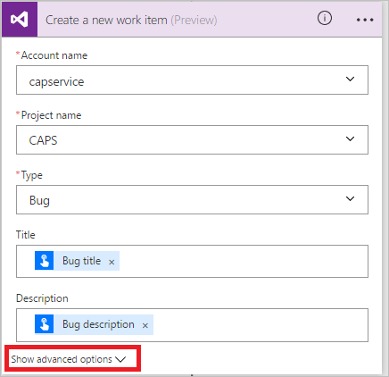

# Présentation des flux de bouton avec entrée utilisateur
Créez un flux de bouton pour exécuter des tâches de routine en appuyant simplement sur un bouton. Personnalisez votre flux en autorisant l’utilisateur à fournir des détails spécifiques à utiliser lors de l’exécution du flux. Cette rubrique vous guide lors de la création d’un flux de bouton qui accepte une entrée de l’utilisateur, lors de l’exécution du flux de bouton, puis lors de la mise en surbrillance de la façon de fournir l’entrée d’utilisateur.

Vous pouvez créer un flux de bouton dans le site web Microsoft Flow ou l’application mobile pour Microsoft Flow. Pour cette rubrique, vous allez utiliser le site web.

### Prérequis
* Un compte sur le site web Microsoft Flow.

## Ouvrir le modèle
1. Connectez-vous au [site web Microsoft Flow](https://flow.microsoft.com), entrez **Visual Studio** dans la zone de recherche, puis cliquez ou appuyez sur l’icône de recherche pour rechercher tous les modèles liés à Visual Studio :
   
      
2. Sélectionnez le modèle **Open a Priority 2 Bug in Visual Studio** (Ouvrir un bogue de priorité 2 dans Visual Studio) :
   
      
3. Sélectionnez le bouton **Utiliser ce modèle** :
   
      
   
    Ce modèle utilise Visual Studio Team Services (VSTS) et les services de notification Push. Vous devez vous connecter à ces services si vous n’êtes connecté à aucun d’eux. Le bouton **Se connecter** s’affiche uniquement si vous avez besoin de vous connecter à un service.
4. Une fois que vous êtes connecté à tous les services requis, sélectionnez le bouton **Continuer** :
   
      
5. (facultatif) Modifiez le nom du flux en tapant le nom de votre choix dans la zone en haut du portail :
   
    

## Personnaliser l’entrée de l’utilisateur
1. Dans la fiche de déclencheur, sélectionnez **Edit** (Modifier) :
   
      
2. Sélectionnez l’icône **+** pour développer la page afin que vous puissiez ajouter des champs avec entrée personnalisée :
   
    
3. Entrez le **titre** et la **description** de chaque champ personnalisé que vous souhaitez rendre disponible lorsqu’un utilisateur exécute votre flux.  
   
    Dans cet exemple, vous allez créer deux champs d’entrée personnalisés (**Étapes de reproduction du bogue** et **Gravité du bogue**) afin que les personnes qui utilisent ce flux puissent entrer les étapes pour reproduire le bogue et évaluer le niveau de gravité de celui-ci :  
   
    

## Personnaliser le bogue
1. Appuyez sur la barre de titre de la carte **Créer un élément de travail** (Create a new work item) :
   
      
2. Effectuez les sélections appropriées pour votre environnement VSTS, puis sélectionnez **Edit** (Modifier) :
   
    Par exemple, connectez-vous à myinstance.visualstudio.com en tapant **myinstance**.
   
      
3. Sélectionnez **Show advanced options** (Afficher les options avancées) pour afficher les autres champs de cette carte :
   
      
4. Placez le curseur avant le jeton **Bug title** (Titre du bogue), puis entrez « Gravité : » dans le champ de texte **Title** (Titre).
5. Avec le curseur dans le champ de texte Titre, sélectionnez le jeton **Gravité du bogue**, puis entrez « -- ».  
6. Dans le champ de texte **Description**, placez le curseur juste après le jeton **Bug description** (Description du bogue), puis appuyez sur Entrée pour commencer une nouvelle ligne.
7. Placez votre curseur sur la nouvelle ligne, puis sélectionnez le jeton **Bug Repro steps** (Étapes de reproduction du bogue) :
   
    

## Personnaliser la notification Push
1. Appuyez sur la barre de titre de la carte **Send a push notification (Envoyer une notification Push)** pour la développer.
2. Dans la liste des jetons de contenu dynamique, sélectionnez **Voir plus**, puis ajoutez le jeton **URL** dans le champ de texte **Lien**.
3. Dans le champ de texte **Link label** (Étiquette du lien), ajoutez le jeton **ID** :
   
      
4. Appuyez sur **Créer un flux** dans le menu pour créer votre flux :   

## Exécuter votre flux
Dans cette procédure pas à pas, vous allez utiliser l’application mobile Microsoft Flow pour exécuter le flux de bouton que vous venez de créer. Vous allez fournir toutes les entrées utilisateur nécessaires pour créer un bogue contenant un titre, une description, les étapes de reproduction et le niveau de gravité.  

1. Dans l’application mobile Microsoft Flow, appuyez sur l’onglet **Boutons**, puis appuyez sur le bouton **Create bug report with steps** (Créer un rapport de bogue avec des étapes).
   
      
2. Entrez le titre du bogue signalé, puis appuyez sur **Suivant**. Par exemple :
   
      
3. Entrez la description du bogue signalé, puis appuyez sur **Suivant**. Par exemple :
   
      
4. Entrez les étapes de reproduction du bogue signalé, puis appuyez sur **Suivant**. Par exemple :
   
      
5. Entrez la gravité du bogue signalé, puis appuyez sur **Terminé** :  
      
   
    Le flux s’exécute.
6. (facultatif) Appuyez sur l’onglet **Activité** pour afficher les résultats.
   
      
7. (facultatif) Affichez les résultats détaillés de l’exécution de flux en appuyant sur l’étape **Create a new work item** (Créer un élément de travail).
   
    

## Utiliser différents types d’entrée

Les flux de votre bouton peuvent également accepter des types de données enrichis. Voici la liste des types d’entrée de données que les flux de bouton acceptent : 

- Texte
- Listes déroulantes (comme des boutons radio)
- Adresse e-mail
- Fichier (par exemple, une photo sur votre téléphone)
- Case à cocher Oui ou Non
- Nombre
- Date (avec un sélecteur de calendrier)

Pour utiliser ces types d’entrée, ajoutez le déclencheur **Déclencher manuellement un flux** et ajoutez un de ces types à votre flux :

Vous pouvez également désigner certaines entrées comme obligatoires et d’autres comme facultatives. Utilisez le menu d’action (... sur le côté droit) dans chaque champ d’entrée. Il existe une limite de cinq entrées par bouton.

## Étapes suivantes
* [Partager des flux de bouton](share-buttons.md)
* [En savoir plus sur les flux de bouton](introduction-to-button-flows.md)  
* [En savoir plus sur les flux de bouton avec jetons de déclencheur](introduction-to-button-trigger-tokens.md)  

