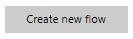
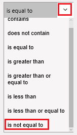
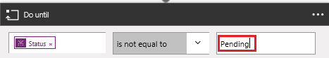
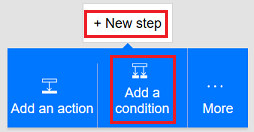
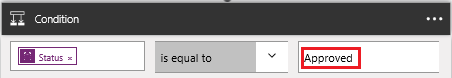
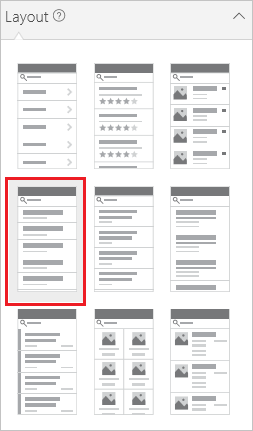
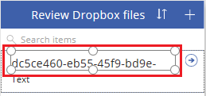
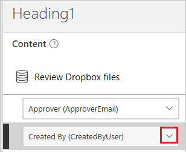
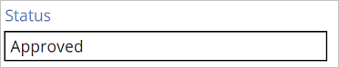

# Créer une boucle d’approbation à l’aide de Microsoft Flow et de Microsoft Common Data Service
[!INCLUDE [view-pending-approvals](includes/cc-rebrand.md)]
Le Common Data Service peut vous offrir un moyen de créer des flux qui contiennent des informations stockées dans une base de données indépendamment d’un flux. Le meilleur exemple est avec les approbations. Si vous stockez l’état de l’approbation dans une entité, votre Flow peut travailler dessus.

Dans cet exemple, vous allez créer un processus d’approbation qui démarre lorsqu’un utilisateur ajoute un fichier à Dropbox. Une fois le fichier ajouté, des informations s’affichent dans une application, dans laquelle un réviseur peut approuver ou rejeter la modification. Lorsque le réviseur approuve ou rejette la modification, le courrier de notification est envoyé et les fichiers rejetés sont supprimés de Dropbox.

En suivant les étapes de cette section, vous allez créer :

* **entité personnalisée** qui contient des informations sur chaque fichier ajouté à Dropbox et indique si l’état du fichier est approuvé, rejeté ou en attente.
* un **Flow** qui ajoute des informations à l’entité personnalisée lorsqu’un fichier est ajouté à Dropbox, envoie un message lorsque le fichier est approuvé ou rejeté et supprime les fichiers rejetés. Ces étapes montrent comment créer un tel flot à partir de zéro, mais vous pouvez créer un flot similaire à partir d’un modèle.
* **application** dans laquelle un réviseur peut approuver ou rejeter des fichiers ajoutés à Dropbox. Vous allez utiliser PowerApps pour générer automatiquement cette application en fonction des champs de l’entité personnalisée.

**Conditions préalables**

* Inscrivez-vous à [Microsoft Flow](sign-up-sign-in.md) et [powerapps](https://powerapps.microsoft.com/tutorials/signup-for-powerapps/).
* Créez des connexions à Dropbox et Office 365 Outlook, comme décrit dans [gérer vos connexions](https://powerapps.microsoft.com/tutorials/add-manage-connections/) .

## Créer l’entité
1. Connectez-vous à [powerapps.com](https://web.powerapps.com).
2. Si la barre de navigation de gauche n’apparaît pas par défaut, cliquez ou appuyez sur l’icône avec trois lignes horizontales dans le coin supérieur gauche.
   
    
3. Dans la barre de navigation de gauche, cliquez ou appuyez sur **gérer**, puis cliquez ou appuyez sur **entités**.
   
    
4. Si vous y êtes invité, cliquez ou appuyez sur **créer ma base de données**.
   
    
5. Près de l’angle supérieur droit, cliquez ou appuyez sur **nouvelle entité**.
   
    
   
    Si la fenêtre de votre navigateur n’est pas agrandie, ce bouton peut apparaître à un autre emplacement.
6. Sous **nom**de l’entité, spécifiez un nom qui ne contient pas d’espaces et n’a pas d’autre entité dans votre base de données.
   
    Pour suivre exactement cet exemple, spécifiez **réviserfichiersdropbox**.
   
    
7. Sous **nom complet**, spécifiez un nom convivial.
   
    
8. Cliquez ou appuyez sur **suivant**.
   
    

## Ajouter des champs à l’entité
1. Près de l’angle supérieur droit, cliquez ou appuyez sur **Ajouter un champ**.
   
    
2. Dans la ligne vide qui apparaît en bas de la liste des champs, définissez les propriétés d’un champ **approbateur** . (Lorsque vous définissez ces propriétés, vous pouvez basculer vers la colonne suivante en appuyant sur la touche Tab.)
   
   * Dans la colonne **nom complet** , tapez **approbateur**.
   * Dans la colonne **nom** , tapez **ApproverEmail**.
   * Dans la colonne **type** , cliquez ou appuyez sur l’option **e-mail** .
   * Dans la colonne **obligatoire** , activez la case à cocher.
     
     
3. Dans la ligne suivante, définissez les propriétés d’un champ d' **État** :
   
   * Dans la colonne **nom complet** , tapez **Status**.
   * Dans la colonne **nom** , tapez **Status**.
   * Dans la colonne **type** , cliquez ou appuyez sur l’option **Text (texte** ).
   * Dans la colonne **Propriétés** , laissez la valeur par défaut.
   * Dans la colonne **obligatoire** , activez la case à cocher.
     
     
4. Dans la ligne suivante, définissez les propriétés d’un champ **fileid** :
   
   * Dans la colonne **nom complet** , tapez **identificateur de fichier**.
   * Dans la colonne **nom** , tapez **fileid**.
   * Dans la colonne **type** , cliquez ou appuyez sur l’option **Text (texte** ).
   * Dans la colonne **Propriétés** , laissez la valeur par défaut.
   * Dans la colonne **unique** , activez la case à cocher.
   * Dans la colonne **obligatoire** , activez la case à cocher.
     
     
5. Près du bord droit, cliquez ou appuyez sur les points de suspension (...) du champ **fileid** , puis cliquez ou appuyez sur **définir comme champ de titre**.
   
    
6. Près de l’angle inférieur gauche, cliquez ou appuyez sur **créer**.
   
    
7. facultatif Lorsque la liste des entités réapparaît, agrandissez la fenêtre de votre navigateur si elle n’est pas déjà agrandie, puis cliquez ou appuyez sur l’en-tête de colonne **type** . La liste est triée avec les entités personnalisées, telles que celle que vous venez de créer, qui apparaît en haut.

## Se connecter et créer un Flow
1. Ouvrez le [portail Microsoft Flow](https://flow.microsoft.com).
2. Agrandissez la fenêtre de votre navigateur si elle n’est pas déjà agrandie, puis cliquez ou appuyez sur **se connecter dans** l’angle supérieur droit.
   
    
3. Dans le menu en haut à droite, sélectionnez l’environnement dans lequel vous avez créé la base de données dans powerapps.com.
   
    **Remarque**: Si vous ne sélectionnez pas le même environnement, vous ne verrez pas votre entité.
4. Près de l’angle supérieur gauche, cliquez ou appuyez sur **mes flux**.
   
    
5. Près de l’angle supérieur droit, cliquez ou appuyez sur **créer un nouveau fluide**.
   
    

## Démarrer quand un fichier est ajouté
1. Dans la zone qui contient **Rechercher d’autres déclencheurs**, tapez ou collez **Dropbox**, puis cliquez ou appuyez sur **Dropbox-quand un fichier est créé**.
   
    
2. Sous **dossier**, cliquez ou appuyez sur l’icône de dossier, puis accédez au dossier dans lequel les fichiers seront ajoutés.
   
    

## Ajouter des données à l’entité
1. Cliquez ou appuyez sur **nouvelle étape**, puis cliquez ou appuyez sur **Ajouter une action**.
   
    
2. Dans la zone qui contient **Rechercher d’autres actions**, tapez ou collez **Common Data Service**, puis cliquez ou appuyez sur **Common Data Service-créer un objet**.
   
    
3. Sous **l’entité**, tapez ou collez la **révision**, puis cliquez ou appuyez sur **vérifier les fichiers Dropbox**.
   
    
4. Sous **titre**, cliquez ou appuyez dans la zone, puis cliquez ou appuyez sur **nom de fichier** dans la liste des jetons de paramètre pour ajouter ce jeton au champ.
   
    
5. Sous **approbateur**, tapez ou collez l’adresse de messagerie de la personne qui examinera les fichiers.
   
    **Remarque**: pour faciliter le test du fluide, spécifiez votre propre adresse. Vous pouvez le modifier ultérieurement, lorsque le workflow est prêt pour une utilisation réelle.
   
    
6. Sous **État**, tapez ou collez **en attente**.
   
    
7. Sous **identificateur de fichier**, cliquez ou appuyez dans la zone, puis cliquez ou appuyez sur **identificateur de fichier** dans la liste des jetons de paramètre pour ajouter ce jeton au champ.
   
    

## Vérifier si le fichier a été révisé
1. Sous l' **action créer un objet** , cliquez ou appuyez sur **nouvelle étape**, cliquez ou appuyez sur **plus**, puis cliquez ou appuyez sur **Ajouter un Do Until**.
   
    
2. Dans l’angle supérieur gauche de l’action **Do Until** , cliquez ou appuyez dans la zone contenant **choisir une valeur**.
   
    
   
    **Remarque**: Si votre fenêtre de navigateur n’est pas agrandie, cliquez ou appuyez dans la zone supérieure contenant **choisir une valeur**.
3. Sous **sorties de Create Object**, cliquez ou appuyez sur **Status** pour ajouter ce jeton de paramètre au champ.
   
    
4. Ouvrez la liste à proximité du centre de l’action **Do Until** , puis cliquez ou appuyez sur **n’est pas égal à**.
   
    
5. Dans l’angle supérieur droit de l’action **Do Until** , tapez ou collez en **attente** dans la zone contenant **choisir une valeur**.
   
    
   
    **Remarque**: Si votre fenêtre de navigateur n’est pas agrandie, cliquez ou appuyez dans la zone inférieure contenant **choisir une valeur**.
6. Vers le bas de l’action **Do Until** , cliquez ou appuyez sur **Ajouter une action**.
   
    
7. Dans la zone qui contient **Rechercher d’autres actions**, tapez **Common**, puis cliquez ou appuyez sur **Common Data Service-obtenir un objet**.
   
    
8. Sous **l’espace de noms**, cliquez ou appuyez sur votre base de données.
9. Sous **l’entité**, tapez ou collez la **révision**, puis cliquez ou appuyez sur **vérifier les fichiers Dropbox**.
   
    
10. Sous **ID d’objet**, cliquez ou appuyez dans la zone, puis cliquez ou appuyez sur le jeton de paramètre d' **identificateur de fichier** pour l’ajouter au champ.
    
     

## Vérifier si l’élément a été approuvé
1. Sous l’action **Do-Until** , cliquez ou appuyez sur **nouvelle étape**, puis cliquez ou appuyez sur **Ajouter une condition**.
   
    
2. Dans l’angle supérieur gauche de la condition, cliquez ou appuyez dans la zone contenant **choisir une valeur**.
   
    
   
    **Remarque**: Si votre fenêtre de navigateur n’est pas agrandie, cliquez ou appuyez dans la zone supérieure contenant **choisir une valeur**.
3. Sous **sorties de l’objet d’extraction**, cliquez ou appuyez sur le jeton de paramètre d' **État** pour l’ajouter au champ.
   
    
4. Dans le coin supérieur droit de la condition, tapez ou collez **approuvé** dans la zone contenant **choisir une valeur**.
   
    
   
    **Remarque**: Si votre fenêtre de navigateur n’est pas agrandie, tapez ou collez **approuvé** dans la zone inférieure contenant **choisir une valeur**.

## Envoyer un message de notification
1. Sous **si oui, ne rien faire**, cliquez ou appuyez sur **Ajouter une action**.
   
    
2. Dans la zone qui contient **Rechercher d’autres actions**, tapez ou collez **Envoyer un message**électronique, puis cliquez ou appuyez sur **Office 365 Outlook-envoyer un e-mail**.
   
    
3. Sous **à**, tapez ou collez l’adresse de la personne que vous souhaitez notifier lorsqu’un élément est accepté.
   
    **Remarque**: pour faciliter le test du fluide, spécifiez votre propre adresse. Vous pouvez le modifier lorsque le workflow est prêt pour une utilisation réelle.
   
    
4. Sous **objet**, cliquez ou appuyez sur dans la zone, puis cliquez ou appuyez sur le jeton de paramètre de **nom de fichier** pour l’ajouter au champ.
   
    
5. Sous **corps**, tapez ou collez **l’élément a été approuvé.**
   
    
6. Sous **si non, ne rien faire**, répétez les étapes 1-5 de cette procédure, sauf si vous spécifiez le corps du message électronique lorsque **l’élément a été rejeté.**
   
    

## Supprimer les fichiers rejetés
1. Sous les champs du courrier de rejet, cliquez ou appuyez sur **Ajouter une action**.
   
    
2. Dans la zone qui contient **Rechercher d’autres actions**, tapez ou collez **Dropbox**, puis cliquez ou appuyez sur **Dropbox-supprimer le fichier**.
   
    
3. Sous **fichier**, cliquez ou appuyez dans la zone, puis cliquez ou appuyez sur le paramètre jeton de l' **identificateur de fichier** pour l’ajouter au champ.
   
    

## Enregistrer le Flow
1. En haut de l’écran, tapez ou collez un nom pour le Flow que vous êtes en train de créer, puis cliquez ou appuyez sur **créer un Flow**.
   
    
2. Cliquez ou appuyez sur **Fermer** , puis cliquez ou appuyez sur **terminé**.
3. Dans Dropbox, ajoutez au moins deux fichiers au dossier que vous avez spécifié : un pour tester l’approbation et un pour tester le rejet.

## générer l’application
1. Connectez-vous à [powerapps.com](https://web.powerapps.com), puis cliquez ou appuyez sur **New App (nouvelle application** ) dans la partie inférieure de la barre de navigation de gauche.
   
    
2. Dans la boîte de dialogue qui s’affiche, cliquez ou appuyez sur l’option pour ouvrir l’PowerApps Studio pour Windows ou PowerApps Studio pour le Web.
3. Si vous avez ouvert PowerApps Studio pour Windows, cliquez ou appuyez sur **nouveau** dans la barre de navigation de gauche.
4. Sous **créer une application à partir de vos données**, cliquez ou appuyez sur **mode téléphone** dans la vignette **Common Data Service** .
   
    
5. Dans la zone de **recherche** , tapez ou collez la **révision**.
   
    
6. Sous **choisir une entité**, cliquez ou appuyez sur **vérifier les fichiers Dropbox**.
   
    
7. Près de l’angle inférieur droit, cliquez ou appuyez sur **Connect (connecter**).
   
    
8. Si l’écran d’accueil de la visite guidée de Intro s’affiche, suivez la visite guidée pour vous familiariser avec les PowerApps (ou cliquez ou appuyez sur **Skip**).
   
    
   
    Vous pouvez toujours suivre la visite guidée ultérieurement en cliquant ou appuyant sur l’icône de point d’interrogation près de l’angle supérieur gauche, puis en cliquant ou appuyant sur **Take the Intro tour**.
9. facultatif Vers le bas de l’écran, faites glisser le curseur pour augmenter le zoom afin que l’application soit plus facile à voir.
   
    

## Personnaliser l’application
1. Dans la barre de navigation de droite, cliquez ou appuyez sur la disposition qui comprend un en-tête et une description.
   
    
2. Sur la **BrowseScreen**, cliquez ou appuyez sur juste sous la barre de recherche pour sélectionner le contrôle de zone de texte de plus grande taille.
   
    
3. Dans le volet de droite, ouvrez la liste inférieure en cliquant ou en appuyant sur la flèche vers le bas.
   
    
4. Dans la liste inférieure, cliquez ou appuyez sur **title** pour afficher le nom de fichier des fichiers ajoutés.
   
    
5. Dans le volet de droite, ouvrez la liste supérieure, puis cliquez ou appuyez sur **Status** pour afficher l’état de chaque fichier.
   
    

## Tester la solution globale
1. Dans PowerApps, ouvrez le mode aperçu en cliquant ou en appuyant sur le bouton de lecture près de l’angle supérieur gauche.
   
    
2. Pour le premier fichier de la liste, cliquez ou appuyez sur la flèche pour afficher les détails de ce fichier.
   
    
3. Dans l’angle supérieur droit, cliquez ou appuyez sur l’icône en forme de crayon pour modifier les détails du fichier.
   
    
4. Dans la zone **État** , tapez ou collez **approuvé**.
   
    
5. Dans l’angle supérieur droit, cliquez ou appuyez sur l’icône de coche pour enregistrer vos modifications et revenir à l’écran de détails.
   
    
   
    Dans quelques minutes, vous recevrez un courrier électronique indiquant que le fichier a été approuvé.
6. Dans l’angle supérieur droit, cliquez ou appuyez sur le bouton précédent pour revenir à l’écran de navigation.
   
    
7. Pour l’autre fichier de la liste, cliquez ou appuyez sur la flèche pour afficher les détails de ce fichier.
   
    
8. Dans l’angle supérieur droit, cliquez ou appuyez sur l’icône en forme de crayon pour modifier les détails du fichier.
   
    
9. Dans la zone **État** , tapez ou collez **rejeté** (ou tout sauf **approuvé**, y compris **aproved** ou **approuuvé**).
   
    
10. Dans l’angle supérieur droit, cliquez ou appuyez sur l’icône de coche pour enregistrer vos modifications et revenir à l’écran de détails.
    
     
    
     Dans quelques minutes, vous recevrez un courrier électronique indiquant que le fichier a été rejeté et le fichier sera supprimé de Dropbox.

