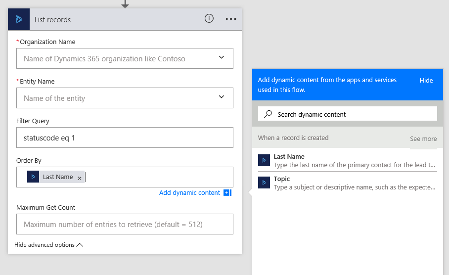

# Créer un flux à l’aide de Dynamics 365 (en ligne)
En utilisant un connecteur Dynamics 365, vous pouvez créer des flux qui se lancent lorsqu’un événement se produit dans Dynamics 365 ou un autre service, qui effectue ensuite une action dans Dynamics 365 ou un autre service. 

Dans Microsoft Flow, vous pouvez définir des workflows automatisés entre vos applications et services favoris pour synchroniser des fichiers, obtenir des notifications, collecter des données, etc. Pour plus d’informations, consultez [Prise en main de Microsoft Flow](getting-started.md).

> [!IMPORTANT] 
> Pour appeler un déclencheur de flux, l’entité d’engagement client Dynamics 365 utilisée avec le flux doit avoir le **suivi des modifications** activé. Plus d’informations : [Activer le suivi des modifications pour contrôler la synchronisation des données](https://docs.microsoft.com/dynamics365/customer-engagement/admin/enable-change-tracking-control-data-synchronization) 

## Créer un flux à partir d’un modèle
Vous pouvez créer un flux à l’aide de l’un des nombreux modèles disponibles, dont voici des exemples :

* Lorsqu’un objet est créé dans Dynamics 365, créez un élément de liste dans SharePoint.
* Créez des enregistrements de prospects Dynamics 365 à partir d’un tableau Excel.
* Copiez les comptes Dynamics 365 vers les clients Dynamics 365 for Operations.

Pour créer un flux à partir d’un modèle, procédez comme suit.

1. Connectez-vous au [site web Microsoft Flow](https://flow.microsoft.com/).
2. Cliquez ou appuyez sur **Services**, puis sur **Dynamics 365**.
3. Plusieurs modèles sont disponibles. Pour commencer, sélectionnez le modèle de votre choix.

## Créer une tâche à partir d’un prospect
Si le modèle dont vous avez besoin n’est pas disponible, créez entièrement un flux. Cette procédure pas à pas vous montre comment créer une tâche dans Dynamics 365 lorsqu’un prospect est créé dans Dynamics 365.

1. Connectez-vous au [site web Microsoft Flow](https://flow.microsoft.com/).
2. Cliquez ou appuyez sur **Mes flux**, puis sur **Créer entièrement**.
3. Dans la liste des déclencheurs de flux, cliquez ou appuyez sur **Dynamics 365 - Lorsqu’un enregistrement est créé**.
4. Si vous y êtes invité, connectez-vous à Dynamics 365.
5. Sous **Nom de l’organisation**, sélectionnez l’instance Dynamics 365 que vous souhaitez que le flux écoute.
6. Sous **Nom de l’entité**, sélectionnez l’entité que vous souhaitez écouter, qui agira comme un déclencheur du flux.
   
     Pour cette procédure pas à pas, sélectionnez **Prospects**.
   
    
    > [IMPORTANT] Pour que le flux se déclenche sur l’entité Dynamics 365, la définition d’entité doit avoir le suivi des modifications activé. Consultez [Activer le suivi des modifications pour contrôler la synchronisation des données](https://docs.microsoft.com/dynamics365/customer-engagement/admin/enable-change-tracking-control-data-synchronization)
    
7. Cliquez ou appuyez sur **Nouvelle étape**, puis sur **Ajouter une action**.
8. Cliquez ou appuyez sur **Dynamics 365 – Créer un enregistrement**.
9. Sous **Nom de l’organisation**, sélectionnez l’instance Dynamics 365 où vous souhaitez que le flux crée l’enregistrement. Notez qu’il ne s’agit pas nécessairement de l’instance à partir de laquelle l’événement est déclenché.
10. Sous **Nom de l’entité**, sélectionnez l’entité qui permet de créer un enregistrement lorsque l’événement se produit.
    
     Pour cette procédure pas à pas, sélectionnez **Tâches**.
11. Une zone **Objet** s’affiche. Lorsque vous cliquez ou appuyez dessus, un volet de contenu dynamique s’affiche dans lequel vous pouvez sélectionner un des champs suivants.
    
    * **Nom**. Si vous sélectionnez ce champ, le nom du prospect est inséré dans le champ **Objet** de la tâche lors de sa création.
    * **Rubrique**. Si vous sélectionnez ce champ, le champ **Rubrique** du prospect est inséré dans le champ **Objet** de la tâche lors de sa création.
    
    Pour cette procédure pas à pas, sélectionnez **Rubrique**.
    
    
    
    > **Conseil :** dans le volet de contenu dynamique, cliquez ou appuyez sur **Voir plus** pour afficher plus de champs associés à l’entité. Par exemple, vous pouvez également remplir le champ **Objet** de la tâche avec le champ **Nom de la société**, **Client**, **Description** ou **E-mail** du prospect.
    > 
    > 
12. Cliquez ou appuyez sur **Créer un flux**.

## Créer une tâche Wunderlist à partir d’une tâche Dynamics 365
Cette procédure pas à pas vous montre comment créer une tâche dans [Wunderlist](https://www.wunderlist.com) lorsqu’une tâche est créée dans Dynamics 365. Wunderlist est un service Internet qui permet de créer des listes de tâches, d’ajouter des rappels ou d’effectuer le suivi de vos courses.

1. Connectez-vous au [site web Microsoft Flow](https://flow.microsoft.com/).
2. Cliquez ou appuyez sur **Mes flux**, puis sur **Créer entièrement**.
3. Dans la liste des déclencheurs de flux, cliquez ou appuyez sur **Dynamics 365 - Lorsqu’un enregistrement est créé**.
4. Sous **Nom de l’organisation**, sélectionnez l’instance Dynamics 365 que vous souhaitez que le flux écoute.
5. Sous **Nom de l’entité**, sélectionnez l’entité que vous souhaitez écouter, qui agira comme un déclencheur du flux.
   
    Pour cette procédure pas à pas, sélectionnez **Tâches**.
6. Cliquez ou appuyez sur **Nouvelle étape**, puis sur **Ajouter une action**.
7. Tapez *créer une tâche*, puis cliquez ou appuyez sur **Wunderlist – Créer une tâche**.
8. Sous **ID de la liste**, sélectionnez **inbox**.
9. Sous **Titre**, sélectionnez **Objet** dans le volet de contenu dynamique.
10. Cliquez ou appuyez sur **Créer un flux**.  

## Logique basée sur des déclencheurs
Des déclencheurs comme **Lorsqu’un enregistrement est créé**, **Lorsqu’un enregistrement est mis à jour** et **Lorsqu’un enregistrement est supprimé** lancent votre flux dans un délai de quelques minutes après la survenance de l’événement.  Dans de rares cas, votre flux peut prendre jusqu’à 2 heures pour se déclencher.

Quand le déclencheur s’active, le flux reçoit une notification mais s’exécute sur les données qui existent au moment où l’action s’exécute.  Par exemple, si votre flux se déclenche quand un nouvel enregistrement est créé et que vous mettez à jour l’enregistrement à deux reprises avant l’exécution du flux, votre flux s’exécute une seule fois avec les données les plus récentes.

## Spécifier des options avancées
Lorsque vous ajoutez une étape à un flux, vous pouvez cliquer ou appuyer sur **Afficher les options avancées** pour ajouter un filtre ou effectuer un tri par requête pour contrôler la façon dont les données sont filtrées dans le flux.

Par exemple, vous pouvez utiliser une requête de filtre pour récupérer uniquement les contacts actifs, puis classer ces derniers par nom. Pour ce faire, entrez la requête de filtre OData **statuscode eq 1** et sélectionnez **Nom** dans le volet de contenu dynamique. Pour plus d’informations sur le filtre et le tri par des requêtes, consultez [MSDN : $filter](https://msdn.microsoft.com/library/gg309461.aspx#Anchor_1) et [MSDN : $orderby](https://msdn.microsoft.com/library/gg309461.aspx#Anchor_2).

  

### Meilleures pratiques lors de l’utilisation des options avancées
Lorsque vous ajoutez une valeur à un champ, vous devez faire correspondre le type de champ, que vous tapiez une valeur ou en sélectionniez une à partir du volet de contenu dynamique.

| Type de champ | Utilisation | Emplacement | Nom | Type de données |
| --- | --- | --- | --- | --- |
| Champs de texte |Les champs de texte nécessitent une seule ligne de texte ou du contenu dynamique (champ de type texte). En voici quelques exemples : **Catégorie** et **Sous-catégorie**. |**Paramètres** > **Personnalisations** > **Personnaliser le système** > **Entités** > **Tâche** > **Champs** |**category** |**Ligne unique de texte** |
| Champs de type entier |Certains champs nécessitent un entier ou du contenu dynamique (champ de type Entier). En voici quelques exemples : **Pourcentage effectué** et **Durée**. |**Paramètres** > **Personnalisations** > **Personnaliser le système** > **Entités** > **Tâche** > **Champs** |**percentcomplete** |**Nombre entier** |
| Champs de date |Certains champs nécessitent une date entrée au format mm/jj/aaaa ou du contenu dynamique (champ de type date). En voici quelques exemples : **Créé le**, **Date de début**, **Début réel**, **Dernière durée de suspension**, **Fin réelle** et **Date d’échéance**. |**Paramètres** > **Personnalisations** > **Personnaliser le système** > **Entités** > **Tâche** > **Champs** |**createdon** |**Date et heure** |
| Champs qui nécessitent à la fois un ID d’enregistrement et un type de recherche |Certains champs qui font référence à un autre enregistrement d’entité nécessitent l’ID d’enregistrement et le type de recherche. |**Paramètres** > **Personnalisations** > **Personnaliser le système** > **Entités** > **Compte** > **Champs** |**accountid** |**Clé primaire** |

### Autres exemples de champs qui nécessitent à la fois un ID d’enregistrement et un type de recherche
Pour compléter le tableau précédent, voici plusieurs exemples de champs qui ne fonctionnent pas avec les valeurs sélectionnées à partir de la liste de contenu dynamique. Au lieu de cela, ces champs nécessitent à la fois un ID d’enregistrement et un type de recherche entrés dans les champs PowerApps.

* **Propriétaire** et **Type de propriétaire**.
  
  * Le champ **Propriétaire** doit être un ID d’enregistrement d’utilisateur ou d’équipe valide.
  * Le **Type de propriétaire** doit avoir la valeur **systemusers** ou **teams**.
* **Client** et **Type de client**.
  
  * Le champ **Client** doit être un ID d’enregistrement de contact ou de compte.
  * Le champ **Type de client** doit être **accounts** ou **contacts**.
* **Concernant** et **Type Concernant**.
  
  * Le champ **Concernant** doit être un ID d’enregistrement valide (comme un ID d’enregistrement de contact ou de compte).
  * Le **Type Concernant** doit être un type de recherche pour l’enregistrement, tel que **accounts** ou **contacts**.

Cet exemple ajoute un enregistrement de compte correspondant à l’ID d’enregistrement, en ajoutant le champ **Concernant** de la tâche.

  

Cet exemple affecte également la tâche à un utilisateur spécifique en fonction de l’ID d’enregistrement de l’utilisateur.

  

Pour rechercher l’ID d’un enregistrement, consultez [Rechercher l’ID d’un enregistrement](#find-the-records-id) plus loin dans cette rubrique.

> **Important :** les champs ne doivent pas contenir de valeur s’ils ont la description « Utilisation interne uniquement ». Ces champs sont **Chemin d’accès traversé**, **Paramètres supplémentaires** et **Numéro de version de la règle du fuseau horaire**.
> 
> 

## Rechercher l’ID d’un enregistrement
1. Dans l’application web Dynamics 365, ouvrez un enregistrement, comme un enregistrement de compte.
2. Dans la barre d’outils Actions, cliquez ou appuyez sur **Ouvrir dans une nouvelle fenêtre**
    (ou cliquez ou appuyez sur **Envoyer un lien par courrier électronique** pour copier l’URL complète dans votre programme de messagerie par défaut).
   
    Dans la barre d’adresse du navigateur web, l’URL contient l’ID d’enregistrement entre les caractères d’encodage %7b et %7d.
   
   

## Rubriques connexes
[Résolution des problèmes de flux](fix-flow-failures.md)

[Questions et réponses sur Microsoft Flow dans votre organisation](organization-q-and-a.md)

[Forum aux questions](frequently-asked-questions.md)

