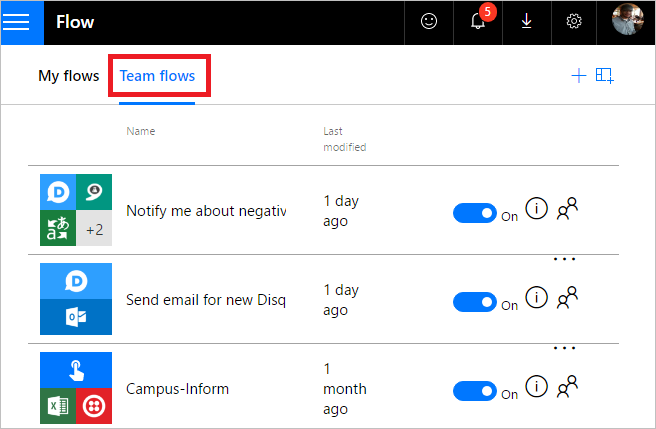

# Créer des flux d’équipe
Créez un flux d’équipe en ajoutant d’autres personnes de votre organisation en tant que propriétaires. Tous les propriétaires d’un flux d’équipe peuvent exécuter les actions suivantes :

* Afficher l’historique du flux (autrement dit, chaque exécution).
* Gérez les propriétés du flux : par exemple, démarrez ou arrêtez le flux, ajoutez des propriétaires ou mettez à jour les informations d’identification pour une connexion.
* Modifiez la définition du flux : par exemple, ajoutez ou supprimez une condition ou action.
* Ajoutez et supprimez d’autres propriétaires (mais pas le créateur du flux).
* Supprimer le flux.

Si vous êtes le créateur ou le propriétaire d’un flux d’équipe, ce dernier est répertorié sous l’onglet **Flux d’équipes** de [Microsoft Flow](https://flow.microsoft.com).

> [!NOTE]
> Les connexions partagées peuvent être utilisées **uniquement** dans le flux dans lequel elles ont été créées.
> 
> 

Les propriétaires peuvent utiliser les services dans un flux mais ils ne peuvent pas modifier les informations d’identification d’une connexion créée par un autre propriétaire.

## Conditions préalables
Vous devez avoir un [abonnement Microsoft Flow payant](https://flow.microsoft.com/pricing/) pour créer un flux d’équipe. En outre, vous devez être le créateur ou le propriétaire pour ajouter/supprimer des propriétaires d’un flux d’équipe.

## Créer un flux d’équipe
Pour créer un flux d’équipe ou pour ajouter des propriétaires à un flux d’équipe, procédez comme suit.

1. Connectez-vous à [Microsoft Flow](https://flow.microsoft.com), puis sélectionnez **Mes flux**.
2. Sélectionnez l’icône représentant des personnes en regard du flux que vous souhaitez modifier :
   
    
3. Entrez le nom, l’adresse e-mail ou le nom du groupe ou de la personne que vous souhaitez ajouter en tant que propriétaire :
   
    
4. Dans la liste qui apparaît, sélectionnez l’utilisateur que vous souhaitez définir comme propriétaire :
   
    
   
     L’utilisateur ou le groupe sélectionné devient un des propriétaires du flux :
   
    
   
     Félicitations, le flux d’équipe a été créé !

## Supprimer un propriétaire
> [!IMPORTANT]
> Quand vous supprimez un propriétaire dont les informations d’identification sont utilisées pour accéder aux services Microsoft Flow, vous devez mettre à jour les informations d’identification de ces connexions afin que le flux continue à s’exécuter correctement.
> 
> 

1. Sélectionnez l’icône représentant des personnes en regard du flux que vous souhaitez modifier :
   
    
2. Sélectionnez l’icône **Supprimer** correspondant au propriétaire que vous souhaitez supprimer :
   
    
3. Dans la boîte de dialogue de confirmation, sélectionnez **Supprimer ce propriétaire** :
   
    
4. Félicitations, l’utilisateur ou le groupe que vous avez supprimé n’est plus répertorié en tant que propriétaire du flux :
   
    

## Connexions incorporées et autres
Les connexions utilisées dans un flux se répartissent en deux catégories :

* **Incorporées** &mdash; Ces connexions sont utilisées dans le flux.
* **Autres** &mdash; Ces connexions ont été définies pour un flux mais ne sont pas utilisées dans celui-ci.

Si vous arrêtez une connexion dans un flux, celle-ci s’affiche dans la liste de connexions **Autres** et y reste jusqu’à ce qu’un propriétaire l’inclue à nouveau dans le flux.

La liste des connexions apparaît sous la liste des propriétaires dans les propriétés d’un flux :

