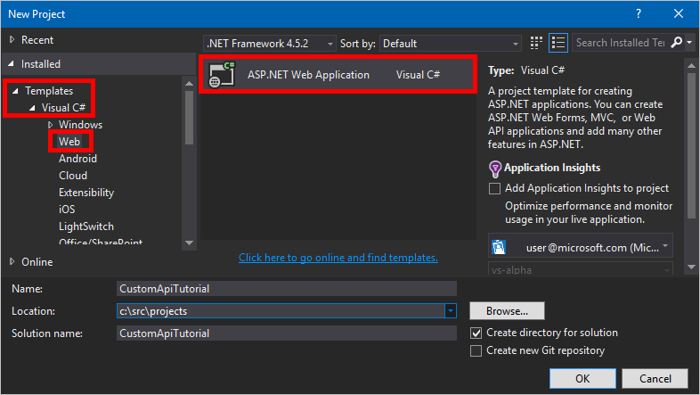

# <a name="build-a-custom-connector-for-a-web-api-in-microsoft-flow"></a>Créer un connecteur personnalisé pour une API web dans Microsoft Flow
Ce tutoriel vous montre comment créer une API web ASP.NET, l’héberger sur Azure Web Apps, activer l’authentification Azure Active Directory, puis inscrire l’API web ASP.NET dans Microsoft Flow. Une fois que vous avez inscrit l’API, vous pouvez vous y connecter et l’appeler à partir de votre flux. 

## <a name="prerequisites"></a>Prérequis
* Un [abonnement Azure](https://azure.microsoft.com/free/).
* Un [compte PowerApps](https://powerapps.microsoft.com).
* [Visual Studio](https://www.visualstudio.com/vs/) 2013 ou version ultérieure.

## <a name="create-an-aspnet-web-api-and-deploy-it-to-azure"></a>Créer une API web ASP.NET et la déployer vers Azure
1. Dans Visual Studio, cliquez sur **Fichier** > **Nouveau projet** pour créer une application web C# ASP.NET.
   
    
2. Sélectionnez le modèle **API web**.  Laissez **Héberger dans le cloud** activé.  Cliquez sur **Modifier l’authentification**.
   
    
3. Sélectionnez **Aucune authentification**, puis cliquez sur **OK**.
   
    
4. Cliquez sur **OK** dans la boîte de dialogue **Nouveau projet ASP.NET**.  La boîte de dialogue Configurer l’application web Microsoft Azure s’affiche.
   
    ]
   
    Sélectionnez votre compte Azure, tapez le **nom de l’application web** (ou laissez la valeur par défaut), puis sélectionnez votre **abonnement** Azure.  Sélectionnez ou créez un **plan App Service** (collection d’applications web dans votre abonnement).  Sélectionnez ou créez un **groupe de ressources** (regroupement de ressources Azure dans votre abonnement).  Sélectionnez la région où l’application web doit être déployée.  Si nécessaire pour votre API web, sélectionnez ou créez un compte de **serveur de base de données** Azure.  Enfin, cliquez sur **OK**.
5. Créez votre API web.
   
   > [!NOTE]
   > Si vous ne disposez pas de code prêt pour l’API web, suivez le tutoriel [Bien démarrer avec ASP.NET Web API 2 (C#)](https://www.asp.net/web-api/overview/getting-started-with-aspnet-web-api/tutorial-your-first-web-api).
   > 
   > 
6. Pour connecter l’API web à PowerApps, vous avez besoin d’un fichier [Swagger](http://swagger.io/) décrivant les opérations associées.  Vous pouvez écrire votre propre fichier OpenAPI à l’aide de l’[éditeur en ligne](http://editor.swagger.io/), mais pour ce tutoriel, vous allez utiliser un outil open source appelé [Swashbuckle](https://github.com/domaindrivendev/Swashbuckle/blob/master/README.md).  Installez le package Nuget Swashbuckle dans votre projet Visual Studio en cliquant sur **Outils** > **Gestionnaire de package NuGet** > **Console du Gestionnaire de package**, puis dans la Console du Gestionnaire de package, tapez la commande `Install-Package Swashbuckle`.
   
    
   
   > [!TIP]
   > Lorsque vous exécutez votre application API web après l’installation de Swashbuckle, un fichier OpenAPI est généré à l’URL `http://<your root URL>/swagger/docs/v1`.  Une interface utilisateur générée est également disponible à l’adresse `http://<your root URL>/swagger`.
   > 
   > 
7. Lorsque votre API web est prête, publiez-la sur Azure. Pour publier à partir de Visual Studio, cliquez avec le bouton droit sur le projet web dans l’Explorateur de solutions, cliquez sur **Publier...**, puis suivez les invites de la boîte de dialogue Publier.
8. Récupérez le fichier JSON OpenAPI en accédant à `https://<azure-webapp-url>/swagger/docs/v1`.  Enregistrez le contenu en tant que fichier JSON.  Selon votre navigateur, vous devrez peut-être copier et coller le texte dans un fichier texte vide.   
   
   > [!IMPORTANT]
   > Un document OpenAPI avec des ID d’opération dupliqués n’est pas valide. Si vous utilisez l’exemple de modèle C#, l’ID d’opération `Values_Get` est répété deux fois. Vous pouvez corriger ce problème en définissant une instance sur `Value_Get` et en republiant.
   > 
   > Vous pouvez également télécharger un [exemple OpenAPI](https://pwrappssamples.blob.core.windows.net/samples/webAPI.json) à partir de ce tutoriel. Veillez à supprimer les commentaires (commençant par `//`) avant de l’utiliser.
   > 
   > 

## <a name="set-up-azure-active-directory-authentication"></a>Configurer l’authentification Azure Active Directory
Vous allez maintenant créer deux applications Azure Active Directory (AAD) dans Azure.  Pour obtenir un exemple de procédure à suivre, consultez le [tutoriel sur Azure Resource Manager](customapi-azure-resource-manager-tutorial.md#enable-authentication-in-azure-active-directory).

> [!IMPORTANT]
> Celles-ci doivent être situées dans le même répertoire.
> 
> 

### <a name="first-aad-application-securing-the-web-api"></a>Première application AAD : sécurisation de l’API web
La première application AAD permet de sécuriser l’API web. Nommez-la **webAPI**.  Suivez les étapes du tutoriel dont le lien est indiqué ci-dessus (uniquement la section intitulée Activer l’authentification dans Azure Active Directory) en indiquant les valeurs suivantes :

* URL de connexion : `https://login.windows.net`
* URL de réponse : `https://<your-root-url>/.auth/login/aad/callback`
* Il est inutile de spécifier une clé de client.
* Il est inutile de déléguer des autorisations.
* **Important !** Notez l’ID de l’application.  Vous en aurez besoin ultérieurement.

### <a name="second-aad-application-securing-the-custom-connector-and-delegated-access"></a>Deuxième application AAD : sécurisation du connecteur personnalisé et accès délégué
La deuxième application AAD permet de sécuriser l’inscription du connecteur personnalisé et d’acquérir un accès délégué à l’API web protégée par la première application. Nommez-la **webAPI-customAPI** .

* URL de connexion : `https://login.windows.net`
* URL de réponse : `https://msmanaged-na.consent.azure-apim.net/redirect`
* Ajoutez des autorisations pour obtenir un accès délégué à l’API web.
* Notez l’ID de cette application également, car vous en aurez besoin ultérieurement.
* Générez une clé de client et stockez-la dans un emplacement sécurisé. Vous en aurez besoin plus tard.

## <a name="add-authentication-to-your-azure-web-app"></a>Ajouter l’authentification à votre application web Azure
1. Connectez-vous au [portail](https://portal.azure.com), puis recherchez l’application web que vous avez déployée dans la première section.
2. Cliquez sur **Paramètres**, puis sélectionnez **Authentification/autorisation**.
3. Activez **Authentification App Service**, puis sélectionnez **Azure Active Directory**.  Dans le panneau suivant, sélectionnez **Express**.  
4. Cliquez sur **Sélectionner une application AD existante**, puis sélectionnez l’application AAD **webAPI** que vous avez créée précédemment.

Vous devez maintenant pouvoir utiliser AAD pour authentifier votre application web.

## <a name="add-the-custom-connector-to-microsoft-flow"></a>Ajouter le connecteur personnalisé à Microsoft Flow
1. Modifiez votre fichier OpenAPI pour ajouter l’objet `securityDefintions` et l’authentification AAD utilisée pour l’application web. La section de votre fichier OpenAPI avec la propriété **host** doit ressembler à ceci :

```javascript
// File header should be above here...

"host": "<your-root-url>",
"schemes": [
    "https"         //Make sure this is https!
],
"securityDefinitions": {
    "AAD": {
        "type": "oauth2",
        "flow": "accessCode",
        "authorizationUrl": "https://login.windows.net/common/oauth2/authorize",
        "tokenUrl" : "https://login.windows.net/common/oauth2/token",
        "scopes": {}
    }
},

// The rest of the OpenAPI follows...
```

1. Accédez à [Microsoft Flow](https://flow.powerapps.com), puis ajoutez un connecteur personnalisé, comme décrit dans [Inscrire et utiliser des connecteurs personnalisés dans Microsoft Flow](register-custom-api.md).
2. Une fois que vous avez chargé votre fichier OpenAPI, l’Assistant détecte automatiquement que vous utilisez l’authentification AAD pour votre API web.
3. Configurez l’authentification AAD pour le connecteur personnalisé.  
   
   * **ID client** : *ID client de webAPI-CustomAPI*
   * **Secret** : *clé de client de webAPI-CustomAPI*
   * **URL de connexion** : `https://login.windows.net`
   * **ResourceUri** : *ID client de webAPI*
4. Cliquez sur **Créer** pour créer une connexion vers le connecteur personnalisé.

## <a name="next-steps"></a>Étapes suivantes
Passez en revue le [tutoriel sur le connecteur personnalisé Azure Resource Manager](customapi-azure-resource-manager-tutorial.md).

