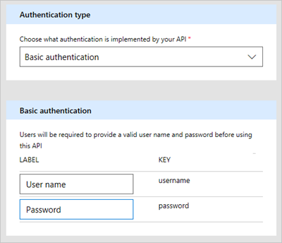

# <a name="use-webhooks-with-microsoft-flow"></a>Utiliser des webhooks avec Microsoft Flow
Les [webhooks](http://www.webhooks.org/) sont de simples rappels HTTP permettant de fournir des notifications d’événements.  Microsoft Flow vous permet d’utiliser des webhooks pour déclencher des flux.  Ce didacticiel montre comment créer un flux déclenché par un webhook.

> [!NOTE]
> Nous allons utiliser GitHub comme exemple de service qui peut envoyer des notifications via des webhooks. Mais les techniques décrites ici peuvent être étendues à tout service qui utilise des « webhooks ».
> 
> 

## <a name="prerequisites"></a>Conditions préalables
Pour suivre ce didacticiel, vous avez besoin des éléments suivants :

* Notions de base sur les [webhooks](http://www.webhooks.org/).
* Notions de base sur la [spécification OpenAPI](http://swagger.io/specification/) (Swagger).
* Un compte [GitHub](https://www.github.com).
* L’[exemple de fichier JSON OpenAPI](http://pwrappssamples.blob.core.windows.net/samples/githubWebhookSample.json) pour ce tutoriel.
* Vous pouvez également utiliser l’[interface utilisateur des déclencheurs](customapi-webhooks.md#creating-webhook-triggers-from-the-ui) pour définir des déclencheurs de webhook si vous ne voulez pas écrire à la main le fichier OpenAPI.

## <a name="the-openapi-file"></a>Fichier OpenAPI
Les webhooks sont implémentés dans Microsoft Flow sous la forme d’un type de [connecteur personnalisé](register-custom-api.md). Vous allez donc devoir fournir un fichier JSON OpenAPI pour définir la forme de votre webhook.  Le fichier OpenAPI contient trois définitions indispensables pour le bon fonctionnement du webhook :

1. Création du webhook
2. Définition de la demande entrante de raccordement à partir de l’API (dans ce cas, GitHub)
3. Suppression du webhook

### <a name="creating-the-webhook"></a>Création du webhook
Le webhook est créé sur GitHub par une requête HTTP POST à `/repos/{owner}/{repo}/hooks`.  Microsoft Flow doit publier vers cette URL quand un flux est créé à l’aide du déclencheur défini dans le fichier OpenAPI, ou lorsque le déclencheur est modifié.  Dans l’exemple ci-dessous, la propriété `post` contient le schéma de la demande qui sera publiée dans GitHub.

```json
"/repos/{owner}/{repo}/hooks": {
    "x-ms-notification-content": {
    "description": "Details for Webhook",
    "schema": {
        "$ref": "#/definitions/WebhookPushResponse"
    }
    },
    "post": {
    "description": "Creates a Github webhook",
    "summary": "Triggers when a PUSH event occurs",
    "operationId": "webhook-trigger",
    "x-ms-trigger": "single",
    "parameters": [
        {
        "name": "owner",
        "in": "path",
        "description": "Name of the owner of targetted repository",
        "required": true,
        "type": "string"
        },
        {
        "name": "repo",
        "in": "path",
        "description": "Name of the repository",
        "required": true,
        "type": "string"
        },
        {
        "name": "Request body of webhook",
        "in": "body",
        "description": "This is the request body of the Webhook",
        "schema": {
            "$ref": "#/definitions/WebhookRequestBody"
        }
        }
    ],
    "responses": {
        "201": {
        "description": "Created",
        "schema": {
            "$ref": "#/definitions/WebhookCreationResponse"
        }
        }
    }
    }
},
```

> [!IMPORTANT]
> La propriété `"x-ms-trigger": "single"` est une extension de schéma qui indique à Microsoft Flow d’afficher ce webhook dans la liste des déclencheurs disponibles dans le concepteur de flux. Vous devez donc veiller à l’inclure.
> 
> 

### <a name="defining-the-incoming-hook-request-from-the-api"></a>Définition de la demande entrante de raccordement à partir de l’API
La forme de la demande entrante de raccordement (notification de GitHub vers Microsoft Flow) est définie dans la propriété `x-ms-notification-content` personnalisée, comme indiqué dans l’exemple ci-dessus.  Il n’est pas nécessaire qu’elle contienne tout le contenu de la demande, uniquement les parties que vous souhaitez utiliser dans vos flux.

### <a name="deleting-the-webhook"></a>Suppression du webhook
Il est très important d’inclure une définition dans le fichier OpenAPI qui indique à Microsoft Flow de supprimer le webhook.  Microsoft Flow tente de supprimer le webhook chaque fois que vous mettez à jour le déclencheur dans votre flux ou quand vous supprimez votre flux.

```json
"/repos/{owner}/{repo}/hooks/{hook_Id}": {
    "delete": {
    "description": "Deletes a Github webhook",
    "operationId": "DeleteTrigger",
    "parameters": [
        {
        "name": "owner",
        "in": "path",
        "description": "Name of the owner of targetted repository",
        "required": true,
        "type": "string"
        },
        {
        "name": "repo",
        "in": "path",
        "description": "Name of the repository",
        "required": true,
        "type": "string"
        },
        {
        "name": "hook_Id",
        "in": "path",
        "description": "ID of the Hook being deleted",
        "required": true,
        "type": "string"
        }
    ]
    }
},
```

> [!IMPORTANT]
> Pour que Microsoft Flow puisse supprimer un webhook, l’API **doit** inclure un en-tête HTTP `Location` dans la réponse 201 au moment de la création du webhook.  L’en-tête `Location` doit contenir le chemin d’accès du webhook qui sera utilisé avec la requête HTTP DELETE.  Par exemple, l’élément `Location` inclus avec la réponse de GitHub a le format suivant : `https://api.github.com/repos/<user name>/<repo name>/hooks/<hook ID>`.
> 
> 

## <a name="authentication"></a>Authentification
L’API qui envoie la demande webhook à Microsoft Flow a généralement une forme d’authentification spécifique et GitHub ne fait pas exception.  Plusieurs types d’authentification sont pris en charge.  Pour ce didacticiel, nous allons utiliser des jetons d’accès personnels de GitHub.

1. Accédez à [GitHub](https://www.github.com) et connectez-vous si vous ne l’avez pas déjà fait.
2. En haut à droite, cliquez sur votre **image de profil**, puis, dans le menu, cliquez sur **Paramètres**.
   
    
3. Dans le menu de gauche, sous **Paramètres de développeur**, cliquez sur **Jetons d’accès personnels**.
   
    
4. Cliquez sur le bouton **Generate new token** (Générer un nouveau jeton).
   
    
5. Dans la zone **Token description** (Description du jeton), entrez une description.
6. Sélectionnez la case **admin:repo_hook**.
   
    
7. Cliquez sur le bouton **Générer un jeton**.
8. Prenez note du nouveau jeton.
   
    
   
   > [!IMPORTANT]
   > Vous ne pourrez plus accéder à ce jeton. Vous devez le copier-coller quelque part, un bloc-notes par exemple, pour l’utiliser ultérieurement dans ce didacticiel.
   > 
   > 

## <a name="adding-the-webhook-to-microsoft-flow"></a>Ajout du webhook à Microsoft Flow
Vous avez maintenant tous les éléments en main pour ajouter le webhook à Microsoft Flow en tant que connecteur personnalisé.

1. Accédez au [portail web Microsoft Flow](https://flow.microsoft.com) et connectez-vous si vous ne l’avez pas déjà fait.
2. Cliquez sur l’icône **Paramètres**, puis sur **Connecteurs personnalisés**.
   
    
3. Cliquez sur le bouton **Créer un connecteur personnalisé**.
4. Cliquez sur l’icône du dossier dans la zone **Import OpenAPI (Importer OpenAPI)**, puis sélectionnez l’exemple de fichier OpenAPI.
5. Cliquez sur **Charger l’icône** dans la section **Informations générales**, puis sélectionnez un fichier image à utiliser en tant qu’icône.
6. Cliquez sur **Continuer**.
   
    
7. Sur l’écran suivant, vous allez configurer les paramètres de sécurité.  Sous **Type d’authentification**, sélectionnez **Authentification de base**.
8. Dans la section **Authentification de base**, pour les champs d’étiquette, entrez le **nom d’utilisateur** et le **mot de passe**.  Notez qu’il s’agit uniquement des étiquettes qui seront affichées lorsque le déclencheur sera utilisé dans un flux.
   
    
9. En haut de la page, nommez votre flux, puis cliquez sur **Créer un connecteur**.
   
    

Le nouveau connecteur personnalisé doit maintenant apparaître dans la liste sur la page des connecteurs personnalisés.

## <a name="creating-webhook-triggers-from-the-ui"></a>Création de déclencheurs de webhook à partir de l’interface utilisateur
1. Une fois que vous avez chargé/créé votre fichier OpenAPI de base, accédez à l’onglet **Définition** de l’Assistant Connecteur personnalisé.
2. Dans le volet gauche, cliquez sur **+ Nouveau déclencheur** et remplissez la description de votre déclencheur. Dans cet exemple, vous créez un déclencheur qui se déclenche lorsqu’une requête de tirage est effectuée dans un dépôt.
   
    
3. Définissez ensuite la requête pour créer le déclencheur de webhook. Pour ce faire, importez un exemple de demande *Créer un déclencheur de webhook*. Pour la création d’un webhook, consultez la [référence sur les API Github](https://developer.github.com/v3/repos/hooks/#create-a-hook). 
4. Comme Microsoft Flow ajoute automatiquement des en-têtes ```content-type``` et de sécurité, nous n’avez pas besoin de les définir pendant l’importation d’un exemple. 
   
    
5. Une fois que vous avez importé la demande de création de webhook, définissez la réponse webhook en important à partir d’un exemple de réponse. Consultez la [référence sur les API Github](https://developer.github.com/v3/activity/events/types/#pullrequestevent) pour un événement de requête de tirage. 
   
    **Remarque** : vous n’êtes pas obligé de coller le contenu dans la réponse complète. Seuls les champs dont vous avez besoin doivent être définis.
   Pour cet exemple, extrayez uniquement l’URL de la requête de tirage et les informations de l’utilisateur qui a effectué cette requête.
   
    
6. L’étape finale consiste à sélectionner un paramètre dans la demande de création de webhook. Pour la valeur associée, Microsoft Flow doit remplir une URL de rappel à remplir par Github. Dans le cas présent, il s’agit de la propriété d’URL de l’objet ```config```.
   
    

## <a name="using-the-webhook-as-a-trigger"></a>Utilisation du webhook comme déclencheur
Maintenant que vous avez tout configuré, vous pouvez utiliser le webhook dans un flux.  Créez maintenant un flux qui envoie une notification Push à l’application mobile Microsoft Flow chaque fois que notre dépôt GitHub reçoit une commande git push.

1. Dans le [portail web Microsoft Flow](https://flow.microsoft.com), en haut de la page, cliquez sur **Mes flux**.
2. Cliquez sur **Créer entièrement**.
3. Dans le concepteur Microsoft Flow, recherchez le connecteur personnalisé que nous avons inscrit précédemment.
   
    
   
    Cliquez sur l’élément dans la liste pour l’utiliser comme déclencheur.
4. Dans la mesure où il s’agit de la première fois que vous utilisez ce connecteur, vous devez vous y connecter.  Pour **Nom de la connexion**, entrez un nom descriptif.  Pour **Nom d’utilisateur**, utilisez votre nom d’utilisateur GitHub.  Pour **Mot de passe**, utilisez le **jeton d’accès personnel** que vous avez créé précédemment.
   
    
   
    Cliquez sur **Créer**.
5. Vous devez à présent donner des informations à Microsoft Flow concernant le dépôt que vous souhaitez surveiller.  Vous pouvez reconnaître les champs de l’objet **WebhookRequestBody** dans le fichier OpenAPI.  Pour **propriétaire** et **référentiel**, entrez le propriétaire et le nom d’un référentiel GitHub que vous souhaitez surveiller.
   
    
   
   > [!IMPORTANT]
   > Dans cet exemple, j’utilise le référentiel pour [Visual Studio Code](https://code.visualstudio.com). Vous devez utiliser un référentiel que votre compte est autorisé à utiliser.  Le moyen le plus simple pour cela est d’utiliser votre propre référentiel.
   > 
   > 
6. Cliquez sur **+ Nouvelle étape**, puis sur **Ajouter une action**.
7. Recherchez et sélectionnez l’action **Notification Push**.
   
    
8. Entrez du texte dans le champ **Texte**.  Notez que l’objet **WebhookPushResponse** dans le fichier OpenAPI définit la liste des paramètres que vous pouvez utiliser.
   
    
9. En haut de la page, nommez votre flux, puis cliquez sur **Créer un flux**.
   
    

## <a name="verification-and-troubleshooting"></a>Vérification et résolution des problèmes
Pour vérifier que tout est configuré correctement, cliquez sur **Mes flux**, puis cliquez sur l’**icône d’information** en regard du nouveau flux pour afficher l’historique d’exécution.  Vous devez déjà au moins voir une exécution « réussie » depuis la création du webhook.  Cela montre que le webhook a été correctement créé sur GitHub.  Si l’exécution a échoué, vous pouvez affiner les détails de l’exécution pour en connaître la raison.  Si l’échec est dû à une réponse « 404 Introuvable », il est probable que votre compte GitHub n’a pas les autorisations appropriées pour créer un webhook sur le référentiel que vous avez utilisé.

## <a name="summary"></a>Résumé
Si tout est correctement configuré, vous recevez à présent des notifications Push dans l’application mobile Microsoft Flow chaque fois qu’une commande git push se produit sur le référentiel GitHub que vous avez sélectionné.  En utilisant la procédure ci-dessus, vous pouvez utiliser n’importe quel service compatible webhook comme déclencheur dans vos flux.

## <a name="next-steps"></a>Étapes suivantes
* [Inscrivez un connecteur personnalisé](register-custom-api.md).
* [Utiliser une API web ASP.NET](customapi-web-api-tutorial.md).
* [Inscrire une API Azure Resource Manager](customapi-azure-resource-manager-tutorial.md).

