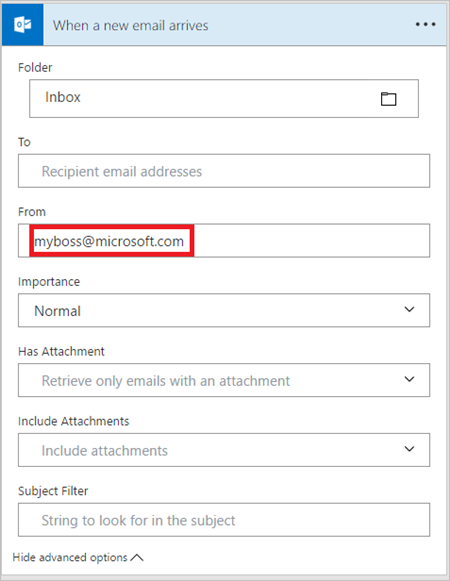
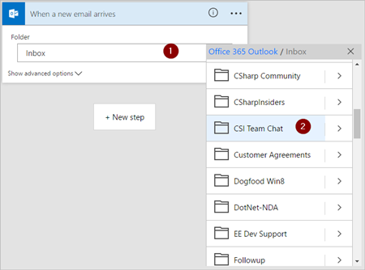
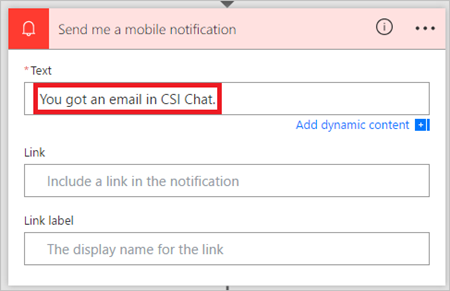

# Déclencher un flux en fonction des propriétés d’un courrier
Utilisez le déclencheur **Lors de l’arrivée d’un nouveau message électronique** pour créer un flux qui s’exécute lorsqu’une ou plusieurs des propriétés de courrier suivantes correspondent aux critères que vous fournissez :

| Propriété | Dans quel cas l’utiliser |
| --- | --- |
| Dossier |Déclenchez un flux à chaque fois que des courriers arrivent dans un dossier spécifique. Cette propriété peut être utile si vous avez des règles qui routent les courriers électroniques dans différents dossiers. |
| À |Déclenchez un flux en fonction de l’adresse à laquelle le courrier a été envoyé. Cette propriété peut être utile si vous recevez le courrier qui a été envoyé à différentes adresses de courrier dans la même boîte de réception. |
| De |Déclenchez un flux en fonction de l’adresse de courrier de l’expéditeur. |
| Importance |Déclenchez un flux en fonction de l’importance avec laquelle les courriers ont été envoyés. Le courrier peut être envoyé avec une importance haute, normale ou faible. |
| A des pièces jointes |Déclenchez un flux en fonction de la présence de pièces jointes dans les messages entrants. |
| Filtre Objet |Recherchez la présence de mots spécifiques dans l’objet d’un courrier. Votre flux exécute ensuite des *actions* basées sur les résultats de votre recherche. |

> [!IMPORTANT]
> Chaque [offre Microsoft Flow](https://flow.microsoft.com/pricing/) inclut un quota d’exécution. Vérifiez toujours les propriétés du déclencheur du flux lorsque cela possible pour vous éviter d’utiliser votre quota d’exécution inutilement. Si vous vérifiez une propriété dans une condition, chaque exécution est comptabilisée dans le quota d’exécution de votre offre, même si la condition de filtre que vous avez définie n’est pas remplie. Par exemple, si vous vérifiez l’adresse d’*expéditeur* d’un courrier dans une condition, chaque exécution est comptabilisée dans le quota d’exécution de votre offre, même si ce n’est pas l’adresse de l’*expéditeur* qui vous intéresse.
> 
> 

Dans les procédures détaillées ci-dessous, vous allez vérifier toutes les propriétés du déclencheur **Lors de l’arrivée d’un nouveau message électronique**. Pour en savoir plus, consultez les [questions fréquentes sur la facturation](billing-questions.md#what-counts-as-a-run) et la page sur la [tarification](https://ms.flow.microsoft.com/pricing/).

## Conditions préalables
* Un compte ayant accès à [Microsoft Flow](https://flow.microsoft.com).
* Un compte Office 365 Outlook.
* Application mobile Microsoft Flow pour [Android](https://aka.ms/flowmobiledocsandroid), [iOS](https://aka.ms/flowmobiledocsios) ou [Windows Phone](https://aka.ms/flowmobilewindows).
* Des connexions à Office 365 Outlook et au service de notification Push.

## Déclencher un flux en fonction de l’objet d’un courrier
Dans cette procédure pas à pas, vous créez un flux qui envoie une notification Push à votre téléphone portable si l’objet d’un nouveau courrier comporte le mot « loterie ». Votre flux marque ensuite les messages de ce type comme *lus*.

Remarque : bien que cette procédure pas à pas envoie une notification Push, vous êtes libre d’utiliser une autre action qui correspond à vos besoins de flux de travail. Par exemple, vous pouvez stocker le contenu des courriers dans un autre dépôt tel que Google Sheets ou un fichier Microsoft Excel stocké sur Dropbox.

Commençons :

[!INCLUDE [sign-in-use-blank-select-email-trigger-and-inbox-folder](includes/sign-in-use-blank-select-email-trigger-and-inbox-folder.md)]

1. Dans la zone **Filtre Objet**, entrez le texte que votre flux utilise pour filtrer les courriers entrants.
   
     Dans cet exemple, intéressez-vous aux courriers dont l’objet contient le mot « loterie ».
   
    

[!INCLUDE [add-mobile-notification-action](includes/add-mobile-notification-action.md)]

1. Entrez les détails de la notification mobile que vous souhaitez recevoir lorsqu’un courrier qui correspond au **Filtre Objet** que vous avez spécifié précédemment arrive.
   
    

[!INCLUDE [add-mark-as-read-action](includes/add-mark-as-read-action.md)]

1. Donnez un nom à votre flux, puis enregistrez-le en sélectionnant **Créer un flux** en haut de la page.
   
    

Félicitations. Vous recevez une notification Push chaque fois que vous recevez un courrier dont l’objet contient le mot « loterie ».

## Déclencher un flux en fonction de l’expéditeur d’un courrier
Dans cette procédure pas à pas, vous créez un flux qui envoie une notification Push à votre téléphone portable si un nouveau courrier provient d’un expéditeur spécifique (adresse de courrier). Le flux marque également les messages comme *lus*.

[!INCLUDE [sign-in-use-blank-select-email-trigger-and-inbox-folder](includes/sign-in-use-blank-select-email-trigger-and-inbox-folder.md)]

1. Entrez l’adresse de courrier de l’expéditeur dans le champ **De**.
   
     Votre flux effectue une action sur les courriers envoyés à partir de cette adresse.
   
    

[!INCLUDE [add-mobile-notification-action](includes/add-mobile-notification-action.md)]

1. Entrez les détails de la notification mobile que vous souhaitez recevoir lorsqu’un message provient de l’adresse de courrier entrée précédemment.
   
    

[!INCLUDE [add-mark-as-read-action](includes/add-mark-as-read-action.md)]

1. Donnez un nom à votre flux, puis enregistrez-le en sélectionnant **Créer un flux** en haut de la page.
   
    

## Déclencher un flux quand des courriers arrivent dans un dossier spécifique
Si vous avez défini des règles qui routent les courriers dans différents dossiers en fonction de certaines propriétés, telles que l’adresse, ce type de flux est idéal.

Commençons :

> [!NOTE]
> Si vous n’avez pas encore défini de règle qui route les courriers vers un dossier autre que votre boîte de réception, créez-en une et vérifiez qu’elle fonctionne en envoyant un courrier de test.
> 
> 

[!INCLUDE [sign-in-use-blank-select-email-trigger-and-specific-folder](includes/sign-in-use-blank-select-email-trigger-and-specific-folder.md)]

1. Sélectionnez le dossier vers lequel la règle que vous avez créée route des courriers spécifiques. Pour afficher tous les dossiers de courrier, sélectionnez l’icône **Afficher le sélecteur**, qui se trouve à droite de la zone **Dossier** sur la carte **Lors de l’arrivée d’un nouveau message électronique**.
   
    

[!INCLUDE [add-mobile-notification-action](includes/add-mobile-notification-action.md)]

1. Entrez les détails de la notification mobile que vous souhaitez recevoir lorsqu’un courrier arrive dans le dossier spécifié précédemment. Si vous ne l’avez pas déjà fait, entrez les informations d’identification correspondant au service de notifications.
   
    

[!INCLUDE [add-mark-as-read-action](includes/add-mark-as-read-action.md)]

1. Donnez un nom à votre flux, puis enregistrez-le en sélectionnant **Créer un flux** en haut de la page.
   
    

Testez le flux en envoyant un courrier qui est routé vers le dossier que vous avez sélectionné plus haut dans cette procédure pas à pas.

