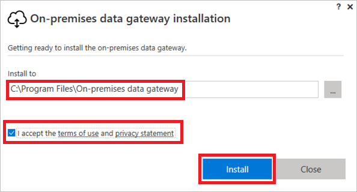
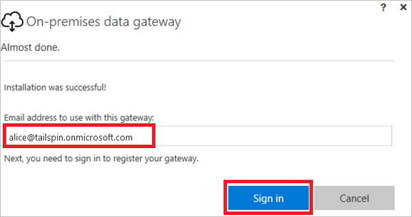
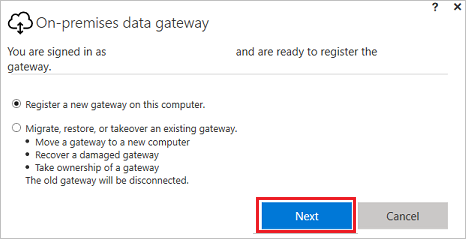

# <a name="understand-on-premises-data-gateways-for-microsoft-flow"></a>Comprendre les passerelles de données locales pour Microsoft Flow
Utilisez la passerelle de données locale avec Microsoft Flow pour établir des connexions sécurisées à vos sources de données locales telles que Microsoft SQL Server.

## <a name="installation-and-configuration"></a>Installation et configuration
### <a name="prerequisites"></a>Prérequis
Configuration minimale :

* [.NET Framework 4.6](https://www.microsoft.com/download/details.aspx?id=48130)
* Version 64 bits de Windows 7 ou Windows Server 2008 R2 (ou version ultérieure)

Configuration recommandée :

* 8 cœurs de processeur
* 8 Go de mémoire
* Version 64 bits de Windows Server 2012 R2 (ou version ultérieure)

Considérations liées :

* Vous ne pouvez pas installer une passerelle sur un contrôleur de domaine.
* Vous ne devez pas installer une passerelle sur un ordinateur, tel qu’un portable, pouvant être mis hors tension, en veille ou déconnecté d’Internet.
* Les performances de la passerelle peuvent être dégradées sur un réseau sans fil.

## <a name="install-a-gateway"></a>Installer une passerelle
> [!IMPORTANT]
> Les passerelles de données Microsoft SharePoint prennent maintenant en charge le trafic HTTP et HTTPS.
> 
> 

1. [Téléchargez le programme d’installation](https://go.microsoft.com/fwlink/?LinkID=820931), puis exécutez-le.
   
    
2. Dans le premier écran de l’Assistant Installation, sélectionnez **Suivant** pour confirmer que vous avez pris connaissance du rappel concernant l’installation d’une passerelle sur un ordinateur portable.
   
    
3. Sélectionnez l’emplacement d’installation.
4. Acceptez les conditions d’utilisation et la déclaration de confidentialité.
5. Sélectionnez **Installer**.
   
    
6. Dans la boîte de dialogue **Contrôle de compte d’utilisateur**, sélectionnez **Oui** pour continuer.
7. Dans l’écran **Passerelle de données locale**, entrez l’adresse de messagerie du compte que vous utilisez pour vous connecter à la passerelle, sélectionnez **Se connecter**, puis terminez le processus de connexion.
   
    

## <a name="register-new-gateway-or-take-over-existing-gateway"></a>Inscrire une nouvelle passerelle ou reprendre une passerelle existante
1. Sélectionnez **Inscrire une nouvelle passerelle sur cet ordinateur** ou **Migrer, restaurer ou reprendre une passerelle existante**, puis sélectionnez **Suivant**.
   
    
2. Pour configurer une passerelle, entrez un nom dans la zone **New on-premises data gateway name (Nom de la nouvelle passerelle de données locale)**, entrez une clé de récupération dans la zone **Clé de récupération**, entrez cette même clé dans la zone **Confirmer la clé de récupération**. Sélectionnez **Configurer**, puis **Fermer**.
   
    
3. Spécifiez une clé de récupération qui contient au moins huit caractères et conservez-la en lieu sûr. Vous aurez besoin de cette clé si vous souhaitez migrer, restaurer ou récupérer la passerelle.
4. Pour la migration, la restauration ou la reprise d’une passerelle existante, indiquez le nom de la passerelle et sa clé de récupération, sélectionnez **Configurer**, puis suivez les invites supplémentaires.
   
    

## <a name="restart-the-gateway"></a>Redémarrer la passerelle
La passerelle s’exécute comme un service Windows et en tant que telle, vous pouvez la démarrer et l’arrêter de plusieurs façons. Par exemple, vous pouvez ouvrir une invite de commandes avec des autorisations élevées sur l’ordinateur sur lequel la passerelle est exécutée, puis exécuter les commandes suivantes :

* Pour arrêter le service, exécutez la commande suivante :

```batchfile
    net stop PBIEgwService
```

* Pour démarrer le service, exécutez la commande suivante :

```batchfile
    net start PBIEgwService
```

## <a name="configure-a-firewall-or-proxy"></a>Configurer un pare-feu ou un proxy
Pour plus d’informations sur la façon de fournir des informations de proxy pour votre passerelle, consultez [Configurer des paramètres de proxy](https://powerbi.microsoft.com/documentation/powerbi-gateway-proxy/).

Vous pouvez vérifier si votre pare-feu ou proxy peut bloquer les connexions en exécutant la commande suivante à partir d’une invite PowerShell. Cette commande permet de tester la connectivité à Azure Service Bus. Cette commande teste uniquement la connectivité réseau. Elle n’a pas d’impact sur le service du serveur cloud ni la passerelle. Elle permet de déterminer si votre ordinateur est connecté à Internet.

```powershell
Test-NetConnection -ComputerName watchdog.servicebus.windows.net -Port 9350
```

Le résultat doit ressembler à la sortie ci-dessous. Si **TcpTestSucceeded** n’est pas défini sur *true*, vous pouvez être bloqué par un pare-feu.

    ComputerName           : watchdog.servicebus.windows.net
    RemoteAddress          : 70.37.104.240
    RemotePort             : 5672
    InterfaceAlias         : vEthernet (Broadcom NetXtreme Gigabit Ethernet - Virtual Switch)
    SourceAddress          : 10.120.60.105
    PingSucceeded          : False
    PingReplyDetails (RTT) : 0 ms
    TcpTestSucceeded       : True

Si vous souhaitez être exhaustif, remplacez les valeurs **Nom_ordinateur** et **Port** par celles répertoriées sous **Configurer des ports** plus loin dans cette rubrique.

Le pare-feu peut également bloquer les connexions d’Azure Service Bus aux centres de données Azure. Si tel est le cas, annulez le blocage de toutes les [adresses IP](https://www.microsoft.com/download/details.aspx?id=41653) de votre région pour ces centres de données.

## <a name="configure-ports"></a>Configurer les ports
La passerelle crée une connexion sortante à Azure Service Bus. Elle communique sur les ports de sortie suivants : TCP 443 (valeur par défaut), 5671, 5672, 9350 à 9354. La passerelle ne nécessite pas de ports d’entrée.

En savoir plus sur les [solutions hybrides](https://azure.microsoft.com/documentation/articles/service-bus-fundamentals-hybrid-solutions/).

| Noms de domaine | Ports de sortie | Description |
| --- | --- | --- |
| *.analysis.windows.net |443 |HTTPS |
| *.login.windows.net |443 |HTTPS |
| *.servicebus.windows.net |5671-5672 |Advanced Message Queuing Protocol (AMQP) |
| *.servicebus.windows.net |443, 9350-9354 |Écouteurs Service Bus Relay sur TCP (nécessite le port 443 pour l’acquisition de jeton Access Control) |
| *.frontend.clouddatahub.net |443 |HTTPS |
| *.core.windows.net |443 |HTTPS |
| login.microsoftonline.com |443 |HTTPS |
| *.msftncsi.com |443 |Permet de tester la connectivité à Internet si la passerelle n’est pas accessible. |

Si vous avez besoin à mettre sur liste blanche des adresses IP au lieu des domaines, vous pouvez télécharger et utiliser la [liste de plages d’adresses IP des centres de données Microsoft Azure](https://www.microsoft.com/download/details.aspx?id=41653). Dans certains cas, les connexions Azure Service Bus sont effectuées avec l’adresse IP plutôt qu’avec le nom de domaine complet.

## <a name="sign-in-account"></a>Compte de connexion
Les utilisateurs se connectent avec un compte professionnel ou scolaire. Il s’agit du compte de votre organisation. Si vous vous êtes inscrit à une offre Office 365 et que vous n’avez pas fourni votre adresse de messagerie professionnelle, le compte peut ressembler à nancy@contoso.onmicrosoft.com. Au sein d’un service cloud, votre compte est stocké dans un locataire au sein d’Azure Active Directory (AAD). Dans la plupart des cas, l’UPN de votre compte AAD correspond à l’adresse de messagerie.

## <a name="windows-service-account"></a>Compte de service Windows
La passerelle de données locale est configurée de façon à utiliser *NT SERVICE\PBIEgwService* comme informations d’identification pour la connexion au service Windows. Par défaut, elle est autorisée à se connecter en tant que service, dans le contexte de l’ordinateur sur lequel vous installez la passerelle.

Il ne s’agit pas du compte utilisé pour se connecter à des sources de données locales ou le compte professionnel ou scolaire avec lequel vous vous connectez aux services cloud.

## <a name="frequently-asked-questions"></a>Forum aux questions
### <a name="general-questions"></a>Questions générales
**Question :** Quelles sources de données la passerelle prend-elle en charge ?
**Réponse :**

* SQL Server
* SharePoint
* Oracle
* Informix
* Système de fichiers
* DB2

**Question :** Ai-je besoin d’une passerelle pour les sources de données dans le cloud, comme SQL Azure ?
**Réponse :** Non. Une passerelle se connecte aux sources de données locales uniquement.

**Question :** Quel est le nom réel du service Windows ?
**Réponse :** dans Services, la passerelle est appelée **Power BI Enterprise Gateway Service**.

**Question :** Existe-t-il des connexions entrantes dans la passerelle à partir du cloud ?
**Réponse :** Non. La passerelle utilise des connexions sortantes vers Azure Service Bus.

**Question :** Que se passe-t-il si je bloque les connexions sortantes ? Que dois-je ouvrir ?
**Réponse :** Vérifiez les [ports](gateway-reference.md#configure-ports) et les hôtes que la passerelle utilise.

**Question :** La passerelle doit-elle être installée sur le même ordinateur que la source de données ?
**Réponse :** Non. La passerelle se connecte à la source de données en utilisant les informations de connexion qui ont été fournies. Considérez la passerelle comme une application cliente. Elle doit simplement être en mesure de se connecter au nom de serveur fourni.

**Question :** Quelle est la latence pour exécuter des requêtes sur une source de données à partir de la passerelle ? Quelle est la meilleure architecture ?
**Réponse :** Pour réduire le temps de réponse du réseau, installez la passerelle le plus près possible de la source de données. Si vous pouvez installer la passerelle sur la source de données réelle, cela minimise le temps de réponse. Prenez également en compte les centres de données. Par exemple, si votre service utilise le centre de données États-Unis de l’Ouest et que SQL Server est hébergé sur une machine virtuelle Azure, nous vous recommandons d’installer la machine virtuelle Azure dans cette même région. Cela réduit le temps de réponse et évite que des frais de sortie soient facturés sur la machine virtuelle Azure.

**Question :** Existe-t-il des conditions requises concernant la bande passante réseau ?
**Réponse :** Il est recommandé d’avoir un débit relativement élevé pour votre connexion réseau. Chaque environnement est différent et la quantité de données envoyées a une incidence sur les résultats. L’utilisation d’ExpressRoute peut contribuer à garantir un niveau de débit entre les centres de données Azure et locaux.

Vous pouvez utiliser l’outil tiers [Azure Speed Test](http://azurespeedtest.azurewebsites.net/) pour déterminer votre débit.

**Question :** Le service Windows de passerelle peut-il s’exécuter avec un compte Azure Active Directory ?
**Réponse :** Non. Le service Windows doit avoir un compte Windows valide. Par défaut, il s’exécute avec le SID de service *NT SERVICE\PBIEgwService*.

**Question :** Comment les résultats sont-ils envoyés dans le cloud ?
**Réponse :** Les résultats sont envoyés à l’aide d’Azure Service Bus. Pour plus d’informations, consultez [Fonctionnement](gateway-reference.md#how-the-gateway-works).

**Question :** Où sont stockées mes informations d’identification ?
**Réponse :** Les informations d’identification que vous entrez pour une source de données sont chiffrées et stockées dans le service cloud de passerelle. Les informations d’identification sont déchiffrées au niveau de la passerelle en local.

### <a name="high-availabilitydisaster-recovery"></a>Haute disponibilité/reprise d’activité
**Question :** Existe-t-il des formules pour activer les scénarios de haute disponibilité avec la passerelle ?
**Réponse :** Cela est prévu, mais nous n’avons pas encore de date.

**Question :** Quelles options sont disponibles pour la reprise d’activité ?
**Réponse :** Vous pouvez utiliser la clé de récupération pour restaurer ou déplacer une passerelle.

**Question :** Quel est l’avantage de la clé de récupération ?
**Réponse :** Elle permet de migrer ou de récupérer les paramètres de la passerelle.

### <a name="troubleshooting-questions"></a>Questions relatives à la résolution des problèmes
**Question :** Où sont les journaux de la passerelle ?
**Réponse :** Consultez la section [Outils](gateway-reference.md#tools) plus loin dans cette rubrique.

**Question :** Comment puis-je voir quelles requêtes sont envoyées à la source de données locale ?
**Réponse :** Vous pouvez activer le traçage de requête, qui inclut les requêtes envoyées. N’oubliez pas de rétablir la valeur d’origine lors de la résolution des problèmes. Si vous laissez le traçage des requêtes activé, cela génère des journaux plus volumineux.

Vous pouvez également consulter les outils disponibles dans votre source de données pour le traçage des requêtes. Par exemple, vous pouvez utiliser des événements étendus ou le Générateur de profils SQL pour SQL Server et Analysis Services.

## <a name="how-the-gateway-works"></a>Fonctionnement de la passerelle


Lorsqu’un utilisateur interagit avec un élément qui est connecté à une source de données locale :

1. Le service cloud crée une requête, ainsi que les informations d’identification chiffrées de la source de données, puis envoie la requête à la file d’attente pour que la passerelle la traite.
2. Le service cloud de passerelle analyse la requête et transmet la demande à [Azure Service Bus](https://azure.microsoft.com/documentation/services/service-bus/).
3. La passerelle de données locale vérifie auprès d’Azure Service Bus les demandes en attente.
4. La passerelle obtient la requête, puis déchiffre les informations d’identification qu’elle utilise ensuite pour se connecter aux sources de données.
5. La passerelle envoie la requête à la source de données pour exécution.
6. Les résultats sont envoyés de la source de données vers la passerelle, puis vers le service cloud. Le service utilise ensuite les résultats.

## <a name="troubleshooting"></a>Résolution des problèmes
### <a name="update-to-the-latest-version"></a>Mettre à jour vers la version la plus récente
De nombreux problèmes peuvent apparaître lorsque la version de la passerelle est obsolète. Veillez à utiliser la version la plus récente.  Si vous n’avez pas mis à jour la passerelle récemment, envisagez d’installer la dernière version pour voir si vous pouvez reproduire le problème.

#### <a name="error-failed-to-add-user-to-group---2147463168---pbiegwservice---performance-log-users---"></a>Erreur : Impossible d’ajouter l’utilisateur au groupe.  (-2147463168   PBIEgwService   Utilisateurs du journal de performances    )
Vous pouvez recevoir cette erreur si vous essayez d’installer la passerelle sur un contrôleur de domaine, ce qui n’est pas pris en charge. Vous devez installer la passerelle sur un ordinateur qui n’est pas un contrôleur de domaine.

## <a name="tools"></a>Outils
### <a name="collecting-logs-from-the-gateway-configurator"></a>Collecte de journaux à partir de l’outil de configuration de passerelle
Vous pouvez collecter plusieurs journaux pour la passerelle. Les journaux sont indispensables.

1. Journaux du programme d’installation
   
    %localappdata%\Temp\On-premises_data_gateway_*.log
2. Journaux de configuration
   
    %localappdata%\Microsoft\on-premises data gateway\GatewayConfigurator*.log
3. Journaux du service de passerelle d’entreprise
   
    C:\Users\PBIEgwService\AppData\Local\Microsoft\on-premises data gateway\Gateway*.log
4. Journaux des événements

Les journaux des événements du **service de passerelle de données locale** sont présents sous **Journaux des applications et des services**.


### <a name="fiddler-trace"></a>Suivi Fiddler
[Fiddler](http://www.telerik.com/fiddler) est un outil gratuit de Telerik qui surveille le trafic HTTP.  Vous pouvez voir les allers-retours entre le service Power BI et l’ordinateur client. L’outil peut indiquer des erreurs et autres informations connexes.

