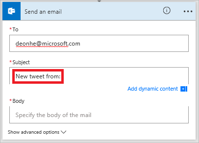

# Créer un flux dans Microsoft Flow

> [!VIDEO https://www.youtube.com/embed/Gt3CMhLAQqE?list=PL8nfc9haGeb55I9wL9QnWyHp3ctU2_ThF]

Créez un flux qui effectue une ou plusieurs tâches automatiquement une fois qu’il est déclenché par un événement. Par exemple, créez un flux qui vous avertit par courrier électronique dès que quelqu’un envoie un tweet contenant un mot clé que vous spécifiez. Dans cet exemple, l’envoi d’un tweet est l’événement et l’envoi d’un message électronique est l’action.

## Prérequis

* Un compte sur [flow.microsoft.com](https://flow.microsoft.com)
* Un compte Twitter
* Informations d’identification Office 365

## Spécifier un événement qui déclenche le flux

Tout d’abord, vous devez sélectionner l’événement ou le *déclencheur* qui lance votre flux.

1. Dans [flow.microsoft.com](https://flow.microsoft.com), sélectionnez **Mes flux** dans la barre de navigation supérieure, puis **Créer entièrement**.

    
1. Cochez la case **Rechercher des centaines de connecteurs et de déclencheurs**en bas de l’écran, entrez **Twitter** dans la zone qui indique **Rechercher tous les connecteurs et les déclencheurs**, puis sélectionnez **Twitter - Quand un nouveau tweet est posté**.

    

1. Si vous n’avez pas déjà connecté votre compte Twitter à Microsoft Flow, sélectionnez **Se connecter à Twitter**, puis entrez vos informations d’identification.

1. Dans la zone **Texte de recherche**, tapez le mot clé que vous souhaitez rechercher.

    

## Spécifier une action

1. Sélectionnez **Nouvelle étape**, puis **Ajouter une action**.

    

1. Dans la zone intitulée **Rechercher dans l’ensemble des connecteurs et des actions**, tapez ou collez **Envoyer un message électronique**, puis sélectionnez **Office 365 Outlook - Envoyer un message électronique**.

    

1. Si vous y êtes invité, sélectionnez le bouton de connexion, puis fournissez vos informations d’identification.

1. Dans le formulaire qui apparaît, tapez ou collez votre adresse de messagerie dans la zone **À**, puis sélectionnez votre nom dans la liste de contacts qui s’affiche.

    
1. Dans la zone **Objet**, tapez ou collez **New tweet from:** (Nouveau tweet de :), puis tapez une espace.

    
1. Dans la liste des jetons, sélectionnez le jeton **Tweeté par** pour ajouter un espace réservé pour celui-ci.

    
1. Sélectionnez la zone **Corps**, puis le jeton **Texte du tweet** pour ajouter un espace réservé pour celui-ci.
1. (facultatif) Ajoutez davantage de jetons, d’autres contenus ou les deux dans le corps du message électronique.
1. Près du haut de l’écran, nommez votre flux, puis sélectionnez **Créer un flux**.

    
1. Sélectionnez **Terminé** pour mettre à jour la liste de flux.

     
1. Envoyez un tweet avec le mot clé que vous avez indiqué ou attendez que quelqu'un d’autre poste un tweet de ce type.

     Une minute après l’envoi du tweet, un e-mail vous informe du nouveau tweet.

## Gérer un flux

1. Dans [flow.microsoft.com](https://flow.microsoft.com), sélectionnez **Mes flux** dans la barre de navigation supérieure.
1. Dans la liste de flux, effectuez l’une des opérations suivantes :

   * Pour suspendre un flux, réglez son bouton bascule sur **Désactivé**.

       
   * Pour reprendre un flux, réglez son bouton bascule sur **Activé**.

       
   * Pour modifier un flux, sélectionnez l’icône de crayon qui correspond au flux à modifier.

       
   * Pour supprimer un flux, sélectionnez l’icône **...**, sélectionnez **Supprimer**, puis **Supprimer** dans la zone de message qui apparaît.

       
   * Pour afficher l’historique d’exécution d’un flux, sélectionnez le flux à partir de la page **Mes flux**, puis affichez l’historique sous la section **Historique d’exécution** de la page qui s’ouvre.

       

     Sélectionnez une exécution de flux dans la liste des exécutions pour voir les entrées et sorties de chaque étape.

> [!NOTE]
> Votre compte peut avoir jusqu’à 50 flux. Si vous en avez déjà 50, supprimez-en un avant de pouvoir en créer un autre.
>
>

## Étapes suivantes

* [Ajoutez des étapes](multi-step-logic-flow.md) à votre flux, par exemple les différentes façons d’être averti.
* [Exécutez des tâches selon une planification](run-scheduled-tasks.md), lorsque vous souhaitez qu’une action s’exécute chaque jour, à une certaine date ou après un certain nombre de minutes.
* [Ajoutez un flux à une application](https://powerapps.microsoft.com/tutorials/using-logic-flows/) pour permettre à cette dernière de lancer la logique dans le cloud.
* [Prenez en main les flux d’équipe](create-team-flows.md) et invitez des personnes à collaborer avec vous lors de la conception de flux.
