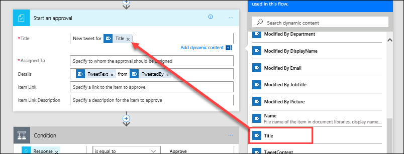
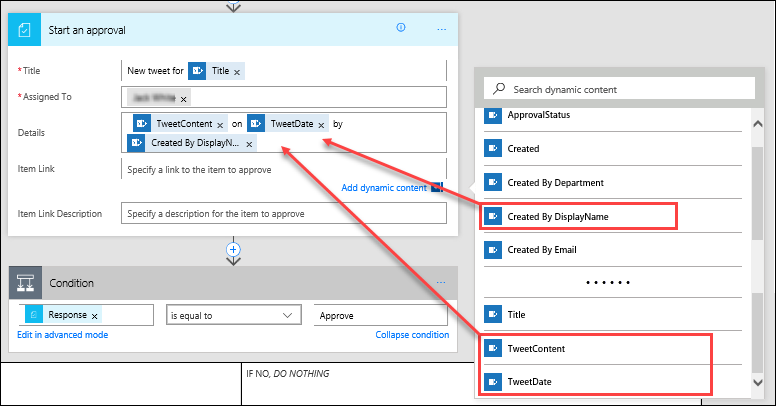
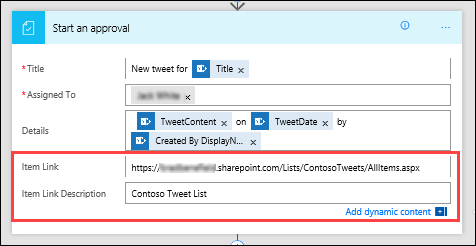
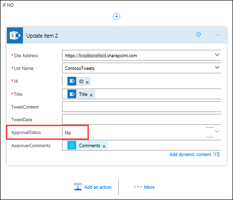

# Créer une demande d’approbation
Dans une rubrique précédente, vous avez appris à alimenter de façon simple votre flux Twitter à l’aide d’une liste SharePoint. Cette rubrique explique comment créer un scénario plus adapté à l’entreprise en utilisant des approbations. Ainsi, toute personne ayant accès à la liste SharePoint peut tweeter, et l’équipe en charge des médias sociaux peut approuver ou rejeter les tweets. L’équipe conserve le contrôle du compte et du contenu envoyé aux clients. 

## Créer un flux de demande d’approbation
1. Dans la page d’accueil de **Microsoft Flow**, sélectionnez **Approbations**, **Créer un flux d’approbation**, puis faites défiler vers le bas et sélectionnez le modèle **Postez des éléments de liste sur Twitter après approbation**. 
   
    
2. Vérifiez les informations d’identification de votre compte pour **SharePoint**, **Approbations** et **Twitter**, puis sélectionnez **Continuer**. 
   
    

Par défaut, ce modèle démarre un processus d’approbation chaque fois qu’un élément est créé dans une liste donnée, puis, si l’élément est approuvé, publie un tweet sur Twitter. Dans le cadre de cette rubrique, vous allez modifier ce processus en ajoutant des étapes qui mettent à jour la liste SharePoint avec la réponse d’approbation, indiquent si l’approbation a été donnée, et ajoutent les commentaires que les approbateurs peut avoir ajoutés au tweet proposé. 

1. Dans la liste SharePoint **TweetsContoso** créée précédemment, ajoutez deux colonnes :
   
   1. Sélectionnez le signe « **+** », puis **Oui/Non**
   2. Entrez l’**ÉtatApprobation**, puis sélectionnez **Créer**
   3. Sélectionnez le signe «**+**», puis choisissez **Une seule ligne de texte**
   4. Entrez **CommentairesApprobateur**, puis sélectionnez **Enregistrer**
      
      
2. De retour dans **Microsoft Flow**, dans l’action **Lorsqu’un élément est créé**, entrez les valeurs suivantes :
   
   * **Adresse du site** : URL SharePoint de votre équipe
   * **Nom de la liste** : TweetsContoso
     
     
3. Dans l’action **Démarrer une approbation**, sélectionnez **Modifier** pour afficher tous les champs. 
   
    
4. Dans **Titre**, entrez **Nouveau tweet pour**, puis sélectionnez **Titre** dans la liste de contenu dynamique. 
   
    
5. Dans **Affectée à**, entrez et sélectionnez votre nom ou le nom d’un utilisateur de test. 
   
    
6. Dans **Détails**, supprimez les éléments par défaut et ajoutez les éléments **ContenuTweet**, **DateTweet** et **Créé par NomAffichage** à partir de la liste de contenu dynamique, reliés par les mots **le** et **par**. 
   
    
7. Dans **Lien vers l’élément**, copiez et collez l’URL de votre liste SharePoint, puis, dans **Description du lien vers l’élément**, entrez **Liste**. 
   
    
8. Dans l’action **Condition**, pointez sur le champ **Si Oui**, sélectionnez le signe plus « **+** », puis choisissez **Ajouter une action**. 
   
    
9. Recherchez **Mettre à jour l’élément**, sélectionnez le connecteur **SharePoint**, puis choisissez l’action **SharePoint – Mettre à jour l’élément**.
   
    
10. Dans **Adresse du site** et **Nom de la liste**, entrez de nouveau l’URL de votre site et la liste **TweetsContoso**, puis, dans **ID**, entrez un **ID**  de la liste de contenu dynamique. 
    
     
11. Sélectionnez le champ **Titre**, puis, dans la liste de contenu dynamique, recherchez **Titre**. Ajoutez l’élément **Titre** de l’action **Lorsqu’un élément est créé**. 
    
     
12. Sélectionnez **ÉtatApprobation** et définissez la valeur sur **Oui**, puis choisissez **CommentairesApprobateur** et définissez la valeur de **Commentaires** à partir de la liste de contenu dynamique. 
    
     
13. Au bas de la zone **Si Non, *ne rien faire***, sélectionnez **Ajouter une action**.
    
     
14. En procédant de la même manière que pour la configuration de la condition **Si Oui**, créez une action **SharePoint – Mettre à jour l’élément**, puis configurez les champs avec les mêmes valeurs, à l’exception du paramètre **ÉtatApprobation** que vous définissez sur **Non**. 
    
     
15. Sélectionnez l’action **Publier un tweet**, choisissez **Modifier**, puis définissez la valeur de **Texte du tweet** sur **ContenuTweet** à partir de la liste de contenu dynamique.  En haut de la page, sélectionnez **Créer un flux** pour enregistrer votre travail. 
    
     

Ceci n’est que lune des manières dont Microsoft Flow peut dynamiser la productivité de votre équipe. Votre équipe peut suggérer des idées, proposer des nouveautés pertinentes ou prodiguer des conseils concernant des produits. Quoi qu’il en soit, vous contrôlez toujours ce qui est tweeté aux clients.

Dans la rubrique suivante, nous allons voir ce qui se passe quand un approbateur reçoit une nouvelle demande concernant un tweet proposé. 

