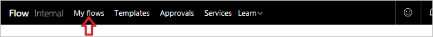

# Créer un flux à partir d’un modèle
Bienvenue à nouveau dans la Formation guidée sur Microsoft Flow. Dans le cadre de cette leçon, vous allez découvrir davantage l’environnement Microsoft Flow, et **créer votre premier flux**.

La prise en main de Microsoft Flow est aisée, car vous avez le choix entre un très grand nombre de **modèles** qui vous aident à interconnecter de façon plus significative les services que vous utilisez déjà.  

## Modèles Microsoft Flow
Accédons au [site web de Microsoft Flow](https://ms.flow.microsoft.com) et ouvrons le menu **Modèles**. En faisant défiler la liste, vous pouvez constater que Microsoft Flow vous permet de vous connecter à de nombreux services.

## Choisir un modèle
La **recherche de pièces jointes** dans les e-mails peut prendre beaucoup de temps. Ce flux vous permet d’en gagner en **stockant toutes les pièces jointes** dans un dossier sur votre OneDrive.

Sélectionnez le modèle **Enregistrer les pièces jointes Office 365 dans OneDrive Entreprise**.

## Créer et administrer un flux
Ceci est l’un de nos modèles disponibles en **un clic** où vous répondez uniquement aux questions pertinentes **nécessaires pour créer le flux**.

Le graphique du modèle présente une **description** de ce que le modèle **fait et de ce dont il a besoin** pour opérer correctement.

Vous êtes invité à **fournir vos informations d’identification** pour les services **Office 365 Outlook** et **SharePoint**. Si vous utilisez ces deux services régulièrement , vous y serez déjà connectés.

1. Sélectionnez **Créer un flux**.
   
    
   
    Vous voyez alors les résultats. 
   
    
   
    Microsoft Flow a **créé un dossier** sur votre OneDrive, dans lequel il placera désormais automatiquement toutes les **pièces jointes** aux e-mails envoyés à votre adresse professionnelle.
2. Ouvrez **Mes flux**.
   
    
3. Sélectionnez le **flux que vous venez de créer** pour voir comment il fonctionne.
   
    
4. Vous voyez une **coche verte** indiquant que l’exécution du **flux a réussi**. Sélectionnez **Opération réussie** pour afficher l’historique des exécutions et les résultats.
   
    
   
    **Toutes les parties du flux de** ont réussi. 
   
    

## Concepts importants dans Microsoft Flow
Voici ce qu’il faut savoir concernant la génération de flux. Chaque flux comporte deux composantes principales : un **déclencheur** et **une ou plusieurs actions**. 

Le **déclencheur** est l’action de départ du flux. Ce peut être, par exemple, **la réception d’un nouvel e-mail**, comme ici, ou **l’ajout d’un élément** si vous avez utilisé SharePoint. Il peut également s’agit d’une planification fixe si vous utilisez un déclencheur nommé **Périodicité** que nous présenterons plus tard.

**Les actions sont les activités** qui doivent se produire lors de l’**appel d’un déclencheur**. Par exemple, l’action **Créer un fichier** a pour effet de recréer le fichier en question sur OneDrive.

D’autres actions peuvent être l’envoi d’un **e-mail**, la publication d’un **tweet**, le démarrage d’une **approbation**, et bien plus.
Ces actions entreront en jeu ultérieurement, lorsque vous générerez votre propre flux à partir de rien. 

## Leçon suivante
La leçon suivante présente l’application mobile Microsoft Flow et ses fonctionnalités. 

