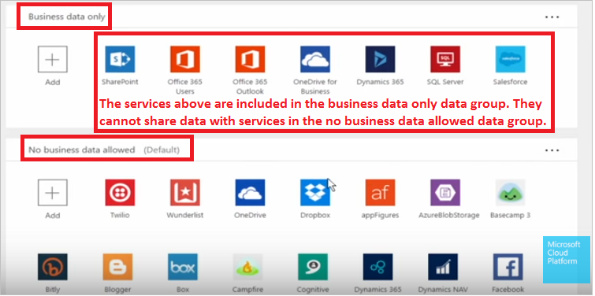
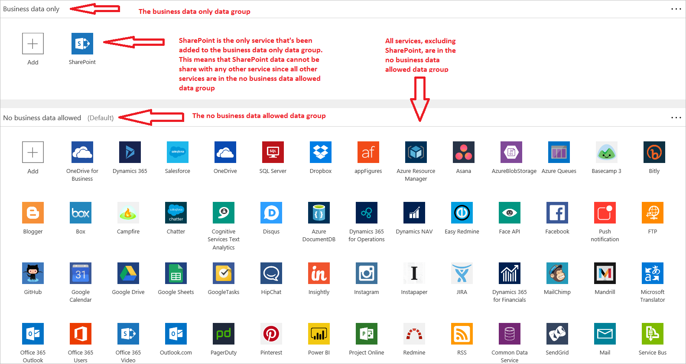

# Utiliser des stratégies de protection contre la perte de données
Avec la liste toujours plus grande de [services](https://flow.microsoft.com/services) disponibles pour créer des flux de travail avec [Microsoft Flow](https://flow.microsoft.com), vous devrez peut-être protéger les données sensibles et critiques stockées dans les services d’entreprise tels que SharePoint ou SalesForce. Il se peut que votre organisation ait besoin de créer une stratégie qui garantit que les données sensibles de l’entreprise ne sont pas publiées dans les services grand public tels que Twitter et Facebook. Avec Microsoft Flow, vous pouvez facilement créer des stratégies de **protection contre la perte de données** pour contrôler étroitement les services grand public avec lesquels vos données d’entreprise peuvent être partagées quand vos utilisateurs créent des flux.  

## Termes que vous devez connaître
| Terme | Description |
| --- | --- |
| **DLP** |Il s’agit de l’abréviation de « protection contre la perte de données ». Vous allez créer une stratégie DLP pour gérer le partage des données entre les **services**. |
| **Services** |Les [services](https://flow.microsoft.com/services) sont des applications telles que Salesforce, SharePoint et Twitter. Ces services et bien d’autres sont utilisés pour créer des flux. |
| **Groupe de données** |Regroupement logique des services. Vous y placez des services qui sont autorisés à partager des données dans le même groupe de données. Deux groupes de données sont disponibles : **Données d’entreprise uniquement** et **Aucune donnée commerciale autorisée**. |
| **Environnement** |Une stratégie DLP est appliquée à un [environnement](../environments-overview-admin.md). Un environnement contient des utilisateurs. |
| **Utilisateurs** |Les utilisateurs sont les membres de votre organisation auxquels une stratégie DLP s’applique, en fonction de leur appartenance à un environnement. |
| **Flux** |Un flux est une application de flux de travail qui utilise n’importe quelle combinaison de services disponibles. |

## Tout ce que vous devez savoir sur le fonctionnement des stratégies DLP
Une stratégie DLP est tout simplement une règle nommée qui place chaque service dans un des deux groupes de données qui s’excluent mutuellement. Cette règle est ensuite appliquée à un environnement. Un environnement est un regroupement logique d’utilisateurs. Les utilisateurs ne sont pas autorisés à créer des flux qui partagent des données entre les services que vous avez placés dans des groupes de données différents. En d’autres termes, vos utilisateurs peuvent créer uniquement des flux qui partagent des données entre les services appartenant au **même** groupe de données. Aucun partage de données entre les groupes n’est autorisé.  

| **Nom du groupe de données** | **Description du groupe de données** |
| --- | --- |
| **Données d’entreprise uniquement** |Tous les services de ce groupe peuvent partager des données entre eux. Ils ne peuvent pas partager des données avec le groupe de données **Aucune donnée commerciale autorisée**. |
| **Aucune donnée commerciale autorisée** |Tous les services de ce groupe peuvent partager des données entre eux. Ils ne peuvent pas partager des données avec le groupe de données **Données d’entreprise uniquement**. |

**Remarque** : l’ajout d’un service à un groupe de données automatiquement le supprime de l’autre groupe de données. Par exemple, si Twitter se trouve actuellement dans le groupe de données **Données d’entreprise uniquement** et que vous ne voulez pas autoriser le partage des données d’entreprise sur Twitter, ajoutez simplement le service Twitter au groupe de données **Aucune donnée commerciale autorisée**. Cela permet de supprimer Twitter du groupe de données **Données d’entreprise uniquement**.

## Voici ce dont vous avez besoin pour créer une stratégie DLP
* Accéder au [centre d’administration](https://admin.flow.microsoft.com) Microsoft Flow  
* Un compte disposant du rôle d’administrateur d’environnement  
* Un environnement auquel des utilisateurs ont été attribués  

## Créer une stratégie de protection contre la perte de données
Voici un aperçu rapide de la création d’une stratégie DLP :  

1. Attribuez un nom à la stratégie.
2. Sélectionnez l’environnement auquel la stratégie s’applique.
3. Ajoutez les services à l’un des deux groupes de données. N’oubliez pas que seuls les services situés dans un groupe spécifique peuvent partager des données. Par conséquent, tout flux créé pour partager des données entre des services situés dans les deux groupes de données est bloqué automatiquement lorsque le créateur l’enregistre.  

Une [procédure plus détaillée](../prevent-data-loss.md) sur les stratégies DLP est également disponible.  

## Exemples :
* Si vous devez créer une stratégie qui oblige les flux à partager des données d’entreprise uniquement entre SharePoint, les utilisateurs Office 365, Office 365 Outlook, OneDrive Entreprise, Dynamics 365, SQL Server et Salesforce, elle ressemble à ceci :  
    
* Voici à quoi elle ressemble si vous avez décidé de créer une stratégie qui n’autorise aucun des membres d’un environnement spécifique à créer un flux qui partage des données SharePoint. Notez que SharePoint est le seul service situé dans le groupe de données **Données d’entreprise uniquement** :  
  

