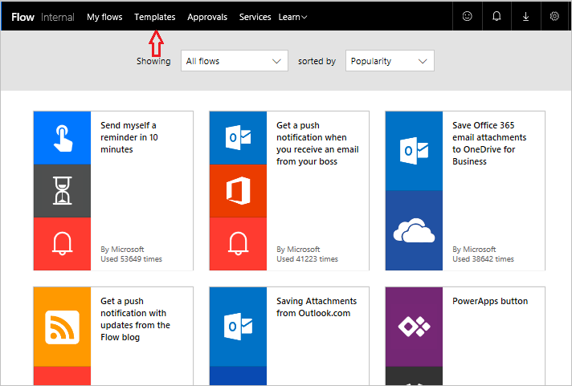

# Formation guidée sur Microsoft Flow
Bienvenue dans la Formation guidée sur Microsoft Flow. Cette **autoformation en ligne** explique le fonctionnement de Microsoft Flow de façon séquentielle pour vous permettre d’acquérir et d’approfondir vos connaissances pas à pas, à partir de la base. Le cours est conçu pour fournir des **conseils sous la forme de modules compréhensibles**, riches en **éléments visuels et exemples**, suivant une progression logique pour vous aider à apprendre les principes et les détails.

Ce cours vous permet de découvrir Microsoft Flow et ses concepts, et d’apprendre à **générer des flux**, ainsi qu’à **gérer** et **administrer** ceux-ci dans votre environnement. Il présente des informations et scénarios relatifs à une entreprise fictive nommée Contoso Flooring, l’objectif étant que vous compreniez comment appliquer les mêmes scénarios à votre propre entreprise ou aux entreprises de vos clients.

Si vous ne savez rien de Microsoft Flow, ce cours vous aide à le prendre en main. Si vous disposez déjà d’une certaine expérience, ce cours vous aide à relier les concepts entre eux, et à combler vos lacunes éventuelles. Cette formation étant en cours d’élaboration, nous vous invitons à **nous dire ce que vous en pensez** ainsi qu’à nous indiquer les sujets que vous souhaitez voir abordés.

## Qu’est-ce que Microsoft Flow ?
Microsoft Flow est un **service de flux de travail** en ligne qui vous permet de travailler à la fois plus intelligemment et plus efficacement, en **automatisant des flux de travail** entre les applications et services que vous utilisez le plus souvent. Par exemple, vous pouvez créer un flux qui ajoute un prospect à **Dynamics 365** et un enregistrement dans **MailChimp** chaque fois qu’une personne suivie par plus de 100 abonnés publie un tweet sur votre entreprise.

Lorsque vous vous inscrivez, vous pouvez vous **connecter à plus de 100 services** et **gérer les données dans des sources cloud ou locales** telles que SharePoint et SQL Server. La liste des applications et services que vous pouvez utiliser avec Microsoft Flow croît en permanence.

## Que pouvez-vous faire avec Microsoft Flow ?
Vous pouvez utiliser Microsoft Flow pour **automatiser des flux de travail** entre vos **applications et services** favoris, synchroniser des fichiers, obtenir des notifications, collecter des données, et bien plus encore. 

Par exemple, vous pouvez **automatiser** les tâches suivantes :

* Répondre instantanément aux notifications ou e-mails hautement prioritaires.
* Capturer et suivre de nouveaux clients potentiels.
* Copier des fichiers d’un service à un autre.
* Collecter des données sur votre entreprise et partager ces informations avec votre équipe.
* Automatisez les flux de travail d’approbation.

Une utilisation courante de Microsoft Flow consiste à **obtenir des notifications**. Par exemple, vous pouvez recevoir instantanément un e-mail ou une notification Push sur votre smartphone chaque fois qu’un client potentiel est ajouté à Dynamics 365 ou à Salesforce.

Vous pouvez également **utiliser Microsoft Flow pour copier des fichiers**. Par exemple, vous pouvez faire en sorte que tout fichier ajouté à Dropbox soit **automatiquement copié** vers SharePoint où votre équipe peut le trouver.

 

 

Vous pouvez **surveiller ce qu’il se dit** de votre entreprise en créant un flux qui s’exécute chaque fois que **quelqu’un émet un tweet** contenant un hashtag (#) déterminé. Ce flux peut consigner des détails relatifs au tweet dans une base de données SQL Server, une liste SharePoint, voire un fichier Excel hébergés sur OneDrive, selon ce qui vous convient le mieux. Vous pouvez créer des actions sur les données que vous collectez afin de connecter celles-ci à Power BI, d’identifier des tendances et de poser des questions sur les données.

Enfin, **vous pouvez automatiser des boucles d’approbation**, par exemple, pour des demandes de congé, dans une liste SharePoint.

Pour trouver d’autres idées, **parcourez notre liste de modèles** qui vous aident à générer des flux en quelques étapes. Par exemple, vous pouvez facilement générer des flux afin de **recevoir des prévisions météorologiques**, des rappels à intervalles réguliers ou des notifications par téléphone chaque fois que votre chef vous envoie un e-mail.

Vous avez une idée de flux qui ne figure pas dans la liste ? Vous pouvez créer entièrement votre propre flux et, si vous le souhaitez, le partager avec la communauté.

## Où puis-je créer et administrer un flux ?
Vous pouvez créer un flux et l’administrer **dans un navigateur** ou **sur votre smartphone** (après avoir téléchargé l’application mobile pour Microsoft Flow).

  

Vous notamment effectuer les tâches suivantes :

* activer ou désactiver des flux où que vous soyez ;
* voir lorsqu’un flux a échoué ;
* passer en revue des rapports détaillés sur l’historique des exécutions ;
* afficher et filtrer les exécutions par type de notification.

## Petite visite guidée de Microsoft Flow
Accédons à l’outil. Nous allons vous montrer un peu de quoi il retourne. Nous tenons à votre disposition une foultitude d’informations qui vous permettront d’en apprendre davantage sur l’utilisation de Microsoft Flow.

La page d’accueil présente les menus suivants :

* **Mes flux**, où vos flux s’animent ;
* **Modèles**, qui constitue un excellent point de départ ;
* **Approbations**, où vous pouvez automatiser et simplifier votre processus d’approbation ;
* **Connecteurs** (anciennement **Services**), où vous pouvez vous connecter d’un service à un autre ;
* **Apprendre**, où vous pouvez trouver des informations qui vous permettent de progresser rapidement vers la maîtrise de Microsoft Flow.

Pour l’instant, concentrons-nous sur **Apprendre**, qui contient les options suivantes :

* **Formation guidée** vous guide dans l’utilisation de Microsoft Flow, des techniques de base aux scénarios avancés.
* **Documentation** regroupe nos rubriques avancées. Si vous souhaitez vraiment comprendre une fonctionnalité ou une fonction, vous pouvez approfondir vos connaissances ici.
* **Support** est une excellente source d’aide.
* **Communauté** est un emplacement où entrer en contact avec d’autres personnes et découvrir comment elles utilisent Microsoft Flow.
* **Donner votre avis** vous permet d’accéder à une communauté d’utilisateurs chevronnés au sein de laquelle vous pouvez **adresser des commentaires et des questions** à des développeurs et à d’autres utilisateurs.
* **Blog** vous permet de vous tenir informé des développements et publications les plus récents dans l’écosystème Microsoft Flow.
* **Tarification** peut vous aider à choisir le plan approprié pour vous ou votre entreprise.

La page **Modèles** présente des modèles très populaires susceptibles de vous donner des idées sur les flux que vous souhaitez essayer.

## Leçon suivante
Maintenant que vous avez obtenu un aperçu de Microsoft Flow et de ce que l’application peut faire, examinons à quoi ressemble un flux.

