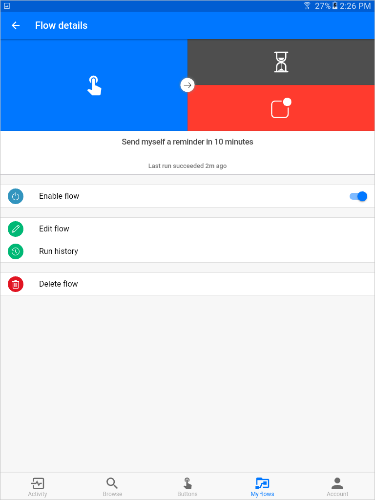

# Gérer les flux avec l’application mobile
L’application mobile Microsoft Flow pour [Android](https://aka.ms/flowmobiledocsandroid), [iOS](https://aka.ms/flowmobiledocsios) ou [Windows Phone](https://aka.ms/flowmobilewindows) a pratiquement les mêmes fonctionnalités que le portail web.

En bas de l’écran, une **barre d’outils** où sont disponibles les fonctions de l’application s’affiche.

## Activité
L’écran **Activité** affiche toutes les activités de votre flux, y compris l’**historique d’exécution** et les **notifications**.

Appuyez sur une entrée d’**historique d’exécution** pour voir un **journal détaillé** qui montre quelles étapes du flux **ont réussi ou échoué**.  Cliquez sur une étape de ce journal pour afficher des **informations de débogage** qui peuvent être utiles dans le cadre du **dépannage** d’un flux qui ne se comporte pas comme prévu.

## Parcourir
L’écran **Parcourir** offre une interface qui permet de **rechercher** ou de **parcourir** des **modèles** de flux.  Lorsque vous appuyez sur un modèle, une boîte de dialogue permettant de terminer le modèle et de créer un flux s’affiche. 

## Boutons
L’écran **Boutons** est l’endroit où vous pouvez déclencher n’importe quel flux qui contient un déclencheur **Bouton - Déclencher manuellement un flux**.

## Mes flux
L’écran **Mes flux** répertorie tous vos flux.  Lorsque vous appuyez sur un flux, l’écran **Détails du flux** s’ouvre.

Le bouton bascule **Activer le flux** permet d’activer/de désactiver un flux sans le supprimer.

Appuyez sur l’icône **Modifier le flux** pour ouvrir le concepteur de flux et modifier votre flux.

Appuyez sur **Historique d’exécution** pour afficher l’**historique d’exécution** du flux, comme sur l’écran **Activité**.

Appuyez sur **Supprimer le flux** pour supprimer le flux.  Une fois supprimé, un flux ne peut pas être récupéré.

## Compte
L’écran **Compte** vous permet de **vous déconnecter** de l’application mobile, ainsi que de modifier votre **environnement** actuel.  Vous pouvez également trouver des informations sur l’application et les options de **support**.

## Leçon suivante
Vous venez de voir deux façons de **gérer Microsoft Flow**.  Vous allez ensuite passer en revue ce que vous avez appris dans cette section.

