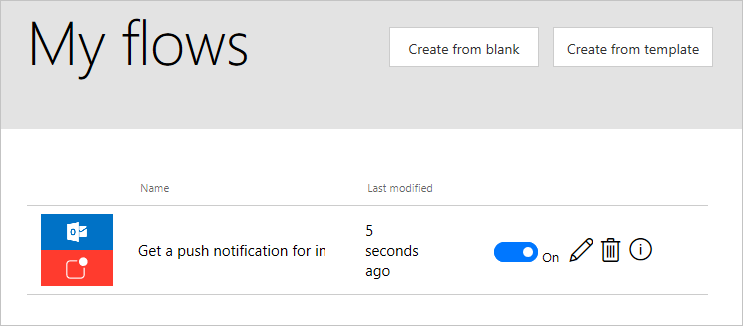

# Gérer les flux avec le portail web
Le portail web **Microsoft Flow** situé à l’adresse **flow.microsoft.com** fournit tout ce dont vous avez besoin pour administrer vos flux dans un **navigateur web**.  Le portail fonctionne avec les navigateurs de **bureau** et **mobiles**, mais pour une meilleure **expérience mobile**, vous pouvez utiliser l’**application mobile**.

## Accès au portail web
Si vous accédez à **flow.microsoft.com** et que vous vous connectez, vous pouvez afficher la liste des flux en cliquant sur **Mes flux** en haut de la page.

## Gestion de flux
À droite du nom et de l’heure de la dernière modification de votre flux, vous voyez des **boutons bascules** et des **icônes**.

Le **bouton bascule** permet d’activer/de désactiver un flux sans le supprimer.

Cliquez sur l’**icône en forme de crayon** pour ouvrir le Concepteur de flux et modifier votre flux.

L’**icône Corbeille** supprime le flux.  Une fois supprimé, un flux ne peut pas être récupéré.

Enfin, l’**icône d’information** affiche l’**historique d’exécution** du flux.  L’**historique d’exécution** affiche un journal qui consigne **chaque exécution d’un flux** et si celle-ci a **réussi** ou non. 

Cliquez sur un élément d’historique pour afficher un **journal détaillé** où vous pouvez voir quelles étapes du flux **ont réussi ou échoué**.  Cliquez sur une étape de ce journal pour afficher des **informations de débogage** qui peuvent être utiles dans le cadre du **dépannage** d’un flux qui ne se comporte pas comme prévu.

## Leçon suivante
Maintenant que vous en savez plus sur le **portail web Microsoft Flow**, découvrez comment gérer vos flux avec l’**application mobile**.

