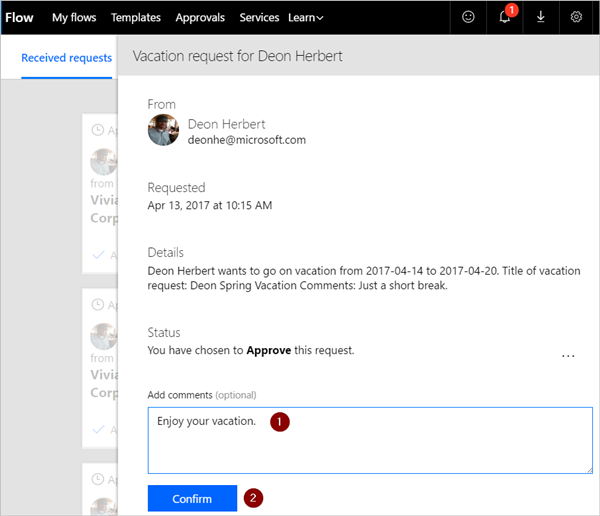
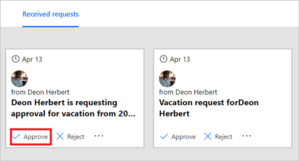

Si vous êtes approbateur dans un flux d’approbation, vous recevrez un courrier chaque fois qu’un utilisateur crée une demande. La demande d’approbation est également envoyée au centre d’approbations. Vous pouvez ensuite approuver ou refuser les demandes à partir du courrier, du centre d’approbations ou de l’application Microsoft Flow.

Pour approuver une demande :

### À partir de l’e-mail
1. Sélectionnez **Approuver** dans l’e-mail que vous recevez lorsqu’un élément est ajouté à la liste SharePoint Online.
   
     Remarque : si vous utilisez un appareil mobile sur lequel l’application Microsoft Flow est installée, cette dernière démarre. Sinon, le centre d’approbations s’ouvre dans votre navigateur.
   
    
2. Entrez un commentaire, puis sélectionnez le bouton **Confirmer**.
   
    

### À partir du centre d’approbations
1. Connectez-vous à [Microsoft Flow](https://flow.microsoft.com).
   
    
2. Sélectionnez l’onglet **Approbations**.
   
    
3. Sélectionnez **Approuver** dans la demande que vous souhaitez approuver.
   
    
4. Ajoutez une note, puis sélectionnez le bouton **Confirmer**.
   
    

### À partir de l’application Microsoft Flow
1. Sur votre téléphone mobile sur lequel l’application Microsoft Flow est installée, sélectionnez **Approuver** dans l’e-mail d’approbation de la demande.
2. Sélectionnez **Confirmer** dans l’angle supérieur droit de l’écran.
   
    
3. La page de réussite s’affiche. Elle indique que votre approbation a été enregistrée.
   
    

Remarque : les écrans sur Android, iOS et Windows Phone peuvent être légèrement différents. Toutefois, les fonctionnalités sont identiques sur tous les appareils.

