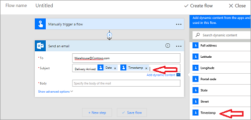

Cette rubrique explique comment **Créer un flux de bouton** pour la société Contoso Flooring. 

Un flux de bouton permet d’**envoyer un courrier** à une équipe pour l’**alerter concernant des tâches** à accomplir. La **Propriété** des flux **peut être attribuée à une** personne ou **partagée par plusieurs** membres d’une équipe.  

1. Tout d’abord, accédez au [site web de Microsoft Flow](https://ms.flow.microsoft.com) et connectez-vous.
2. Une fois connecté, sélectionnez **Mes flux**, puis **Créer entièrement**.
   
    
   
    La première chose qu’il vous faut, c’est un déclencheur. Le flux de bouton en est un, facile à utiliser. 
3. S’il ne figure pas dans la liste, sélectionnez **Rechercher parmi des centaines de connecteurs et déclencheurs** au bas de la page, entrez **bouton**, et il s’affiche pour vous. 
4. Sélectionnez **Bouton de flux pour mobile**.
   
     
5. Sélectionnez **Bouton de flux pour mobile - Déclencher manuellement un flux de**.
   
    
6. Dans l’écran d’entrée, sélectionnez **Ajouter une entrée**.
   
    
7. Entrez **Contoso Flooring** dans la première zone de texte, puis **E-mail de livraison à l’entrepôt** dans la deuxième.
   
    
8. Sélectionnez **Nouvelle étape**. 
   
    
9. Sélectionnez **Ajouter une action**. 
   
    
10. Sélectionnez le connecteur **Office 365 Outlook**. S’il est absent, recherchez **Outlook**.
    
     
11. Sélectionnez **Office 365 Outlook - Envoyer un message électronique**.
    
     
    
     Lorsque le bouton est actionné, un e-mail est envoyé à tous les membres de l’équipe Contoso Warehouse, où qu’ils se trouvent dans l’immeuble, les informant de l’arrivée de la livraison.
12. Développez les champs et personnalisez le message pour l’adapter à Contoso Flooring.
    
    1. Dans le champ **À**, entrez une adresse e-mail valide au sein dans votre organisation.
    2. Dans le champ **Objet**, entrez **Livraison arrivée**. 
    3. Notez qu’une boîte de dialogue **Contenu dynamique** s’est affichée à droite. Pour afficher, dans la ligne d’objet, la date et l’heure exactes d’action du bouton, sélectionnez **Date** et **Horodatage**. 
       
        
13. À présent, entrez un simple **Corps** pour l’e-mail, quelque chose comme : **À l’équipe de l’entrepôt. La livraison d’aujourd’hui est arrivée. veuillez vous rendre au quai de déchargement**.
14. Sélectionnez **Créer un flux** pour enregistrer le flux.
    
     

## Créer un flux d’équipe
Vous pouvez utiliser ce flux de bouton en tant qu’exemple montrant comment créer un flux d’équipe. Que se passe-t-il si la créatrice de ce flux est absente pour cause de maladie ? Que se passe-t-il si elle quitte l’entreprise ? Vous voulez être certain que ce flux continuera de fonctionner. Pour ce faire, ajoutez des copropriétaires.

1. Pour ajouter un copropriétaire, sélectionnez l’**icône d’équipe** sur votre flux.
   
     
2. Entrez des noms, des adresses e-mail ou des groupes d’utilisateurs pour ajouter des copropriétaires.
   
    
3. Pour supprimer un copropriétaire, sélectionnez la corbeille à droite de son nom.
   
    
4. Pour achever la suppression, sélectionnez **Supprimer ce propriétaire**.
   
    

## Résumé
Dans cette leçon, vous avez vu comment **créer un flux de bouton**. 

En quelques minutes, le flux a permis à une employée de l’entrepôt d’**alerter son équipe** de l’**arrivée d’une livraison**, de sorte que l’équipe n’a pas dû attendre celle-ci et perdre par la même occasion un temps précieux qu’elle a pu consacrer à d’autres tâches. 

L’employée a ensuite partagé ce bouton avec l’équipe, afin que d’autres membres de celle-ci puissent également déclencher le flux au cas où elle viendrait à s’absenter.

## Leçon suivante
Suivez la leçon suivante pour apprendre à créer un flux utilisant des **notification Push**.

