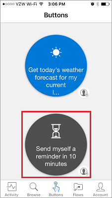
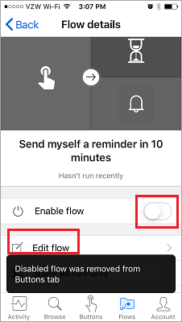

Cette leçon présente l’application mobile Microsoft Flow et ses fonctionnalités. À partir de l’application mobile, vous pouvez accéder à ces fonctionnalités : **Flux d’activité**, **navigation**, **boutons**, et **la gestion des flux**.

Tout d’abord, vous devez **télécharger** et **installer** l’application Microsoft Flow à partir de votre magasin d’applications.

Une fois l’application installée, **ouvrez-la** et **connectez-vous**. Lorsque vous ouvrez l’application, vous accédez aux **Informations sur les activités**.

Les Informations sur les activités vous permettent de voir ce qui se passe avec vos flux **lorsque vous êtes en déplacement** et n’avez pas **accès à votre ordinateur** pour bénéficier d’une expérience complète.

Par exemple, si vous sélectionnez l’un des flux, vous pouvez **voir de plus près** la **dernière activité** de celui-ci, si son exécution a réussi ou échoué et, en cas d’échec, l’étape défaillante.

Comme vous pouvez le voir, les deux étapes du flux ont réussi. À ce stade, poursuivez et sélectionnez l’icône **Boutons**.

## Mode de démarrage des flux
   Les boutons permettent de démarrer des flux par une action manuelle. Par exemple, vous pouvez créer un bouton pour **envoyer à votre chef un e-mail signalant que vous travaillez à domicile**.
Vous pouvez utiliser celui-ci si votre domicile est éloigné de votre lieu de travail ou les jours où le trafic est infernal.

Utilisez le bouton **Parcourir** pour consulter des modèles de **flux de bouton supplémentaires** à ajouter à votre collection.

Pour voir comment cela fonctionne, nous allons utiliser le flux de bouton **M’envoyer un rappel dans 10 minutes**.

1. Sélectionnez **Boutons**, puis **Parcourir les modèles**.
2. Sélectionnez le flux de bouton de rappel.
3. Appuyez sur **Utiliser ce modèle**.
   
    
4. Appuyez sur **Créer**.
   
    
   
    Le flux est **enregistré**.
   
    
5. Appuyez sur **Boutons** pour voir le nouveau flux. 
   
    
6. Poursuivez en cliquant dessus. Dans 10 minutes, vous allez **recevoir un rappel**.
   
    

Il est facile d’ajouter des boutons à votre collection.

## Modifier ou supprimer un flux
Si vous souhaitez modifier ou supprimer l’un de vos flux, c’est facile.

1. Appuyez sur le bouton **Flux**, qui est essentiellement la zone de gestion mobile de vos flux.
   
    
2. À présent, appuyez sur l’un de vos flux.
   
    
   
    Vous pouvez voir qu’il n’y a quelques options :
   
   * Pour activer ou désactiver le flux, appuyez sur le bouton bascule **Activer le flux**.
   * Vous pouvez toujours modifier le flux si vous voulez le rendre à nouveau utile pour vous-même. 
   * Et vous pouvez consulter l’historique des exécutions du flux de données pour avoir une idée des exécutions qui ont réussi et échoué.
   * Vous pouvez également supprimer le flux en appuyant sur le bouton **Supprimer le flux**.
     
     
     
     Vous voyez ici que le **flux a été supprimé**.
     
     

## Leçon suivante
La leçon suivante explique comment **créer un flux de bouton** pour une équipe. 

