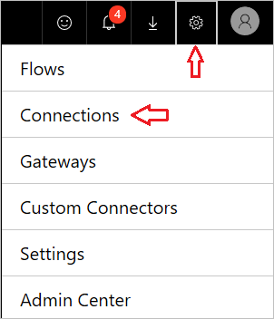
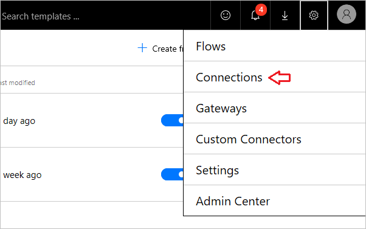
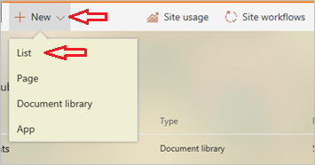
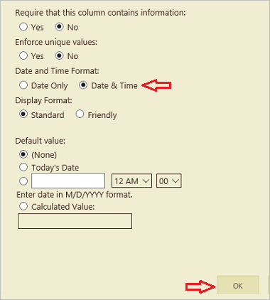
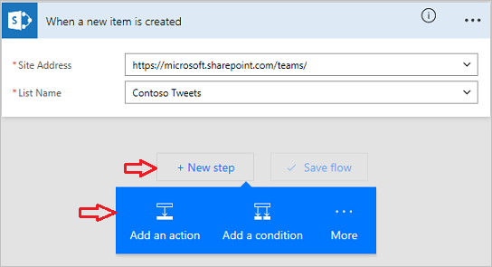
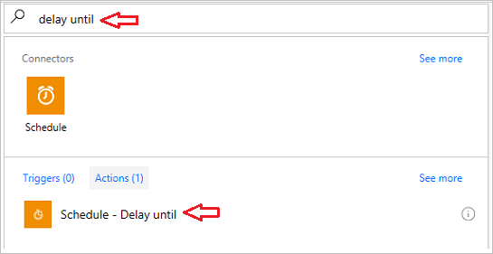
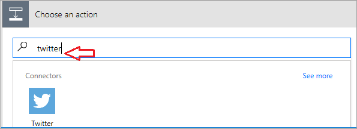
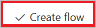

Pour ce flux, vous allez créer une liste **SharePoint** dans laquelle l’équipe Marketing de **Contoso Flooring** stocke ses **publications Twitter** ainsi que leurs dates. À partir de là, vous allez générer un flux qui tweete automatiquement le contenu à la place de l’équipe. 

## Connecter les services Microsoft Flow
Dans le cadre de cette rubrique, vous allez utiliser les services **SharePoint** et **Twitter**. Si vous utilisez un service pour la première fois, vous devez commencer par vous y connecter. 

1. Dans Microsoft Flow, sélectionnez l’**icône d’engrenage**, puis **Connexions**,
   
     
2. Sélectionnez **+ Créer une connexion**.
   
     
3. Faites défiler la liste, recherchez Twitter, puis sélectionnez **+**.
   
    
4. Pour autoriser un compte Twitter, entrez votre nom d’utilisateur ou adresse e-mail et votre mot de passe, puis sélectionnez **Autoriser une application**.
   
    
5. Pour vérifier vos connexions, sélectionnez l’**icône d’engrenage**, puis **Connexions**.
   
    
   
    Vous devez voir votre nouvelle connexion Twitter ainsi que les autres connexions que vous avez créées. 
   
    

## Créer une liste SharePoint List
La première chose à faire est de créer une liste SharePoint Online pour Contoso Flooring. 

1. Dans SharePoint Online, sélectionnez **Nouveau**, puis **Liste**.
   
    
2. Nommez la liste **TweetsContoso**. 
3. Désactivez la case à cocher **Afficher dans la navigation dans les sites**, puis sélectionnez **Créer**.
   
    
   
    Lorsque vous sélectionnez **Créer**, SharePoint vous dirige vers votre nouvelle liste.
4. Par défaut, la liste comprend une seule colonne, **Titre**. Ajoutez une colonne et nommez-la **Contenus de tweets**. Le contenu de vos tweets se retrouvera ici. 
   
   1. Sélectionnez le signe plus, puis choisissez **Autres...**
      
       
   2. Sélectionnez **Plusieurs lignes de texte**, puis **OK**.
      
       
5. Ajoutez une colonne pour les date et heure de tweet, puis nommez-la **Date de tweet**.
   
   1. Comme pour **Contenus de tweets** ci-dessus, sélectionnez le signe plus, puis **Autres...**
      
       
   2. Faites défiler jusqu’à **Format date et heure**. Sélectionnez **Date et heure** de façon à ce que les deux valeurs soient incluses.
      
       
   3. Sélectionnez **OK**. Vous voyez la liste **TweetsContoso** sur votre site SharePoint, et pouvez y ajouter des éléments.

## Générer le flux
Votre liste étant établie, vous pouvez générer le flux.

### Choisir un déclencheur
1. Dans Microsoft Flow, accédez à **Mes flux**, puis sélectionnez **Créer entièrement**.
   
    
2. Sélectionnez **Lors de la création d’un élément**.
   
    
   
    Nous voulons que le déclencheur se déclenche lors de l’ajout d’une ligne avec un contenu de tweet.
3. Sélectionnez votre site SharePoint, puis la liste que vous avez établie précédemment, **TweetsContoso**.
   
    

Voilà pour le déclencheur.

### Ajouter une action pour différer la publication
1. Sélectionnez **+ Nouvelle étape**, puis **Ajouter une action**. 
   
    
2. Dans le service **Planification**, sélectionnez **Différer jusqu’à**. 
   
      
3. Définissez la valeur de délai.
   
   1. Cliquez ou appuyez dans le champ **Horodatage**. 
   2. Lorsque la zone de contenu dynamique s’ouvre, faites défiler vers le bas, et vous voyez les trois colonnes de la liste SharePoint : **Titre**, **Date de Tweet**, et **contenu du Tweet**.
   3. Sélectionnez **Date de tweet**. 
      
       
      
       Désormais, quand quelqu’un ajoute un élément à votre liste SharePoint, cela a pour effet de différer toute action jusqu’à la date et l’heure définies dans la colonne **Date de tweet**.
      
       

### Ajouter une action pour publier un tweet
Vous allez maintenant ajouter une action au flux à exécuter aux date et heure spécifiées dans la colonne **Date de tweet**.

1. Sélectionnez **+ Nouvelle étape**, **Ajouter une action**, puis recherchez **Twitter**.
   
     
2. Choisissez l’action, **Twitter - Publier un tweet**.
   
     
3. Cliquez ou appuyez dans le champ **Texte du tweet**, puis, dans la zone de contenu dynamique, sélectionnez **Contenus de tweets**. Voici la séquence que vous avez créée. 
   
    
4. Sélectionnez **Créer un flux...**.
   
     
5. Sélectionnez **Terminé**.
   
    
   
    Désormais, le flux est créé.
   
    
   
    Lors de la création d’un élément dans votre liste SharePoint, le flux diffère la publication jusqu’à la date prédéfinie. À cette date, le flux publie sur Twitter le texte figurant dans la colonne **Contenu du tweet** de votre liste.

## Leçon suivante
La leçon suivante explique comment **exécuter des flux selon un calendrier** en utilisant un déclencheur nommé **périodicité**.

