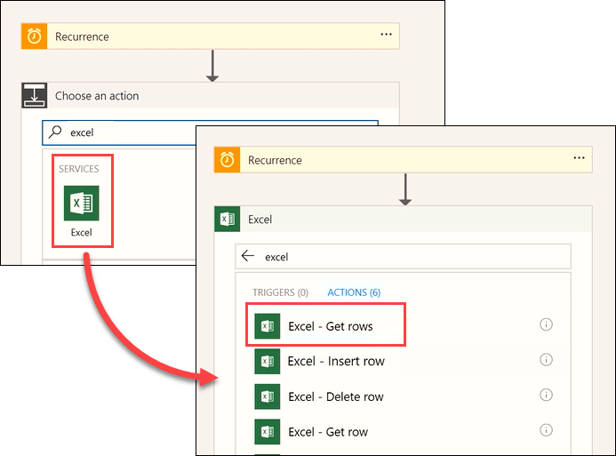
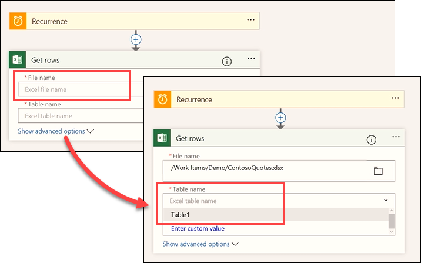

Cette rubrique montre comment exécuter des flux planifiés en utilisant un déclencheur nommé **Périodicité**.  Vous allez générer pour l’équipe marketing de Contoso un flux qui extrait automatiquement les adresses e-mail de clients d’un tableau Excel sur OneDrive. Vous allez configurer le flux de façon à ce qu’une fois par jour, les nouvelles adresses e-mail entrées dans la feuille de calcul soient ajoutées à une liste de clients sur MailChimp. 

## Créer une tâche planifiée
1. Ouvrez **Microsoft Flow**, sélectionnez **Mes flux**, puis **Créer entièrement**. 
   
    
2. Sélectionnez **Rechercher parmi des centaines de connecteurs et déclencheurs**.
3. Recherchez le service **Planification**, sélectionnez-le, puis choisissez le déclencheur **Planification – Périodicité**.
   
    
4. Définissez **Fréquence** sur **Jour** et **Intervalle** sur **1**. Sélectionnez **Nouvelle étape**, puis **Ajouter une action**. 
   
    
5. Recherchez **Excel**, sélectionnez le service **Excel**, puis sélectionnez l’action **Excel – obtenir des lignes**. 
   
    
   
    **Remarque** : Veillez à sélectionner **obtenir les lignes**, et non **obtenir une ligne**. 
6. Sélectionnez **Nom de fichier**, puis accédez à l’emplacement de votre fichier. Sélectionnez **Nom de la table**, puis choisissez la table souhaitée dans la feuille de calcul. 
   
    
7. Ajouter une nouvelle action. 
   
    
8. Recherchez le service **MailChimp**, puis sélectionnez l’action **MailChimp - Ajouter un membre à la liste**.
   
    
   
    **Remarque :** MailChimp est un *premium* connecteur. Selon votre licence Microsoft Flow, il se peut que vous deviez souscrire une version d’évaluation pour pouvoir utiliser ce connecteur.
9. Ajoutez les champs **ID de la liste** et **État** à partir des menus déroulants :
   
   * **ID de la liste** : sélectionnez la liste de distribution MailChimp de votre choix.
   * **État** : sélectionnez **Abonné**. 
     
     
10. Dans **Adresse e-mail**, utilisez la fonctionnalité de contenu dynamique pour ajouter le champ **ContactEmail**. 
    
     
    
     Notez que le flux crée automatiquement une étape supplémentaire. Microsoft Flow détecte que vous allez définir une action nécessitant une action supplémentaire. Chaque fois que le flux lit une nouvelle adresse e-mail, il crée une nouvelle action pour chaque ligne. 
    
     
11. Utilisez le contenu dynamique pour remplir les champs **Prénom** et **Nom** :
    
    * **Prénom** : FirstName.
    * **Nom** : LastName.
      
      

Désormais, ce flux s’exécutera une fois par jour pour obtenir les nouvelles lignes de cette table Excel, récupérer les adresses e-mail et les noms, et utiliser ceux-ci pour remplir la liste de publipostage MailChimp de Contoso, vous permettant ainsi d’économiser du temps et de l’argent. 

