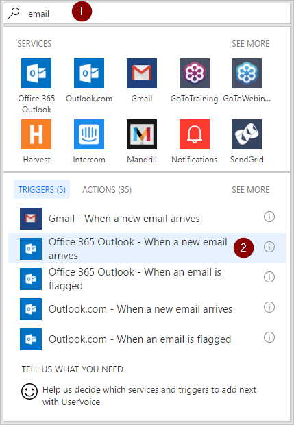

1. Connectez-vous à [Microsoft Flow](https://flow.microsoft.com), puis sélectionnez l’onglet **Mes flux**.
2. Sélectionnez **Créer entièrement**.
   
    
3. Recherchez « message électronique » et sélectionnez **Outlook Office 365 - Lors de l’arrivée d’un nouveau message électronique** dans la liste des déclencheurs. Ce déclencheur s’exécute chaque fois qu’un message électronique arrive.
   
    

