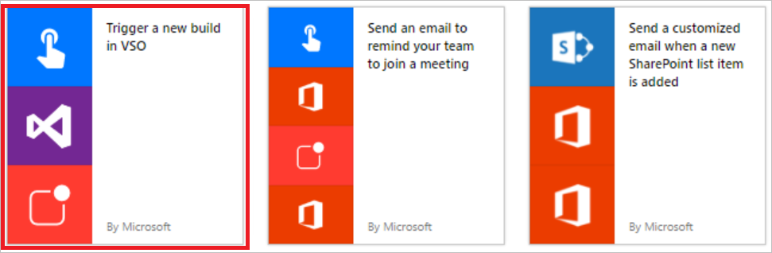
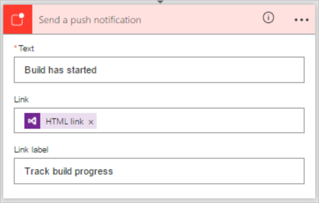
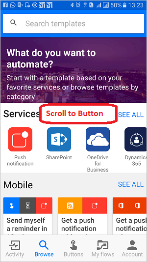

# Présentation des flux de bouton
## Que sont les flux de bouton ?
Il existe de nombreuses tâches répétitives que nous voudrions tous exécuter en appuyant simplement sur un bouton. Par exemple, vous pouvez avoir besoin d’envoyer rapidement un e-mail à votre équipe pour lui rappeler de rejoindre la synchronisation d’équipe quotidienne, ou de démarrer une nouvelle build Visual Studio Online de votre base de code une fois que vous avez été informé qu’il n’y a plus aucun archivage planifié pour la journée. Les flux de bouton vous permettent d’accomplir ces tâches et de nombreuses autres simplement en appuyant sur un bouton sur votre appareil mobile.

**Remarque** Vous pouvez créer des flux de bouton à partir de votre appareil mobile ou du portail Flow.  
    

## Pourquoi créer des boutons ?
Créez des boutons pour pouvoir facilement exécuter des tâches répétitives depuis n’importe où et à tout moment sur votre appareil mobile. L’exécution de boutons vous fait gagner du temps et, puisque les tâches sont automatisées, les erreurs sont moins nombreuses qu’avec une exécution manuelle.  

## Créer un bouton
### Prérequis
* Accès à Flow. Contactez votre administrateur pour lui demander l’accès.
* Un compte disposant des autorisations pour utiliser les connecteurs afin de créer votre bouton. Par exemple, vous avez besoin d’un compte Dropbox pour créer un bouton qui permet d’accéder à Dropbox.

### À partir du portail
Dans cette procédure pas à pas, nous allons créer un bouton qui démarre une build Visual Studio Online (VSO) et envoie des notifications pour vous avertir au début de la génération :  

1. Sélectionnez la liste déroulante **Affichage** et choisissez la catégorie **Bouton**. Cela filtre la liste des modèles pour afficher uniquement ceux qui peuvent être utilisés dans les flux de bouton.  
      
2. Sélectionnez le modèle **Trigger a new build in VSO (Déclencher une nouvelle génération dans VSO)** dans la liste des modèles.  
     
3. Sélectionnez le bouton **Utiliser ce modèle** dans la page **Trigger a new build in VSO (Déclencher une nouvelle génération dans VSO)**.   
     
4. Si vous n’êtes pas connecté, vous êtes invité à le faire à ce stade :  
     
5. Une fois que vous êtes connecté à Flow, vous êtes invité à vous connecter aux connecteurs utilisés dans le modèle que vous avez sélectionné. Dans cet exemple, à l’étape 2 ci-dessus, vous avez sélectionné le modèle **Trigger a new build in VSO (Déclencher une nouvelle génération dans VSO)**. Vous devez donc vous connecter à VSO (et aux autres connecteurs que vous utilisez), si vous n’êtes pas déjà connecté :  
       
6. Sélectionnez le bouton **Accepter** si vous acceptez d’autoriser Flow à accéder à votre compte VSO.  
      
   **Remarque** Vous devez autoriser chaque connecteur de la même façon. Le concepteur doit avoir l’aspect suivant lorsque vous êtes prêt à passer à l’étape suivante. Sélectionnez le bouton **Continuer** pour poursuivre :  
      
7. Vous êtes maintenant prêt à configurer les propriétés de la build que vous souhaitez démarrer :    
     
8. Sélectionnez ou entrez le **nom de compte**, le **nom du projet**, l’**ID de définition de build**, la **branche source** et éventuellement les **paramètres** dans la carte **Mettre en file d’attente une nouvelle build** :    
     
9. Ensuite, configurez les propriétés de la notification Push sur la carte **Envoyer une notification Push**. Par défaut, cette notification Push est configurée pour envoyer un lien HTML à une page web qui affiche l’état de la build :  
     
10. Sélectionnez le bouton **Créer un flux** pour enregistrer votre flux de bouton :   
11. Le message de réussite suivant doit s’afficher au bout de quelques instants :  
      

Félicitations, vous avez créé un flux de bouton. Vous pouvez maintenant exécuter ce flux de bouton à tout moment, en tout lieu, à partir de l’onglet **Boutons** de l’application Flow. Appuyez simplement sur le « bouton » pour exécuter le flux. L’application mobile Microsoft Flow est disponible pour [Android](https://aka.ms/flowmobiledocsandroid), [iOS](https://aka.ms/flowmobiledocsios) ou [Windows Phone](https://aka.ms/flowmobilewindows).

### À partir de votre appareil mobile
**Remarque** : cette procédure affiche les écrans d’un appareil Android, mais les écrans et l’expérience sur un appareil iOS sont similaires.

Dans l’application Flow :

1. Sélectionnez l’onglet **Parcourir** et faites défiler jusqu’à la catégorie **Bouton**.  
     
2. Sélectionnez le lien **Afficher tous**. Ceci affiche tous les modèles de bouton prêts à l’emploi.     
     
3. Sélectionnez le modèle **Envoyer un courrier électronique pour rappeler à votre équipe de rejoindre une réunion**    
     
4. Sélectionnez le lien **UTILISER CE MODÈLE** en bas de la page.    
     
5. Vous devez vous connecter à tous les services qui utilisent ce modèle :    
     
6. Sélectionnez le lien **Suivant** une fois que vous êtes connecté à tous les services.      
     
7. Sélectionnez le lien **Créer**. Ici, vous pouvez également consulter le flux et apporter les modifications dont vous avez besoin pour personnaliser le message électronique, par exemple.        
     
8. Au bout de quelques instants, le flux de bouton est créé. Sélectionnez **VOIR MON FLUX** :   
     
9. Vos flux s’affichent sous l’onglet **Mes flux**.  
     

Félicitations, vous avez créé un flux de bouton. Vous pouvez maintenant exécuter ce flux de bouton à tout moment, en tout lieu, à partir de l’onglet **Boutons** de l’application Flow. Appuyez simplement sur le « bouton » pour exécuter le flux. L’application Flow est actuellement disponible sur les appareils mobiles Android et iOS.  

  

## Déclencher un flux de bouton
Maintenant que vous avez créé un flux de bouton, il est temps de l’exécuter. Étant donné que vous pouvez uniquement exécuter des flux de bouton à partir de l’application Flow, vérifiez que vous avez installé Flow sur votre appareil mobile Android ou iOS.  

1. À présent, lancez l’application Flow, cliquez sur l’onglet **Boutons** situé en bas de la page, puis cliquez sur le *bouton* qui représente le flux de bouton que vous souhaitez déclencher :  
      
2. Observez la progression de l’exécution du flux :  
      
3. Enfin, la page se met à jour et indique que le flux de bouton est terminé :  
      

Vous savez à présent comment exécuter un flux. 

Vous devriez maintenant recevoir les notifications Push, indiquant que le message a été envoyé.  

## Surveiller l’exécution de votre flux de bouton
Vous pouvez surveiller des flux de bouton à partir de l’onglet **Activité** de l’application Flow :   
  

**Remarque** : appuyez sur une activité pour afficher les résultats de l’exécution et en savoir plus sur l’exécution.  

  

## Gérer les flux de bouton
Comme vous avez un contrôle total sur vos flux de bouton, vous pouvez activer/désactiver, modifier ou supprimer un bouton à tout moment, en tout lieu. À partir de l’application mobile ou du portail Flow, sélectionnez **Mes flux** pour commencer à gérer vos flux.    

Sous l’onglet **Mes flux** de l’application Flow :

1. Sélectionnez le flux que vous souhaitez gérer :    
      
2. Vous pouvez appuyer sur chacune de ces options, selon ce que vous souhaitez accomplir :    
     
3. Appuyez sur **Supprimer le flux** pour supprimer un flux.  

**Remarque** La totalité de l’historique d’exécution est supprimé lorsque vous supprimez un flux :   
   

1. Cliquez sur **Mettre à jour** une fois que vous avez terminé la modification d’un flux de bouton pour enregistrer vos modifications :   
      
2. Cliquez sur **Historique d’exécution** pour afficher les résultats de toutes les exécutions d’un flux de bouton particulier :    
     
3. Si vous désactivez un flux, il n’est plus disponible sous l’onglet **Boutons** :    
     

## Étapes suivantes
* [Partager des flux de bouton](share-buttons.md).
* Apprenez à utiliser les [jetons de déclencheur de bouton](introduction-to-button-trigger-tokens.md) pour envoyer des données en temps réel lorsque vos flux de bouton sont exécutés.
* Installez l’application mobile Microsoft Flow pour [Android](https://aka.ms/flowmobiledocsandroid), [iOS](https://aka.ms/flowmobiledocsios) ou [Windows Phone](https://aka.ms/flowmobilewindows).

