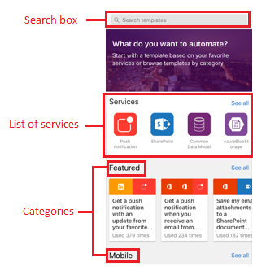

# Créer un flux à partir de votre téléphone à l’aide de Microsoft Flow
Créez un flux à partir de votre téléphone à l’aide d’un modèle, que vous pouvez trouver en recherchant parmi une liste de services, en parcourant les catégories ou en spécifiant des mots clés. Suivez les étapes décrites dans cette rubrique pour créer un flux qui envoie une notification Push à votre téléphone quand vous recevez un message de votre responsable.

Si vous débutez sur Microsoft Flow, [consultez une vue d’ensemble](getting-started.md).

## Prérequis
* Un [compte pour Microsoft Flow](sign-up-sign-in.md).
* Application mobile Microsoft Flow pour [Android](https://aka.ms/flowmobiledocsandroid), [iOS](https://aka.ms/flowmobiledocsios) ou [Windows Phone](https://aka.ms/flowmobilewindows) sur un [appareil pris en charge](getting-started.md#use-the-mobile-app). Les illustrations de cette rubrique reflètent la version iPhone de l’application, mais l’interface Android ou Windows Phone lui ressemble.
* Pour utiliser le modèle présenté dans cette rubrique, vous avez également besoin :
  
  * d’informations d’identification Office 365 ;
  * de notifications Push activées sur votre téléphone.

## Rechercher un modèle
1. Ouvrez l’application mobile, puis appuyez sur **Parcourir** en bas de l’écran.
   
    
   
    Pour trouver un modèle, procédez de l’une des manières suivantes :
   
   * Spécifiez un mot clé dans la zone de recherche en haut de l’écran.
   * Appuyez sur une option dans la liste des services.
   * Défilez vers le bas pour afficher des catégories, puis cliquez sur un modèle dans une catégorie.
     
       
     
     Pour ce didacticiel, vous allez ouvrir le modèle qui envoie une notification Push lorsque vous recevez un message électronique de votre responsable.
2. Dans la liste des services, cliquez sur **Afficher tout**.
   
    
3. Appuyez sur l’icône **Notification Push**.
   
    
4. Dans la barre de recherche, tapez **message électronique**, puis appuyez sur le modèle qui permet d’envoyer des notifications Push lorsque vous recevez un message de votre responsable.
   
    
5. Dans l’écran qui donne des détails sur le modèle que vous avez sélectionné, appuyez sur **Utiliser ce modèle**.
   
    

## Terminer le flux
1. Si vous y êtes invité, cliquez sur **Se connecter**, puis fournissez vos informations d’identification pour Office 365 Outlook et/ou Utilisateurs d’Office 365.
   
    
   
    Vous pouvez utiliser les mêmes connexions lorsque vous créez d’autres flux.
2. Dans l’angle supérieur droit, appuyez sur **Suivant**.
   
    
   
    L’écran suivant affiche l’événement déclencheur et toutes les actions qui en résultent.
   
    
   
    Pour ce modèle, un nouveau message déclenche le flux, qui récupère vos informations (notamment l’adresse de votre responsable) et vous envoie une notification Push lorsque vous recevez un message de cette adresse. Certains modèles nécessitent une personnalisation pour fonctionner correctement. Ce n’est pas le cas de ce modèle.
3. (facultatif) En haut de l’écran, tapez un nom différent pour le flux.
   
    
4. Dans l’angle supérieur droit, appuyez sur **Créer**.
   
    
   
    Votre flux est créé et va vérifier si vous avez reçu un message électronique de votre responsable jusqu’à ce que vous le suspendiez ou supprimiez.

## Étapes suivantes
* [Surveiller l’activité de flux](mobile-monitor-activity.md).
* [Gérer vos flux](mobile-manage-flows.md).

