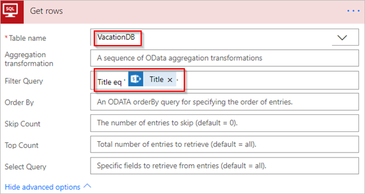

# Filtrer et copier des données avec Microsoft Flow
[!INCLUDE [view-pending-approvals](includes/cc-rebrand.md)]
Cette procédure pas à pas vous montre comment créer un Flow qui surveille une source pour les éléments nouveaux ou modifiés, puis copie ces modifications vers une destination. Vous pouvez créer un fluide similaire à celui-ci si vos utilisateurs entrent des données à un emplacement, mais que votre équipe en a besoin dans un autre emplacement ou format.

Bien que cette procédure pas à pas copie les données d’une [liste](https://support.office.com/article/SharePoint-lists-I-An-introduction-f11cd5fe-bc87-4f9e-9bfe-bbd87a22a194) Microsoft SharePoint (la source) vers une table de [Azure SQL Database](https://docs.microsoft.com/azure/sql-database/sql-database-technical-overview) (la destination), vous pouvez copier des données parmi les plus de [150 services](https://flow.microsoft.com/connectors/) pris en charge par Microsoft Flow.

> [!IMPORTANT]
> Les modifications que vous effectuez dans la destination ne sont pas copiées dans la source, car les synchronisations bidirectionnelles ne sont pas prises en charge. Si vous tentez de configurer une synchronisation bidirectionnelle, vous allez créer une boucle infinie dans laquelle les modifications sont envoyées indéfiniment entre la source et la destination.
> 
> 

## Conditions préalables
* Accès à une source de données et à une destination. Cette procédure pas à pas inclut les étapes de création de la source et de la destination.
* Accès aux [Microsoft Flow](https://flow.microsoft.com).
* Une compréhension élémentaire de la façon dont vos données sont stockées.
* Vous êtes familiarisé avec les principes de base de la création de flux. Vous pouvez voir comment ajouter des [actions, des déclencheurs](multi-step-logic-flow.md#add-another-action)et des [conditions](add-condition.md). Les étapes suivantes supposent que vous savez comment effectuer ces actions.

> [!TIP]
> Chaque nom de colonne dans la source et la destination n’ont pas besoin de correspondre, mais vous devez fournir des données pour toutes les colonnes *requises* lorsque vous insérez ou mettez à jour un élément. Microsoft Flow identifie les champs requis pour vous.
> 
> 

## Vue d’ensemble rapide des étapes
Si vous êtes à l’aise avec Microsoft Flow, utilisez ces étapes rapides pour copier des données d’une source de données vers une autre :

1. Identifiez la source que vous allez surveiller et la destination vers laquelle vous allez copier les données modifiées. Confirmez que vous avez accès aux deux.
2. Identifiez au moins une colonne qui identifie de façon unique les éléments dans la source et la destination. Dans l’exemple qui suit, nous utilisons la colonne **title** , mais vous pouvez utiliser n’importe quelle colonne de votre choix.
3. Configurez un déclencheur qui surveille les modifications apportées à la source.
4. Recherchez la destination pour déterminer si l’élément modifié existe.
5. Utilisez une **condition** comme celle-ci :
   * Si l’élément nouveau ou modifié n’existe pas dans la destination, créez-le.
   * Si l’élément nouveau ou modifié existe dans la destination, mettez-le à jour.
6. Déclenchez votre Flow, puis vérifiez que les éléments nouveaux ou modifiés sont copiés de la source vers la destination.

> [!NOTE]
> Si vous n’avez pas créé de connexion à SharePoint ou Azure SQL Database précédemment, suivez les instructions lorsque vous êtes invité à vous connecter.
> 
> 

Voici les étapes détaillées pour créer le fluide.

## Surveiller la source des modifications
1. Connectez-vous [Microsoft Flow](https://flow.microsoft.com), sélectionnez **mes flux** > **créer à partir d’un espace vide**.
2. Recherchez **sharepoint** > sélectionnez le déclencheur **SharePoint-lors de la création ou de la modification d’un élément** dans la liste des déclencheurs.
3. Entrez l' **adresse du site** , puis sélectionnez le **nom** de la liste sur la carte lors de la création ou de la **modification d’un élément** .
   
    Fournissez l' **adresse du site** et le nom de **liste** de la liste SharePoint que votre workflow surveille pour les éléments nouveaux ou mis à jour.
   
    

## Rechercher l’élément nouveau ou modifié dans la destination
Nous utilisons l’action **SQL Server-obtenir des lignes** pour Rechercher l’élément nouveau ou modifié dans la destination.

1. Sélectionnez **nouvelle étape** > **Ajouter une action**.
2. Recherchez **obtenir des lignes**, sélectionnez **SQL Server-obtenir des lignes**, puis sélectionnez la table que vous souhaitez analyser dans la liste nom de la **table** .
3. Sélectionnez **afficher les options avancées**.
4. Dans la **zone filtrer la requête** , entrez le **titre EQ'** , sélectionnez le jeton de **titre** dans la liste de contenu dynamique, puis entrez **'** .
   
    L’étape précédente suppose que vous mettez en correspondance les titres des lignes dans la source et la destination.
   
    La carte **obtenir les lignes** doit maintenant ressembler à cette image :
   
    

## Vérifier si l’élément nouveau ou modifié a été trouvé
Sélectionnez **nouvelle étape** > **Ajouter une condition** pour ouvrir la carte de **condition** .

Sur la carte condition :

1. Activez la case à cocher à gauche.
   
    La liste **Ajouter du contenu dynamique à partir des applications et des connecteurs utilisés dans cette liste de Flow** s’ouvre.
2. Sélectionnez **valeur** dans la catégorie **extraire les lignes** .
   
   > [!TIP]
   > Confirmez que vous avez sélectionné **valeur** dans la catégorie **extraire les lignes** . Ne sélectionnez pas de **valeur** dans la catégorie lors de la **création ou de la modification d’un élément** .
   > 
   > 
3. SELECT **est égal à** dans la liste dans la zone centrale.
4. Entrez **0** (zéro) dans la zone située à droite.
   
    La carte **condition** ressemble maintenant à l’image suivante :
   
    
5. Sélectionnez **modifier en mode avancé**.
   
    Lorsque le mode avancé s’ouvre, vous voyez **\@est égal à (corps ('Get_rows') ? [' valeur «], 0)** expression dans la zone. Modifiez cette expression en ajoutant **length ()** autour du **corps ('Get_items') ? [' fonction value']** . L’expression entière se présente maintenant comme suit : **@equals(longueur (corps ('Get_rows') ? [' valeur']), 0)**
   
    La carte **condition** ressemble maintenant à l’image suivante :
   
    
   
   > [!TIP]
   > L’ajout de la fonction **length ()** permet au Flow de vérifier la liste de **valeurs** et de déterminer si elle contient des éléments.
   > 
   > 

Lorsque votre Flow « récupère » les éléments de la destination, deux résultats sont possibles.

| Résultats | Étape suivante |
| --- | --- |
| L’élément existe |[Mettre à jour l’élément](odata-filters.md#update-the-item-in-the-destination) |
| L’élément n’existe pas |[Créer un élément](odata-filters.md#create-the-item-in-the-destination) |

> [!NOTE]
> Les images des cartes d' **insertion de ligne** et de ligne de **mise à jour** présentées ci-dessous peuvent différer de la vôtre, car ces cartes affichent les noms des colonnes dans la table Azure SQL Database qui est utilisée dans le Workflow.
> 
> 

## Créer l’élément dans la destination
Si l’élément n’existe pas dans la destination, créez-le à l’aide de l’action **SQL Server-insérer une ligne** .

Sur la branche **si oui** de la **condition**:

1. Sélectionnez **Ajouter une action**, recherchez **Insérer une ligne**, puis sélectionnez **SQL Server-insérer une ligne**.
   
    La carte **Insérer une ligne** s’ouvre.
2. Dans la liste nom de la **table** , sélectionnez la table dans laquelle le nouvel élément sera inséré.
   
    La carte **Insérer une ligne** développe et affiche tous les champs de la table sélectionnée. Les champs avec un astérisque (*) sont obligatoires et doivent être remplis pour que la ligne soit valide.
3. Sélectionnez chaque champ que vous souhaitez remplir, puis entrez les données.
   
    Vous pouvez entrer les données manuellement, sélectionner un ou plusieurs jetons à partir du **contenu dynamique**, ou entrer n’importe quelle combinaison de texte et de jetons dans les champs.
   
    La carte **Insérer une ligne** ressemble maintenant à l’image suivante :
   
    

## Mettre à jour l’élément dans la destination
Si l’élément existe dans la destination, mettez-le à jour avec les modifications.

1. Ajoutez l’action **SQL Server-mettre à jour la ligne** à la branche **si non** de la **condition**.
2. Suivez les étapes de la section [créer l’élément](odata-filters.md#create-the-item-in-the-destination) de ce document pour remplir les champs de la table.
   
    
3. En haut de la page, entrez un nom pour votre Flow dans la zone **nom du workflow** , puis sélectionnez **créer un Flow** pour l’enregistrer.
   
    

Désormais, chaque fois qu’un élément de votre liste SharePoint (source) change, votre workflow se déclenche et insère un nouvel élément ou met à jour un élément existant dans votre Azure SQL Database (destination).

> [!NOTE]
> Votre Flow n’est pas déclenché lorsqu’un élément est supprimé de la source. S’il s’agit d’un scénario important, envisagez d’ajouter une colonne distincte qui indique quand un élément n’est plus nécessaire.
> 
> 

## Pour en savoir plus
Utilisez des [opérations de données](data-operations.md) dans vos flux.

