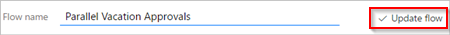
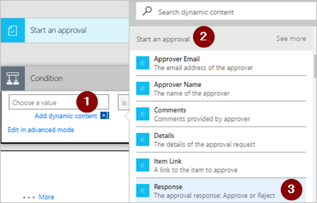

# Créer un flux de travail d’approbations parallèles avec Microsoft Flow
Dans un flux de travail d’approbations parallèles, plusieurs personnes doivent approuver des éléments tels que des factures, commandes fournisseur, demandes de congés, etc. L’approbation de chaque personne est indépendante de tous les autres approbateurs.

Dans cette procédure pas à pas, vous utilisez Microsoft Flow pour créer un flux qui automatise un flux de travail d’approbations parallèles. Ce flux automatise le processus de demande de congés d’un employé qui nécessite une approbation de la part de toutes les personnes (ou équipes) avec lesquelles l’employé travaille régulièrement. Les employés utilisent une [liste SharePoint](https://support.office.com/article/Introduction-to-lists-0a1c3ace-def0-44af-b225-cfa8d92c52d7) pour demander des congés. Les congés doivent être approuvés par le responsable direct de l’employé, l’équipe des ventes et l’équipe des ressources humaines. Chaque demande de congés est routée vers chaque approbateur qui doit prendre une décision. Le flux envoie un courrier avec les modifications d’état, puis met à jour SharePoint avec les décisions.

## Conditions préalables
[!INCLUDE [prerequisites-for-modern-approvals](includes/prerequisites-for-modern-approvals.md)]

La liste SharePoint Online que vous créez doit comprendre les colonnes suivantes :

   

Notez le nom et l’URL de la liste SharePoint Online. Vous utiliserez ces éléments plus tard lorsque vous configurerez le déclencheur **SharePoint - Lorsqu’un élément est créé**.

## Créer votre flux à partir du modèle vide
[!INCLUDE [sign-in-and-create-flow-from-blank-template](includes/sign-in-and-create-flow-from-blank-template.md)]

## Ajouter un déclencheur
[!INCLUDE [add-trigger-when-sharepoint-item-created](includes/add-trigger-when-sharepoint-item-created.md)]

   

## Obtenir le responsable de la personne qui a créé la demande de congés
[!INCLUDE [add-get-manager-action](includes/add-get-manager-action.md)]

## Nommer et enregistrer votre flux
1. Fournissez un nom pour votre flux, puis sélectionnez **Créer un flux** pour enregistrer le travail réalisé jusqu'à présent.
   
   

> [!NOTE]
> Sélectionnez **Mettre à jour le flux** en haut de l’écran régulièrement pour enregistrer les modifications apportées à votre flux.
> 
> 

   

Pour continuer à apporter des modifications après l’enregistrement ou la mise à jour du flux, sélectionnez **Modifier le flux** en haut de l’écran, puis continuez à apporter des modifications.

## Ajouter une action d’approbation pour le responsable immédiat
[!INCLUDE [add-an-approval-action](includes/add-an-approval-action.md)]

> [!IMPORTANT]
> Comme cette action envoie une demande de congés à l’adresse de courrier indiquée dans la zone **Assigned To** (Assigné à), insérez le jeton **Courrier** à partir de la liste **Obtenir le responsable**.
> 
> 

## Insérer une action d’approbation de branche parallèle pour l’équipe des ventes
1. Sélectionnez la flèche vers le bas qui se trouve entre les cartes **Obtenir le responsable** et **Start an approval** (Démarrer une approbation).
2. Sélectionnez le signe plus qui s’affiche sur la flèche vers le bas une fois celle-ci sélectionnée.
3. Sélectionnez **Ajouter une branche parallèle**.
4. Sélectionnez **Ajouter une action**.
   
    
5. Recherchez, sélectionnez et configurez une action **Start an approval** (Démarrer une approbation) qui envoie la demande de congés à l’équipe des ventes. Consultez les [étapes utilisées dans la section Ajouter une action d’approbation pour le responsable immédiat](parallel-modern-approvals.md#add-an-approval-action-for-immediate-manager) si vous ne savez pas comment ajouter l’action **Start an approval** (Démarrer une approbation).

> [!IMPORTANT]
> Utilisez l’adresse de courrier de l’équipe des ventes figurant dans la zone **Assigned To** (Assigné à) de l’action **Start an approval** (Démarrer une approbation).
> 
> 

## Insérer une action d’approbation de branche parallèle pour l’équipe des ressources humaines
1. Répétez les étapes de la section [Insérer une action d’approbation de branche parallèle pour l’équipe des ventes](parallel-modern-approvals.md#insert-a-parallel-branch-approval-action-for-the-sales-team), puis configurez une action **Start an approval** (Démarrer une approbation) pour envoyer des demandes de congés aux ressources humaines.

> [!IMPORTANT]
> Utilisez l’adresse de courrier de l’équipe des ressources humaines figurant dans la zone **Assigned To**  (Assigné à) de l’action **Start an approval** (Démarrer une approbation).
> 
> 

Si vous avez respecté cette procédure, votre flux doit ressembler à l’exemple suivant :

   

## Options après l’ajout des branches parallèles
Une fois que vous avez ajouté des actions aux branches parallèles, vous avez deux options pour ajouter des étapes supplémentaires à votre flux :

* Utilisez le petit bouton **Insérer une nouvelle étape** (bouton plus circulaire qui apparaît lorsque vous sélectionnez un espace blanc sur une branche ou la zone en dessous d’une branche). Ce bouton ajoute une étape à cette **branche spécifique**. Les étapes que vous ajoutez avec ce bouton s’exécutent après la fin de cette branche spécifique.
* Utilisez le plus grand bouton **Nouvelle étape** situé en bas de l’intégralité du flux de travail. Ce bouton ajoute une action qui s’exécute une fois que **toutes les branches** sont terminées. Les étapes que vous ajoutez avec ce bouton s’exécutent une fois que toutes les branches sont terminées.

Dans les sections suivantes, vous utilisez le petit bouton **Insérer une nouvelle étape** pour effectuer les opérations suivantes sur chaque branche :

* Ajoutez une condition qui vérifie si la demande de congés a été approuvée ou rejetée.
* Envoyez un courrier qui informe l’employé de la décision.
* Mettez à jour la demande de congés dans SharePoint avec la décision d’approbation.

Utilisez ensuite le plus grand bouton **Nouvelle étape** pour envoyer un courrier qui résume toutes les décisions prises concernant la demande de congés.

Continuez :

## Ajouter une condition à chaque branche
1. Sélectionnez un espace blanc sur la branche **Start an approval** (Démarrer une approbation).
2. Sélectionnez le petit bouton **Insérer une nouvelle étape** (bouton plus circulaire qui apparaît lorsque vous sélectionnez un espace blanc à l’étape précédente).
3. Sélectionnez **Ajouter une condition** dans le menu qui s’affiche.
4. Sélectionnez la première zone de la carte **Condition**, puis sélectionnez le jeton **Réponse** à partir de la catégorie **Start an approval** (Démarrer une approbation) dans la liste de contenu dynamique.
   
    
5. Vérifiez que la liste (au milieu de la **carte Condition**) est définie sur **Est égal à**.
6. Entrez **Approuver** (ce texte est sensible à la casse) dans la dernière zone.
7. Votre carte Condition doit maintenant ressembler à cet exemple :
   
    
   
   > [!NOTE]
   > Cette condition vérifie la réponse de l’action **Start an approval** (Démarrer une approbation) qui est envoyée au responsable de l’employé.
   > 
   > 
8. Répétez les étapes précédentes sur les branches **Démarrer une approbation 2** (la demande d’approbation au service Ventes) et **Démarrer une approbation 3** (la demande d’approbation aux services Ressources humaines).

## Ajouter des actions de courrier à chaque branche
Procédez comme suit sur le côté **SI OUI, NE RIEN FAIRE** de la branche **Condition**.

   Remarque : votre flux utilise ces étapes pour envoyer un courrier quand la demande est approuvée :

[!INCLUDE [add-action-to-send-email-when-vacation-approved](includes/add-action-to-send-email-when-vacation-approved.md)]

   

Pour envoyer un courrier lorsqu’une demande est rejetée, utilisez le côté **SI NON, NE RIEN FAIRE** de la branche **Condition**, puis répétez les étapes précédentes pour ajouter un modèle de courrier de refus.

Répétez les étapes précédentes sur les branches **Démarrer une approbation 2** (la demande d’approbation au service Ventes) et **Démarrer une approbation 3** (la demande d’approbation aux services Ressources humaines).

## Mettre à jour la demande de congés avec la décision
Procédez comme suit pour mettre à jour SharePoint lorsque des décisions sont prises.

   Remarque : veillez à effectuer ces étapes sur les côtés **SI OUI** et **SI NON** de la branche.

[!INCLUDE [add-action-to-update-sharepoint-with-approval](includes/add-action-to-update-sharepoint-with-approval.md)]

   

Répétez les étapes précédentes sur les branches **Démarrer une approbation 2** et **Démarrer une approbation 3**.

## Terminer le flux
1. Sélectionnez **Nouvelle étape** > **Ajouter une action**.
   
    
2. Utilisez les étapes décrites précédemment pour envoyer un courrier qui résume les résultats de chaque approbation. Envoyez ce courrier à l’employé qui a demandé des congés. Votre carte peut ressembler à cet exemple :
   
   

## En savoir plus sur les approbations modernes
[Présentation des approbations modernes](modern-approvals.md)

