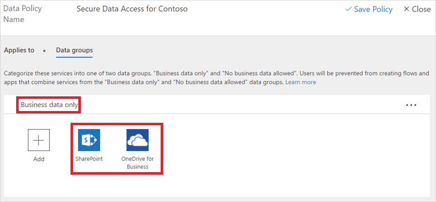

# Stratégies de protection contre la perte de données
## Qu’est-ce qu’une stratégie de protection contre la perte de données ?
Les données d’une entreprise sont essentielles à son succès. Elles doivent être disponibles pour la prise de décisions, mais elles doivent être protégées afin qu’elles ne soient pas partagées avec les publics qui ne sont pas autorisés à y accéder. Pour protéger ces données, Microsoft Flow (Flow) vous offre la possibilité de créer et d’appliquer des stratégies qui définissent avec quelles services/connecteurs grand public des données d’entreprise spécifiques peuvent être partagées. Ces stratégies qui définissent la façon dont les données peuvent être partagées sont appelées stratégies de protection contre la perte de données.

## Pourquoi créer une stratégie de protection contre la perte de données ?
Vous devez créer une stratégie de protection contre la perte de données pour définir clairement avec quels services grand public les données d’entreprise peuvent être partagées. Par exemple, une organisation qui utilise Flow peut refuser que ses données d’entreprise stockées dans SharePoint soient publiées automatiquement sur son flux Twitter. Pour éviter ce problème, vous pouvez créer une stratégie de protection contre la perte de données qui empêche l’utilisation des données SharePoint comme source pour des tweets.

## Avantages d’une stratégie de protection contre la perte de données
* Garantit que les données sont gérées de manière uniforme dans toute l’organisation.  
* Empêche la publication accidentelle des données d’entreprise importantes à des services tels que des sites de réseaux sociaux.   

## Gestion des stratégies de protection contre la perte de données
**Conditions préalables**  
Pour créer, modifier ou supprimer des stratégies de protection contre la perte de données, les éléments suivants sont requis : 

* Des autorisations d’administrateur d’environnement ou d’administrateur de locataire. La [rubrique relative aux environnements](environments-overview-admin.md) inclut des informations sur les autorisations.  
* Une [licence Flow P2](billing-questions.md).  

## Créer une stratégie de protection contre la perte de données
**Conditions préalables**  
Pour créer une stratégie de protection contre la perte de données, vous devez disposer d’autorisations pour au moins un environnement.  

Suivez ces étapes pour créer une stratégie de protection contre la perte de données qui empêche la publication des données de votre entreprise stockées dans SharePoint sur Twitter :  

1. Dans l’onglet Stratégies de données, sélectionnez le lien **Nouvelle stratégie** :  
       
2. Entrez comme nom de la stratégie de protection contre la perte de données *Accès sécurisé aux données pour Contoso* dans l’étiquette **Nom de la stratégie** en haut de la page qui s’ouvre :   
     
3. Sélectionnez l’[environnement](environments-overview-admin.md) sous l’onglet **S’applique à**.  
   **Remarque :** en tant qu’administrateur de l’environnement, vous pouvez créer des stratégies qui s’appliquent à un seul environnement. En tant qu’un administrateur de locataire, vous pouvez créer une stratégie qui s’applique à tous les environnements, un ou plusieurs environnements sélectionnés ou tous les environnements, à l’exception d’un ensemble sélectionné :  
     
4. Sélectionnez l’onglet **Groupes de données** :  
     
5. Sélectionnez le lien **+ Ajouter** situé dans la zone du groupe **Données d’entreprise uniquement** :    
     
6. Sélectionnez les services **SharePoint** et **Salesforce** à partir de la page **Ajouter des services** :  
     
7. Sélectionnez le bouton **Ajouter des services** pour ajouter les services qui sont autorisés à partager les données d’entreprise :    
     
8. Sélectionnez **Enregistrer la stratégie** :  
     
9. Après quelques instants, la nouvelle stratégie s’affiche dans la liste des stratégies de protection contre la perte de données :  
     
10. **Facultatif** Envoyez un courrier électronique ou toute autre communication à votre équipe, en indiquant qu’une nouvelle stratégie de protection contre la perte de données est maintenant disponible.

Félicitations. Vous avez créé une stratégie de protection contre la perte de données qui permet à l’application de partager des données entre SharePoint et Salesforce et bloque le partage des données avec d’autres services.  

**Remarque** : l’ajout d’un service à un groupe de données automatiquement le supprime de l’autre groupe de données. Par exemple, si Twitter se trouve actuellement dans le groupe de données **Données d’entreprise uniquement** et que vous ne voulez pas autoriser le partage des données d’entreprise sur Twitter, ajoutez simplement le service Twitter au groupe de données **Aucune donnée commerciale autorisée**. Cela permet de supprimer Twitter du groupe de données Données d’entreprise uniquement.  

## Violation du partage de données
En supposant que vous avez créé la stratégie de protection contre la perte de données décrite ci-dessus, si un utilisateur crée un flux qui partage des données entre Salesforce (qui est dans le groupes de données **Données d’entreprise uniquement**) et Twitter (qui est dans le groupe de données **Aucune donnée commerciale autorisée**), l’utilisateur est informé que le flux est **suspendu** en raison d’un conflit avec la stratégie de protection contre la perte de données que vous avez créée.  
  

Si vos utilisateurs vous contactent au sujet de flux suspendus, voici quelques éléments à prendre en compte :  

1. Dans cet exemple, s’il existe un motif valide pour partager des données professionnelles entre SharePoint et Twitter, vous pouvez modifier la stratégie de protection contre la perte de données.  
2. Demandez à l’utilisateur de modifier le flux pour qu’il soit conforme à la stratégie de protection contre la perte de données.  
3. Demandez à l’utilisateur de laisser le flux dans l’état suspendu jusqu’à ce qu’une décision soit prise concernant le partage des données entre ces deux entités.  

## Rechercher une stratégie de protection contre la perte de données
### Administrateurs
Les administrateurs peuvent utiliser la fonctionnalité de recherche à partir du centre d’administration pour rechercher les stratégies de protection contre la perte de données spécifiques.  

**REMARQUE** Les administrateurs doivent publier toutes les stratégies de protection contre la perte de données afin que les utilisateurs de l’organisation connaissent les stratégies avant de créer des flux.

### Créateurs
Si vous n’avez pas les autorisations d’administrateur et que vous souhaitez en savoir plus sur les stratégies de protection contre la perte de données dans votre organisation, contactez votre administrateur. Vous pouvez également obtenir plus d’informations à partir de la [rubrique relative aux environnements de création](environments-overview-maker.md)  

**REMARQUE** Seuls les administrateurs peuvent modifier ou supprimer des stratégies de protection contre la perte de données.  

## Modifier une stratégie de protection contre la perte de données
1. Lancez le centre d’administration en accédant à la page https://admin.flow.microsoft.com.  
2. Dans le centre d’administration qui s’ouvre, sélectionnez le lien **Stratégies de données** sur le côté gauche.  
     
3. Dans la liste des stratégies de protection contre la perte de données existantes, sélectionnez le bouton Modifier en regard de la stratégie à modifier :  
     
4. Apportez les modifications souhaitées. Vous pouvez par exemple modifier l’environnement ou les services dans les groupes de données.  
5. Sélectionnez **Enregistrer la stratégie** pour enregistrer vos modifications :  
     

Votre stratégie est maintenant à jour. Vous pouvez vérifier que les modifications ont été apportées à votre stratégie en la recherchant dans la liste des stratégies de protection contre la perte de données et en examinant ses propriétés.   

**Remarque** Les stratégies de protection contre la perte de données créées par les administrateurs de locataires peuvent être consultées par les administrateurs de l’environnement mais ces derniers ne peuvent pas les modifier.  

## Supprimer une stratégie de protection contre la perte de données
1. Lancez le centre d’administration en accédant à la page https://admin.flow.microsoft.com.  
2. Dans le centre d’administration qui s’ouvre, sélectionnez le lien **Stratégies de données** sur le côté gauche.  
     
3. Dans la liste des stratégies de protection contre la perte de données existantes, sélectionnez le bouton Supprimer en regard de la stratégie à supprimer :  
     
4. Confirmez que vous souhaitez réellement supprimer la stratégie en sélectionnant le bouton **Supprimer** :  
     

Votre stratégie est maintenant supprimée. Vous pouvez confirmer que la stratégie n’est plus répertoriée dans la liste des stratégies de protection contre la perte de données en sélectionnant le lien **Stratégies de données** à gauche et en examinant la liste des stratégies.   

## Autorisations liées aux stratégies de protection contre la perte de données
Seuls les administrateurs de locataires et d’environnements peuvent créer et modifier des stratégies de protection contre la perte de données. La [rubrique relative aux environnements](environments-overview-admin.md) inclut des informations sur les autorisations.  

## Étapes suivantes
* [En savoir plus sur les environnements](environments-overview-admin.md)  
* [En savoir plus sur Microsoft Flow](getting-started.md)  
* [En savoir plus sur le centre d’administration](introduction-to-the-admin-center.md).  

