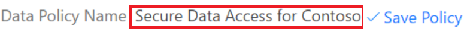

# Stratégies de protection contre la perte de données

Ce document présente les stratégies de protection contre la perte de données, qui permettent d’empêcher le partage de vos données d’entreprise avec une liste de connecteurs que vous définissez.

## Qu’est-ce qu’une stratégie de protection contre la perte de données ?

Les données d’une entreprise sont essentielles à son succès. Elles doivent être disponibles pour la prise de décisions, mais doivent être protégées pour empêcher le partage avec des personnes non autorisées à y accéder. Pour protéger ces données, Microsoft Flow vous offre la possibilité de créer et d’appliquer des stratégies qui définissent les connecteurs grand public autorisés à accéder aux données métiers et à les partager. Ces stratégies qui définissent la façon dont les données peuvent être partagées sont appelées stratégies de protection contre la perte de données.

## Pourquoi créer une stratégie de protection contre la perte de données ?

Vous créez une stratégie DLP pour définir clairement les connecteurs grand public pouvant accéder à vos données métiers et les partager. Par exemple, une organisation qui utilise Microsoft Flow peut refuser que ses données métiers stockées dans SharePoint soient publiées automatiquement sur son flux Twitter. Pour éviter que ça n’arrive, vous créez une stratégie DLP qui empêche l’utilisation des données SharePoint comme source pour des tweets.

## Avantages d’une stratégie de protection contre la perte de données

* Garantit que les données sont gérées de manière uniforme dans toute l’organisation.
* Empêche la publication accidentelle des données métiers importantes sur des connecteurs comme les sites de réseaux sociaux.

## Gestion des stratégies de protection contre la perte de données

### Prérequis pour la gestion des stratégies DLP

* Des autorisations d’administrateur d’environnement ou d’administrateur de locataire.

    Plus d’informations sur les autorisations sont disponibles dans [l’article sur les environnements](environments-overview-admin.md).
* Une [licence Microsoft Flow P2](billing-questions.md).

## Créer une stratégie de protection contre la perte de données

### Prérequis pour la création de stratégies DLP

Pour créer une stratégie DLP, vous devez avoir des autorisations sur au moins un environnement.

Suivez ces étapes pour créer une stratégie DLP qui empêche la publication des données de votre site SharePoint d’entreprise sur Twitter :

1. Connectez-vous au [centre d’administration Microsoft Flow](https://admin.flow.microsoft.com) (Centre d’administration).

1. Sous l’onglet Stratégies de données, sélectionnez le lien **Nouvelle stratégie** :

    
1. Sélectionnez l’onglet **Groupes de données**.

1. Entrez le nom de la stratégie DLP : *Accès sécurisé aux données pour Contoso* dans l’étiquette **Nom de la stratégie de données** en haut de la page :

    

1. Sélectionnez [l’environnement](environments-overview-admin.md) sous l’onglet **Environnements**.

    > [!NOTE]
    > En tant qu’administrateur de l’environnement, vous pouvez créer des stratégies qui s’appliquent à un seul environnement. En tant qu’administrateur de locataire, vous pouvez créer des stratégies qui s’appliquent à n’importe quelle combinaison d’environnements :
    >
    >

    

1. Sélectionnez l’onglet **Groupes de données** :

    

1. Sélectionnez le lien **Ajouter** situé dans la zone de groupe **Données métiers uniquement** :

    

1. Sélectionnez les connecteurs **SharePoint** et **Salesforce** dans la page **Ajouter des connecteurs** :

   

1. Sélectionnez le bouton **Ajouter des connecteurs** pour ajouter les connecteurs pouvant partager les données métiers.

1. Sélectionnez **Enregistrer la stratégie** en haut à droite de l’écran.

1. Après quelques instants, la nouvelle stratégie s’affiche dans la liste des stratégies de protection contre la perte de données :

    

1. **Facultatif** Envoyez un courrier électronique ou toute autre communication à votre équipe, en indiquant qu’une nouvelle stratégie de protection contre la perte de données est maintenant disponible.

Félicitations. Vous avez créé une stratégie DLP qui permet à l’application de partager des données entre SharePoint et Salesforce, et bloque le partage des données avec d’autres services.

> [!NOTE]
> L’ajout d’un service à un groupe de données le supprime automatiquement de l’autre groupe de données. Par exemple, si Twitter se trouve actuellement dans le groupe de données **Données d’entreprise uniquement** et que vous ne voulez pas autoriser le partage des données d’entreprise sur Twitter, ajoutez simplement le service Twitter au groupe de données **Aucune donnée commerciale autorisée**. Cela permet de supprimer Twitter du groupe de données Données d’entreprise uniquement.
>
>

## Violation du partage de données

En supposant que vous avez créé la stratégie DLP décrite ci-dessus, si un utilisateur crée un flux qui partage des données entre Salesforce (qui est dans le groupe de données **Données métiers uniquement**) et Twitter (qui est dans le groupe de données **Aucune donnée métier autorisée**), l’utilisateur est informé que le flux est **suspendu** en raison d’un conflit avec la stratégie de protection contre la perte de données que vous avez créée.

Si vos utilisateurs vous contactent au sujet de flux suspendus, voici quelques éléments à prendre en compte :

1. Dans cet exemple, s’il existe un motif valide pour partager des données métiers entre SharePoint et Twitter, vous pouvez modifier la stratégie DLP.

1. Demandez à l’utilisateur de modifier le flux pour qu’il soit conforme à la stratégie de protection contre la perte de données.

1. Demandez à l’utilisateur de laisser le flux dans l’état suspendu jusqu’à ce qu’une décision soit prise concernant le partage des données entre ces deux entités.

## Rechercher une stratégie de protection contre la perte de données

### Administrateurs

Les administrateurs peuvent utiliser la fonctionnalité de recherche à partir du centre d’administration pour rechercher les stratégies de protection contre la perte de données spécifiques.

> [!NOTE]
> Les administrateurs doivent publier toutes les stratégies DLP afin que les utilisateurs dans l’organisation en prennent connaissance avant de créer des flux.
>
>

### Créateurs

Si vous n’avez pas les autorisations d’administrateur et que vous souhaitez en savoir plus sur les stratégies de protection contre la perte de données dans votre organisation, contactez votre administrateur. Plus d’informations sont également disponibles dans [l’article sur les environnements de création](environments-overview-maker.md)

> [!NOTE]
> Seuls les administrateurs peuvent modifier ou supprimer des stratégies DLP.
>
>

## Modifier une stratégie de protection contre la perte de données

1. Lancez le [Centre d’administration](https://admin.flow.microsoft.com).

1. Dans le centre d’administration qui s’ouvre, sélectionnez le lien **Stratégies de données** sur le côté gauche.

    

1. Dans la liste des stratégies DLP existantes, sélectionnez le bouton Modifier à côté de la stratégie à modifier.

1. Modifiez la stratégie selon vos besoins. Vous pouvez par exemple modifier l’environnement ou les services dans les groupes de données.

1. Sélectionnez **Enregistrer la stratégie** pour enregistrer vos modifications.

> [!NOTE]
> Les stratégies DLP créées par les administrateurs de locataire peuvent être consultées par les administrateurs d’environnement, mais ces derniers ne peuvent pas les modifier.
>
>

## Supprimer une stratégie de protection contre la perte de données

1. Lancez le [Centre d’administration](https://admin.flow.microsoft.com).

1. Sélectionnez l’onglet **Stratégies de données** à gauche.

    

1. Dans la liste des stratégies DLP existantes, sélectionnez le bouton Supprimer à côté de la stratégie à supprimer :

    

1. Confirmez que vous souhaitez réellement supprimer la stratégie en sélectionnant le bouton **Supprimer** :

    

## Autorisations liées aux stratégies de protection contre la perte de données

Seuls les administrateurs de locataires et d’environnements peuvent créer et modifier des stratégies de protection contre la perte de données. Plus d’informations sur les autorisations sont disponibles dans [l’article sur les environnements](environments-overview-admin.md).

## Étapes suivantes

* [En savoir plus sur les environnements](environments-overview-admin.md)
* [En savoir plus sur Microsoft Flow](getting-started.md)
* [En savoir plus sur le centre d’administration](admin-center-introduction.md).
* [En savoir plus sur l'intégration de données](https://docs.microsoft.com/common-data-service/entity-reference/dynamics-365-integration)
