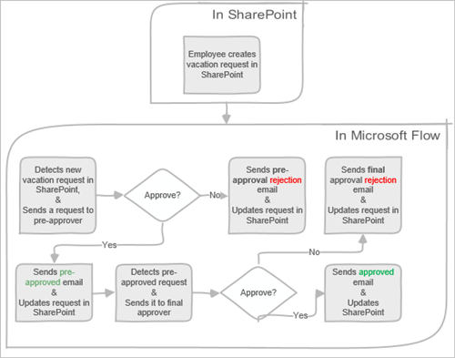
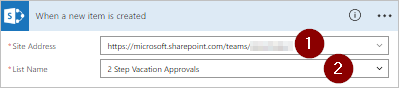

# Gérer les approbations séquentielles avec Microsoft Flow
Certains flux de travail exigent une approbation préalable avant que l’approbateur final donne sa décision finale. Par exemple, une entreprise peut avoir une stratégie d’approbation séquentielle qui exige une approbation préalable des factures dont le montant est supérieur à 1 000 € avant leur approbation par le département Finance.

Dans cette procédure pas à pas, vous créez un flux séquentiel qui gère les demandes de congés des employés.

## Étapes détaillées du flux
Le flux :

1. Démarre lorsqu’un employé crée une demande de congés dans une liste [SharePoint Online](https://support.office.com/article/Introduction-to-lists-0a1c3ace-def0-44af-b225-cfa8d92c52d7).
2. Ajoute la demande de congés dans le centre d’approbation, puis envoie la demande par courrier à la personne chargée de l’approbation préalable.
3. Envoie par courrier la décision d’approbation préalable à l’employé.
4. Met à jour la liste SharePoint Online avec la décision et les commentaires de la personne chargée de l’approbation préalable.
   
   Remarque : si la demande est pré-approuvée, la procédure continue avec les étapes suivantes :
5. Envoie la demande à l’approbateur final.
6. Envoie par courrier la décision finale à l’employé.
7. Met à jour la liste SharePoint avec la décision finale.

Cette image résume les étapes précédentes :

   

## Conditions préalables
[!INCLUDE [prerequisites-for-modern-approvals](includes/prerequisites-for-modern-approvals.md)]

La liste SharePoint Online que vous créez doit comprendre les colonnes suivantes :

   

Notez le nom et l’URL de la liste SharePoint Online. Vous utiliserez ces éléments plus tard lorsque vous configurerez le déclencheur **SharePoint - Lorsqu’un élément est créé**.

## Créer votre flux à partir du modèle vide
[!INCLUDE [sign-in-and-create-flow-from-blank-template](includes/sign-in-and-create-flow-from-blank-template.md)]

## Ajouter un déclencheur
[!INCLUDE [add-trigger-when-sharepoint-item-created](includes/add-trigger-when-sharepoint-item-created.md)]

   

## Obtenir le responsable de la personne qui a créé la demande de congés
[!INCLUDE [add-get-manager-action](includes/add-get-manager-action.md)]

1. Fournissez un nom pour votre flux, puis sélectionnez **Créer un flux** pour enregistrer le travail réalisé jusqu'à présent.
   
    
   
   > [!NOTE]
   > Sélectionnez **Mettre à jour le flux** en haut de l’écran régulièrement pour enregistrer les modifications apportées à votre flux.
   > 
   > 
   
    

Après chaque opération d’enregistrement, sélectionnez **Modifier le flux** en haut de l’écran, puis continuez à apporter des modifications.

## Ajouter une action d’approbation pour les approbations préalables
[!INCLUDE [add-an-approval-action](includes/add-an-approval-action.md)]

Remarque : cette action envoie la demande d’approbation préalable à l’adresse de courrier indiquée dans la zone **Assigned To** (Affecté à).

## Ajouter une condition
[!INCLUDE [add-approval-condition-response](includes/add-approval-condition-response.md)]

> [!NOTE]
> Cette condition vérifie la réponse à partir de l’action **Start an approval** (Démarrer une approbation).
> 
> 

## Ajouter une action de courrier pour les approbations préalables
[!INCLUDE [add-action-to-send-email-when-vacation-approved](includes/add-action-to-send-email-when-vacation-approved.md)]

   

## Ajouter une action de mise à jour pour les demandes pré-approuvées
[!INCLUDE [add-action-to-update-sharepoint-with-approval](includes/add-action-to-update-sharepoint-with-approval.md)]

   

## Obtenir le responsable de la personne chargée de l’approbation préalable
1. Utilisez les étapes de la section [Get the manager for the person who created the vacation request](sequential-modern-approvals.md#get-the-manager-for-the-person-who-created-the-vacation-request) (Obtenir le responsable de la personne qui a créé la demande de congés) suivie précédemment, puis configurez une autre action **Obtenir le responsable**. Cette fois-ci, vous obtenez le responsable de la personne chargée de l’approbation préalable.
2. La carte **Obtenir le responsable 2** doit ressembler à cette image lorsque vous avez terminé. Veillez à utiliser le jeton **Email** (Courrier) à partir de la catégorie **Obtenir le responsable** de la carte **Ajouter du contenu dynamique à partir des applications et services utilisés dans ce flux**.
   
   

## Ajouter une action d’approbation finale
1. Utilisez les étapes [Ajouter une action d’approbation pour les approbations préalables](sequential-modern-approvals.md#add-an-approval-action-for-pre-approvals) suivies précédemment, puis configurez une autre action **Start an approval** (Démarrer une approbation). Cette action envoie par courrier une demande d’approbation finale.
2. Lorsque vous avez terminé, la carte doit ressembler à l’image suivante :
   
    

## Ajouter la condition d’approbation finale
1. Répétez les étapes de la section [Ajouter une condition](sequential-modern-approvals.md#add-a-condition), puis configurez une **Condition** qui vérifie la décision de l’approbateur final.

## Envoyer par courrier l’approbation finale
1. Utilisez les étapes de la section [Ajouter une action d’approbation pour les approbations préalables](sequential-modern-approvals.md#add-an-email-action-for-pre-approvals), puis configurez une action qui envoie un courrier lorsque les demandes de congés sont approuvées.
2. Lorsque vous avez terminé, la carte doit ressembler à l’image ci-dessous :
   
   

## Mettre à jour SharePoint avec l’approbation
1. Utilisez les étapes de la section [Ajouter une action de mise à jour pour les demandes pré-approuvées](sequential-modern-approvals.md#add-an-update-action-for-pre-approved-requests), puis configurez une action qui met à jour SharePoint lorsque la demande de congés est approuvée.
2. Lorsque vous avez terminé, la carte doit ressembler à cette image :
   
    

## Envoyer un courrier avec un refus d’approbation préalable
[!INCLUDE [add-action-to-send-email-when-vacation-rejected](includes/add-action-to-send-email-when-vacation-rejected.md)]

   

Remarque : cette action doit être ajoutée à la branche **SI NON, NE RIEN FAIRE** sous la carte **Condition**.

## Mettre à jour SharePoint avec le refus d’approbation préalable
[!INCLUDE [add-action-to-update-sharepoint-with-rejection](includes/add-action-to-update-sharepoint-with-rejection.md)]

   

## Envoyer par courrier le refus final
1. Utilisez les étapes de la section [Envoyer par courrier le refus final](sequential-modern-approvals.md#send-email-with-pre-approval-rejection), puis configurez une action qui envoie un courrier lorsque la demande de congés est refusée par l’approbateur final.
   
    Remarque : cette action doit être ajoutée à la branche **SI NON, NE RIEN FAIRE** sous la carte **Condition 2**.
2. Lorsque vous avez terminé, la carte doit ressembler à cette image :
   
   

## Mettre à jour SharePoint avec le refus final
1. Utilisez les étapes de la section [Mettre à jour SharePoint avec le refus d’approbation préalable](sequential-modern-approvals.md#update-sharepoint-with-pre-approval-rejection), puis configurez une action qui met à jour SharePoint si l’approbateur final refuse la demande de congés.
2. Lorsque vous avez terminé, la carte doit ressembler à cette image :
   
   
3. Sélectionnez **Mettre à jour le flux** pour enregistrer le travail réalisé.
   
   

Si vous avez respecté cette procédure, votre flux doit ressembler à l’image suivante :

Maintenant que vous avez créé le flux, il est temps de le tester.

## Demander une approbation
[!INCLUDE [request-vacation-approval](includes/request-vacation-approval.md)]

Votre demande doit ressembler à cette image :

## il affiche les demandes d’approbation en attente.
[!INCLUDE [view-pending-approvals](includes/view-pending-approvals.md)]

## Pré-approuver une demande
[!INCLUDE [approve-request-from-different-locations](includes/approve-request-from-different-locations.md)]

## Approuver une demande
Les étapes d’approbation d’une demande sont identiques aux étapes d’[approbation préalable d’une demande](sequential-modern-approvals.md#pre-approve-a-request)

Remarque : l’approbateur final reçoit la demande de congés uniquement une fois qu’elle a été pré-approuvée.

## Refuser une demande
[!INCLUDE [reject-a-request](includes/reject-a-request.md)]

## Plus d’informations
[Procédure pas à pas pour les approbations modernes avec un seul approbateur](modern-approvals.md)

