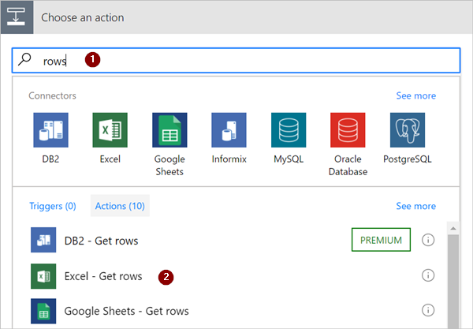

# <a name="use-expressions-in-conditions-to-check-multiple-values"></a>Utiliser des expressions dans des conditions pour vérifier plusieurs valeurs
Dans cette procédure pas à pas, vous allez apprendre à utiliser des expressions et **conditions** pour comparer plusieurs valeurs en **mode Avancé**.

Lorsque vous créez un flux, vous pouvez utiliser la carte [**Condition**](add-condition.md#add-a-condition) en mode de base pour comparer rapidement une valeur avec une autre. Vous devrez peut-être parfois comparer plusieurs valeurs. Par exemple, vous pouvez vérifier la valeur de quelques colonnes d’une feuille de calcul ou une table de base de données.

Vous pouvez utiliser n’importe quelle combinaison parmi les expressions logiques suivantes dans vos conditions.

Expression|Description|Exemple
--------|-----------|-------
|[and](#use-the-and-expression)|Accepte deux arguments et retourne la valeur true si les deux valeurs sont true.<br><b>Remarque</b> : les deux arguments doivent être des valeurs booléennes.|Cette expression retourne la valeur false : <br>and(greater(1,10),equals(0,0))
|[or](#use-the-or-expression)|Accepte deux arguments et retourne la valeur true si un des arguments a la valeur true. <br><b>Remarque</b> : les deux arguments doivent être des valeurs booléennes.|Cette expression retourne la valeur true :<br>or(greater(1,10),equals(0,0))
|equals|Retourne true si les deux valeurs sont égales.|Par exemple, si parameter1 est someValue, cette expression retourne true :<br>equals(parameters('parameter1'), 'someValue')
|[less](#use-the-less-expression)|Accepte deux arguments et retourne la valeur true si le premier argument est inférieur au deuxième argument. <br><b>Remarque</b> : les types pris en charge sont integer, float et string.|Cette expression retourne la valeur true :<br>less(10,100)
|lessOrEquals|Accepte deux arguments et retourne la valeur true si le premier argument est inférieur ou égal au deuxième argument. <br><b>Remarque</b> : les types pris en charge sont integer, float et string.|Cette expression retourne la valeur true :<br>lessOrEquals(10,10)
|[greater](#use-the-greater-expression)|Accepte deux arguments et retourne la valeur true si le premier argument est supérieur au deuxième argument. <br><b>Remarque</b> : les types pris en charge sont integer, float et string.|Cette expression retourne la valeur false :<br>greater(10,10)
|greaterOrEquals|Accepte deux arguments et retourne la valeur true si le premier argument est supérieur ou égal au deuxième argument. <br><b>Remarque</b> : les types pris en charge sont integer, float et string.|Cette expression retourne la valeur false :<br>greaterOrEquals(10,100)
|[empty](#use-the-empty-expression)|Retourne la valeur true si l’objet, le tableau ou la chaîne est vide.|Cette expression retourne la valeur true :<br>empty('')
|not|Accepte deux arguments et retourne la valeur true si les arguments ont la valeur false. <br><b>Remarque</b> : les deux arguments doivent être des valeurs booléennes.|Cette expression retourne la valeur true :<br>not(contains('200 Success','Fail'))
|if|Retourne une valeur spécifique si l’expression retourne la valeur true ou false.|Cette expression retourne la valeur yes :<br>if(equals(1, 1), 'yes', 'no')

## <a name="prerequisites"></a>Prérequis
* Accédez à Microsoft Flow.
* Une feuille de calcul avec les tableaux décrits plus loin dans cette procédure pas à pas. Veillez à enregistrer votre feuille de calcul dans un emplacement tel que Dropbox ou Microsoft OneDrive afin que Microsoft Flow puisse y accéder.
* Microsoft Office 365 Outlook ou un autre service de messagerie pris en charge dans vos flux.

## <a name="use-the-or-expression"></a>Utiliser l’expression or
Parfois, votre flux de travail doit entreprendre une action si la valeur d’un élément est valueA **ou** valueB. Par exemple, vous pouvez suivre l’état des tâches dans un tableau de feuille de calcul. Supposons que le tableau possède une colonne nommée *Status* et que les valeurs possibles dans la colonne *Status* sont les suivantes :

* **completed**
* **blocked**
* **unnecessary**
* **not started**

Voici un exemple de la façon dont la feuille de calcul peut se présenter :


Étant donné la feuille de calcul précédente, vous souhaitez utiliser Microsoft Flow pour supprimer toutes les lignes ayant une colonne *Status* définie sur *completed* ou *unnecessary*.

Vous allez créer le flux.

### <a name="start-with-a-blank-flow"></a>Commencer avec un flux vide
1. Connectez-vous à [Microsoft Flow](https://flow.microsoft.com).

    
2. Sélectionnez l’onglet **Mes flux**.

    
3. Sélectionnez **Créer entièrement**.

    

### <a name="add-a-trigger-to-your-flow"></a>Ajouter un déclencheur à votre flux
1. Recherchez **Planification**, puis sélectionnez le déclencheur **Planification - Récurrence**.

    
2. Définissez l’exécution quotidienne de la planification.

    

### <a name="select-the-spreadsheet-and-get-all-rows"></a>Sélectionner la feuille de calcul et obtenir toutes les lignes
1. Sélectionnez **Nouvelle étape** > **Ajouter une action**.

    
2. Recherchez **rows (lignes)**, puis sélectionnez **Excel - Get rows (Excel - Obtenir les lignes)**.

    Remarque : sélectionnez l’action « obtenir les lignes » qui correspond à la feuille de calcul que vous utilisez. Par exemple, si vous utilisez Google Sheets, sélectionnez **Google Sheets - Get rows (Google Sheets - Obtenir les lignes)**.

    
3. Sélectionnez l’icône de dossier dans la zone **Nom de fichier**, puis sélectionnez la feuille de calcul qui contient vos données.

    
4. Sélectionnez le tableau qui contient vos données à partir de la liste **Nom du tableau**.

    

### <a name="check-the-status-column-of-each-row"></a>Vérifier la colonne Status de chaque ligne
1. Sélectionnez **Nouvelle étape** > **Plus** > **Ajouter un appliquer à chaque**.

    
2. Ajoutez le jeton **Valeur** dans la zone **Sélectionnez un résultat à partir des étapes précédentes**.

    
3. Sélectionnez **Ajouter une condition** > **Modifier en mode Avancé**.
4. Ajoutez l’expression **or** suivante. Cette expression **or** vérifie la valeur de chaque ligne du tableau (une ligne est appelée « élément » dans une expression). Si la valeur de la colonne **status** est *completed* **ou** *unnecessary*, l’expression **or** prend la valeur « true ».

    L’expression **or** s’affiche comme illustré ici :

    ````@or(equals(item()?['status'], 'unnecessary'), equals(item()?['status'], 'completed'))````

    Votre carte **Condition** ressemble à cette image :

    

### <a name="delete-matching-rows-from-the-spreadsheet"></a>Supprimer les lignes correspondantes de la feuille de calcul
1. Sélectionnez **Ajouter une action** sous la section **SI OUI, NE RIEN FAIRE** de la condition.
2. Recherchez **Supprimer la ligne**, puis sélectionnez **Excel - Supprimer la ligne**.

    
3. Dans la zone **Nom de fichier**, recherchez et sélectionnez la feuille de calcul qui contient les données que vous souhaitez supprimer.
4. Dans la liste **Nom du tableau**, sélectionnez le tableau qui contient vos données.
5. Placez le jeton **ID de ligne** dans la zone **ID de ligne**.

    

### <a name="name-the-flow-and-save-it"></a>Nommer le flux et l’enregistrer
1. Nommez votre flux, puis sélectionnez le bouton **Créer un flux**.

    

### <a name="run-the-flow-with-the-or-expression"></a>Exécuter le flux avec l’expression or
Le flux s’exécute une fois que vous l’avez enregistré. Si vous avez créé la feuille de calcul indiquée plus haut dans cette procédure pas à pas, voici à quoi elle ressemble après l’exécution :


Notez que toutes les données des lignes dont le statut était « completed » ou « unnecessary » dans la colonne Status ont été supprimées.

## <a name="use-the-and-expression"></a>Utiliser l’expression and
Supposons que vous avez un tableau de feuille de calcul avec deux colonnes. Les noms de colonne sont Status et Assigned. Supposons également que vous souhaitez supprimer toutes les lignes si la valeur de la colonne Status est « blocked » et que la valeur de la colonne Assigned est « John Wonder ».  Pour accomplir cette tâche, suivez toutes les étapes décrites plus haut dans cette procédure pas à pas. Toutefois, lorsque vous modifiez la carte **Condition** en mode Avancé, utilisez l’expression **and** indiquée ici :

````@and(equals(item()?['Status'], 'blocked'), equals(item()?['Assigned'], 'John Wonder'))````

Votre carte **Condition** ressemble à cette image :


### <a name="run-the-flow-with-the-and-expression"></a>Exécuter le flux avec l’expression and
Si vous avez respecté la procédure, votre feuille de calcul doit ressembler à l’image suivante :


Une fois que votre flux est exécuté, votre feuille de calcul doit ressembler à l’image suivante :


## <a name="use-the-empty-expression"></a>Utiliser l’expression empty
Notez qu’il existe plusieurs lignes vides dans la feuille de calcul. Pour les supprimer, utilisez l’expression **empty** pour identifier toutes les lignes qui n’ont pas de texte dans les colonnes Assigned et Status.

Pour accomplir cette tâche, suivez toutes les étapes décrites plus haut dans la section **Utiliser l’expression and** de cette procédure pas à pas. Toutefois, lorsque vous modifiez la carte **Condition** en mode Avancé, utilisez l’expression empty comme suit :

````@and(empty(item()?['Status']), empty(item()?['Assigned']))````

Votre carte **Condition** ressemble à cette image :


Une fois que votre flux est exécuté, votre feuille de calcul doit ressembler à l’image suivante :


Notez que les lignes supplémentaires sont supprimées du tableau.

## <a name="use-the-greater-expression"></a>Utiliser l’expression greater
Imaginez que vous avez acheté des tickets de match de football pour vos collègues et que vous utilisez une feuille de calcul pour vous assurer que chaque personne vous rembourse. Vous pouvez rapidement créer un flux qui envoie un message quotidien à chaque personne qui n’a pas encore remboursé la totalité du montant.

Utilisez l’expression **greater** pour identifier les employés qui n’ont pas remboursé la totalité du montant. Vous pouvez ensuite envoyer automatiquement un message électronique de rappel à ceux qui n’ont pas payé la totalité du montant.

Voici une vue de la feuille de calcul :


Voici l’implémentation de l’expression **greater** qui identifie toutes les personnes qui ont payé moins que le montant dû :

````@greater(item()?['Due'], item()?['Paid'])````

## <a name="use-the-less-expression"></a>Utiliser l’expression less
Imaginez que vous avez acheté des tickets de match de football pour vos collègues et que vous utilisez une feuille de calcul pour vous assurer que chaque personne vous rembourse à la date acceptée par tous. Vous pouvez créer un flux qui envoie un message de rappel pour chaque personne qui n’a pas encore payé la totalité du montant si la date d’échéance est dans moins d’un jour.

Utilisez l’expression **and** avec l’expression **less**, car il existe deux conditions qui sont validées :


|          Condition à valider          | Expression à utiliser |                    Exemple                     |
|-----------------------------------------|-------------------|------------------------------------------------|
|   La totalité du montant a-t-il été payé ?    |      greater      |   @greater(item()?['Due'], item()?['Paid'])    |
| La date d’échéance est-elle située dans un jour ? |       less        | @less(item()?['DueDate'], addDays(utcNow(),1)) |

## <a name="combine-the-greater-and-less-expressions-in-an-and-expression"></a>Combiner les expressions greater et less dans une expression et
Utilisez l’expression **greater** pour identifier les employés qui ont payé moins que le montant total dû et utilisez l’expression **less** pour déterminer si la date d’échéance du paiement est située dans moins d’un jour. Vous pouvez ensuite ajouter l’action **Envoyer un message électronique** pour envoyer un courrier électronique de rappel à ceux qui n’ont pas payé la totalité du montant alors que la date d’échéance est dans moins d’un jour.

Voici une vue du tableau de la feuille de calcul :


Voici l’implémentation de l’expression **and** qui identifie toutes les personnes qui ont payé moins que le montant dû et le fait que la date d’échéance est située dans moins d’un jour :

````@and(greater(item()?['Due'], item()?['Paid']), less(item()?['dueDate'], addDays(utcNow(),1)))````

## <a name="learn-more"></a>En savoir plus
En savoir plus sur les autres [expressions](https://docs.microsoft.com/azure/logic-apps/logic-apps-workflow-definition-language#functions)

